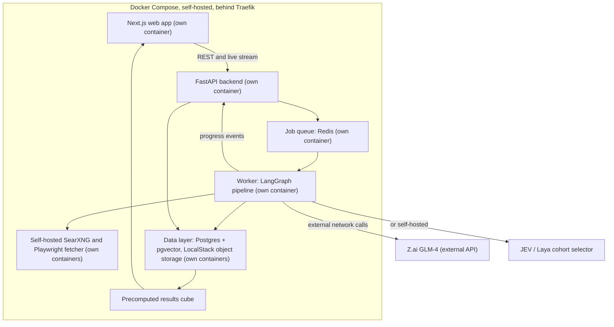

<p align="center">
  
</p>

<p align="center"><i>A flight simulator for policies. Because a law shouldn't be test-flown on real people first.</i></p>

LEGISIM turns a country into a few thousand weighted cohorts, drops a policy on them, and shows you how the effects actually spread, from the first price change to the household budgets three steps downstream.

Built by team **neurocooked** at NIT Karnataka, Surathkal, for Build for Billions, under the Agentic AI for Billions track (autonomous workflows for public and social services).

## Demo

[](https://youtu.be/PcW6NcqxglI)


## Table of contents

- [The problem](#the-problem)
- [Our solution](#our-solution)
- [Key features](#key-features)
- [Tech stack](#tech-stack)
- [Architecture and how it works](#architecture-and-how-it-works)
- [Installation and setup](#installation-and-setup)
- [Challenges and what we learned](#challenges-and-what-we-learned)
- [Roadmap](#roadmap)
- [Team](#team)
- [Pitch deck](#pitch-deck)

## The problem

Fuel gets 10 rupees costlier a litre, and somewhere a tomato gets more expensive too. Nobody mentioned that part in the press release.

Every policy ships with a one-line promise and a long tail of consequences nobody announced. Truckers pay more first. Freight costs rise, so vegetables cost more, so household budgets tighten. People also travel less, so shops see fewer visitors. None of that made the announcement.

The same policy lands differently depending on who you are and where you live, a farmer in Vidarbha does not feel a fuel hike the way a software engineer in Bengaluru does. Right now, the answer to "who gets hit, and when" is scattered across think tank reports and expert opinion. Students, journalists, and policy teams either wait weeks for a full study or guess. A wrong guess about a policy touching a billion people is an expensive guess, which is why a fast, explainable first estimate matters.

## Our solution

LEGISIM puts a whole country in a browser tab. Pick a policy (India first), run the simulation, and watch different groups of people respond in their own way. The platform tracks how those individual reactions add up across the economy and society over time.

We don't simulate a billion individual people. Instead we simulate a few hundred to a few thousand weighted cohorts, groups like "urban salaried households" or "small farmers in one region." Each cohort decides how to change its spending, work, and travel, using real data, simple economic models, and what happened after similar policies in the past. Data handles the numbers; AI handles the judgment calls and the explanations. A ripple engine then pushes the first change through a cause-and-effect map, one hop at a time.

Take a fuel price hike of 10 rupees a litre as an example run: freight costs rise first, food prices follow, and household budgets absorb what's left. LEGISIM shows each hop, how big it is, how long it takes, and how confident the model is about it.

## Key features

- **Customizable country and population.** Set size, income, age, occupation, urban or rural split, education, and region.
- **Policy builder.** Describe or configure a policy by scale, tax or subsidy, target group, coverage, and timeline.
- **Cohort engine.** A few hundred to a few thousand weighted cohorts stand in for the whole population instead of simulating everyone individually.
- **Radical cohort selection with JEV and Laya.** Instead of SQL filters, a fast binary classifier decides which of the 2,000 personas are even relevant to a given policy, in milliseconds. See [Architecture](#architecture-and-how-it-works) below.
- **Ripple explorer.** An animated cause-and-effect chain from policy to prices to household budgets, with a Play button and filters for group, topic, depth, and time. This is the feature we're proudest of.
- **Time slider.** Short and long-term effects side by side, including how long each group takes to accept a change.
- **Impact dashboard and India map.** Sliders for income, region, urban or rural, education, and duration.
- **Plain-language summary report.** Sits next to the charts and reads like a short research note.
- **Evidence drawer.** Every number opens to show the reasoning, data, and sources behind it, plus a label for whether it was measured, modeled, or judged.
- **Historical analogue finder.** Flags when a scenario looks like a past policy, for example "this looks like 2016 demonetisation."
- **Backtest mode.** Reruns a past policy with the data cut off and compares the output against what actually happened.
- **Winners-and-losers view.** Puts the first question a policy reader asks front and center, instead of hiding it behind a national average.

## Tech stack

The stack is fully self-hosted. Every layer runs in its own Docker container on infrastructure we control, behind Traefik.

### Frontend

| Layer | Choice |
|---|---|
| Framework | Next.js with TypeScript |
| Styling and components | Tailwind CSS, shadcn/ui |
| State and data fetching | TanStack Query, Zustand |
| Charts | Apache ECharts (Recharts for simple ones) |
| Ripple graph | React Flow with automatic layout |
| Map | MapLibre GL with deck.gl |
| 3D visuals | ECharts GL, three.js where needed |

### Backend and orchestration

| Layer | Choice |
|---|---|
| API | Python, FastAPI, Pydantic |
| Pipeline orchestration | LangGraph (parallel steps, loops, pause and resume, checkpoints, streaming) |
| Cohort selection | JEV (TypeSafeAI, hosted) or Laya, our self-hosted local alternative. A BERT-based binary classifier that filters the relevant personas out of 2,000 cohort cards |
| LLM | Z.ai GLM-4 via API |
| Numerical modeling | NumPy, pandas or Polars, SciPy |

### Data and storage

| Layer | Choice |
|---|---|
| Database | PostgreSQL with pgvector (self-hosted) |
| Queue and cache | Redis, with ARQ or Celery for jobs |
| Object storage | LocalStack (S3-compatible, self-hosted) |
| Research tools | Self-hosted SearXNG and a Playwright fetcher, plus official government data downloads |

### Infrastructure and observability

| Layer | Choice |
|---|---|
| Auth | Our own Postgres-backed auth, JWT sessions, no third-party auth server |
| Hosting | Docker Compose on our own VPS or bare metal, behind Traefik |
| Observability | Self-hosted Langfuse for AI call traces and cost |
| Testing | Pytest, Playwright, a fixed set of backtest scenarios |

## Architecture and how it works



The request lifecycle runs like this:

1. The user submits the policy wizard. The API stores the inputs, creates a run, and puts a job on the queue.
2. A worker picks it up and starts the LangGraph pipeline, using the run id as its thread id.
3. The pipeline streams progress (stage started, source found, cohorts done) back through Redis to the API, which forwards it to the browser over server-sent events.
4. At a review checkpoint the pipeline pauses for the user, then resumes.
5. When it finishes, results go into Postgres and a results cube goes into object storage.
6. The browser loads the cube once, and every slider, filter, and time scrub afterward runs locally with no new AI calls.

### Picking which cohorts run: JEV and Laya

Rather than filtering personas with hardcoded SQL `WHERE` clauses, cohort selection is fully agentic and runs in four phases:

1. **Context consolidation.** A strong reasoning LLM reads the submitted policy plus the user's wizard settings and produces a detailed "targeting profile" describing who is affected, directly and indirectly.
2. **Massive parallel selection.** JEV (or Laya, our self-hosted alternative) takes that targeting profile and checks it against all 2,000 persona cards in the database. For each one it answers a simple true or false: is this persona relevant here? Because it's a non-generative, BERT-based classifier rather than a full LLM call, it can clear all 2,000 personas in milliseconds.
3. **Prompt hydration.** For the personas that came back true, a strong LLM writes a bespoke prompt for each, injecting the specific data that persona needs (local prices, a relevant historical analogue, and so on).
4. **Execution.** A fast LLM tier runs those prompts in a fan-out LangGraph batch and returns each persona's stance and behavior change.

The reasoning for going this route: SQL filtering misses semantic overlaps a keyword search wouldn't catch, for instance a gig-worker-rights policy that also affects urban food vendors. A generative LLM could catch that, but running one across 2,000 rows is slow and expensive. JEV and Laya sit in between, fast and cheap enough to check every persona, without losing the semantic judgment a keyword filter would miss.

## Installation and setup

```bash
git clone <repo-url>
cd legisim
cp .env.example .env
# fill in your keys in .env
docker compose up --build
```

That's it, the whole stack (frontend, API, worker, database, queue, object storage, and research tools) comes up together.

`.env` needs:

```
SECRET_KEY=
JWT_SECRET_KEY=
ZAI_API_KEY=
OPENAI_API_KEY=
TYPESAFEAI_API_KEY=
```

`TYPESAFEAI_API_KEY` is only needed if you're using hosted JEV. Running Laya locally instead, leave it blank.

## Challenges and what we learned

A simulation like this is only as useful as people's trust in it, so a good chunk of our design time went into questions that had nothing to do with getting a demo running.

The biggest one was keeping the AI honest. It's easy for a language model to produce a confident, wrong claim about how a group of people would react to a policy. We settled on structured outputs everywhere, a rule that every claim needs a source or a past analogue, and a critic step in the LangGraph pipeline that checks each claim against the evidence before the report reaches a user. Related to that: cohort reactions need to come from data and stated assumptions, not from stereotypes, so we deliberately left caste and religion out of the inputs and lean on data-first prompts and sample audits instead.

Being honest about uncertainty turned out to matter as much as being accurate. A single number on a dashboard reads as a forecast even when it's a rough estimate, so every output carries a range, a confidence label, and a "simulation, not a forecast" stamp on anything exported or shared.

Cost and speed pushed against each other constantly. Running a policy through hundreds or thousands of cohorts with an LLM in the loop adds up fast, so we use a smaller model for the high-volume cohort reactions, JEV/Laya to avoid running an LLM over every persona just to filter them, and cache aggressively, and precompute results into a data cube so dashboard sliders don't trigger new AI calls at all.

A few problems were specific to modeling India. Map boundaries are a genuinely sensitive topic, so we're using boundary files that match the official depiction rather than whatever a generic mapping library ships with. And because policy simulation touches politically charged territory almost by definition, we stuck to neutral wording, always show both gains and losses, and never claim more certainty than the model actually has.

Last, we had to draw a hard line around scope. The original idea included a full behavior simulation where people influence and persuade each other, but that's a different, much harder problem than what we set out to build. We settled on cohorts that react independently based on their own situation and history, with no cross-cohort influence for now. It's a narrower claim, but it's one we can actually back up.

## Roadmap

The build itself moves through four phases: a thin slice with one hardcoded policy and mock data end to end, a real engine with the full LangGraph pipeline and real data tables, depth features like the India map and scenario compare, and a final pass on backtests, cost limits, and demo polish.

Past the hackathon, the next features in line are:

- Implementation context (budget, administrative capacity, regional adoption, speed)
- What-if scenario comparison with a difference map
- Simulation replay, stepping through a run with captions
- Mitigation suggestions, like "add a cash transfer for the bottom 20 percent"
- A political acceptance and backlash meter
- "Ask a group," a chat interface for asking a cohort why it reacted the way it did
- Policy document upload, turning a PDF into a structured policy input
- Export to PDF, slides, and CSV, plus shareable links
- Hindi and Kannada UI, with lakh and crore number formats
- A guest demo mode so anyone can try a scenario without signing up

Further out, once the core is solid: district-level drill-down, team comments and sharing on notebooks, and an optimizer that searches for policy settings that keep a chosen impact under a target threshold.

## Team

| Name | Focus |
|---|---|
| Dikshit Rishi Jain (team lead) | Backend and AI: LangGraph pipeline, cohort builder, economic model, ripple engine, API, database |
| Vaishnavi Saraf | Data: population tables, past policy library, backtest data |
| Sowmiyanathan Raja | Frontend and integration: results layout, shared state, live progress streaming, dashboard sliders |
| Sayan Maity | Frontend and design: design system, UI pages, ripple graph and map visuals, demo story |
| Shreya Devendra | Evidence and validation: backtests, report review, methodology page |

National Institute of Technology Karnataka, Surathkal. Agentic AI for Billions track.

## Pitch deck

<embed src="./docs/pithdeck.pdf" type="application/pdf" width="100%" height="600px" />

[View the pitch deck (PDF)](./docs/pithdeck.pdf)
