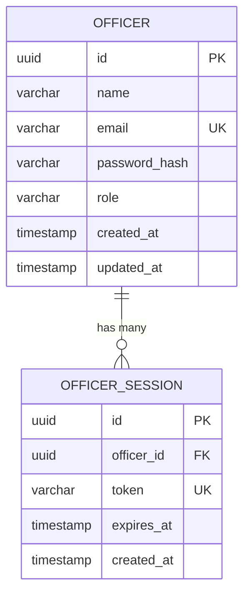

# Database Schema: Authentication & Officers

This document describes the PostgreSQL schema for the authentication domain.

## Entity Relationship Diagram

## Tables

### `officers`
Stores officer (user) credentials and profiles.

| Column | Type | Constraints | Description |
|---|---|---|---|
| `id` | `uuid` | PRIMARY KEY, DEFAULT gen_random_uuid() | Unique identifier for the officer. |
| `name` | `varchar(255)` | NOT NULL | Full name of the officer. |
| `email` | `varchar(255)` | NOT NULL, UNIQUE | Officer's email address (used for login). |
| `password_hash` | `varchar(255)` | NOT NULL | Bcrypt hash of the officer's password. |
| `role` | `varchar(50)` | NOT NULL, DEFAULT 'officer' | Role of the user (e.g., 'admin', 'officer'). |
| `created_at` | `timestamp` | NOT NULL, DEFAULT CURRENT_TIMESTAMP | Record creation time. |
| `updated_at` | `timestamp` | NOT NULL, DEFAULT CURRENT_TIMESTAMP | Record last update time. |

**Indexes:**
- `idx_officers_email` on `email`

### `officer_sessions`
Stores active login sessions and their corresponding tokens.

| Column | Type | Constraints | Description |
|---|---|---|---|
| `id` | `uuid` | PRIMARY KEY, DEFAULT gen_random_uuid() | Unique identifier for the session. |
| `officer_id` | `uuid` | NOT NULL, FOREIGN KEY REFERENCES officers(id) ON DELETE CASCADE | The officer owning this session. |
| `token` | `varchar(512)` | NOT NULL, UNIQUE | Session token (JWT or opaque token). |
| `expires_at` | `timestamp` | NOT NULL | When the session expires. |
| `created_at` | `timestamp` | NOT NULL, DEFAULT CURRENT_TIMESTAMP | When the session was created. |

**Indexes:**
- `idx_officer_sessions_token` on `token`
- `idx_officer_sessions_officer_id` on `officer_id`
