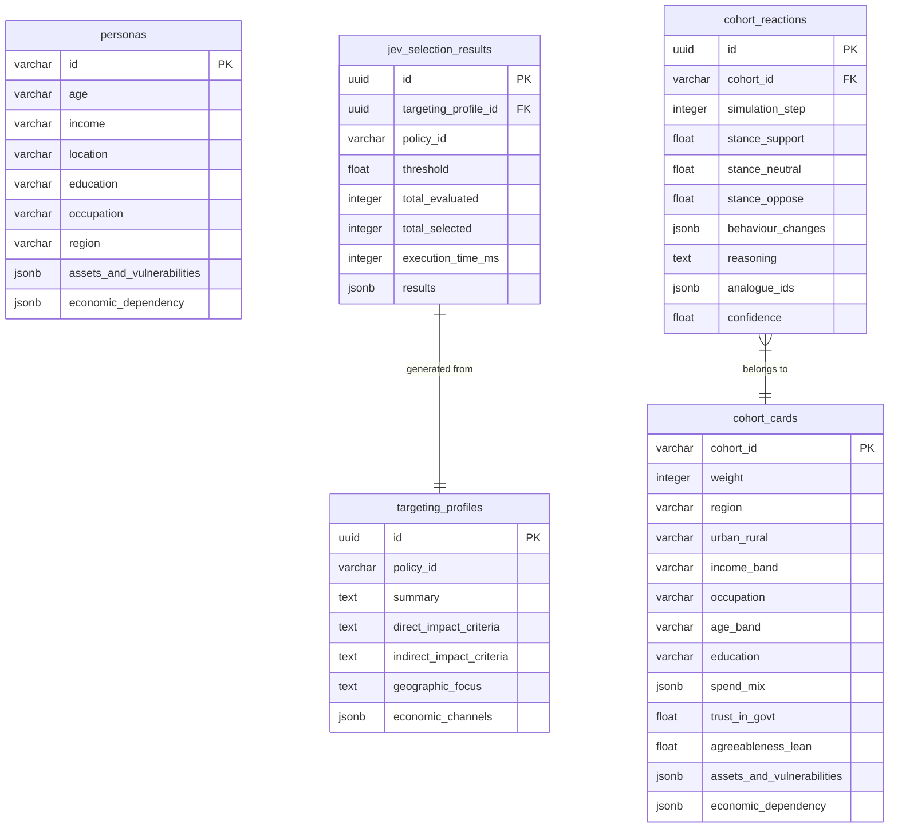

# Cohorts & JEV Database Schema

This document defines the PostgreSQL schema for the Cohorts domain, including baseline personas, runtime cohorts, JEV targeting profiles, and cohort reactions.

## Entity Relationship Diagram

## Tables Details

### `personas`
Baseline personas for JEV evaluation (~2000 records).
- `id` (VARCHAR): Primary key (e.g. `urban_gig_worker_tier1_youth_01`)
- `age` (VARCHAR): Age band
- `income` (VARCHAR): Income band
- `location` (VARCHAR): Settlement type
- `education` (VARCHAR)
- `occupation` (VARCHAR)
- `region` (VARCHAR)
- `assets_and_vulnerabilities` (JSONB): List of tags
- `economic_dependency` (JSONB): List of tags

### `cohort_cards`
Runtime representation of a cohort.
- `cohort_id` (VARCHAR): Primary Key
- `weight` (INTEGER): Population multiplier
- `region` (VARCHAR)
- `urban_rural` (VARCHAR)
- `income_band` (VARCHAR)
- `occupation` (VARCHAR)
- `age_band` (VARCHAR)
- `education` (VARCHAR)
- `spend_mix` (JSONB): Breakdown of spending
- `trust_in_govt` (FLOAT)
- `agreeableness_lean` (FLOAT)
- `assets_and_vulnerabilities` (JSONB)
- `economic_dependency` (JSONB)

### `cohort_reactions`
Reactions generated by LLM during simulation.
- `id` (UUID): Primary Key
- `cohort_id` (VARCHAR): Foreign Key to `cohort_cards.cohort_id`
- `simulation_step` (INTEGER)
- `stance_support` (FLOAT)
- `stance_neutral` (FLOAT)
- `stance_oppose` (FLOAT)
- `behaviour_changes` (JSONB): List of behaviour change objects
- `reasoning` (TEXT)
- `analogue_ids` (JSONB)
- `confidence` (FLOAT)
