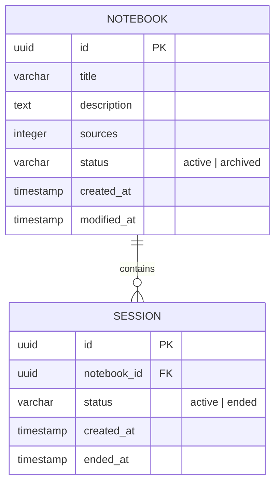

# Database Schema: Notebooks Domain

This document describes the PostgreSQL schema for the **Notebooks** domain, including Notebooks, Sessions, and their Status.

## Mermaid ERD

## Tables

### 1. `notebooks`
Stores the high-level notebook metadata.

| Column | Type | Constraints | Description |
|---|---|---|---|
| `id` | UUID | PRIMARY KEY, default gen_random_uuid() | Unique identifier for the notebook. |
| `title` | VARCHAR(255) | NOT NULL | Human-readable title. |
| `description` | TEXT | | Detailed description. |
| `sources` | INTEGER | DEFAULT 0 | Number of sources attached. |
| `status` | VARCHAR(50) | NOT NULL, CHECK (status IN ('active', 'archived')) | Current lifecycle status. |
| `created_at` | TIMESTAMP | NOT NULL, DEFAULT NOW() | Record creation time. |
| `modified_at` | TIMESTAMP | NOT NULL, DEFAULT NOW() | Last update time. |

**Indexes:**
- `idx_notebooks_status` on `status`

### 2. `sessions`
Stores individual simulation or user sessions associated with a notebook.

| Column | Type | Constraints | Description |
|---|---|---|---|
| `id` | UUID | PRIMARY KEY, default gen_random_uuid() | Unique identifier for the session. |
| `notebook_id` | UUID | FOREIGN KEY REFERENCES `notebooks(id)` ON DELETE CASCADE | The notebook this session belongs to. |
| `status` | VARCHAR(50) | NOT NULL, CHECK (status IN ('active', 'ended')) | Current session status. |
| `created_at` | TIMESTAMP | NOT NULL, DEFAULT NOW() | Session start time. |
| `ended_at` | TIMESTAMP | | Session end time, if applicable. |

**Indexes:**
- `idx_sessions_notebook_id` on `notebook_id`
