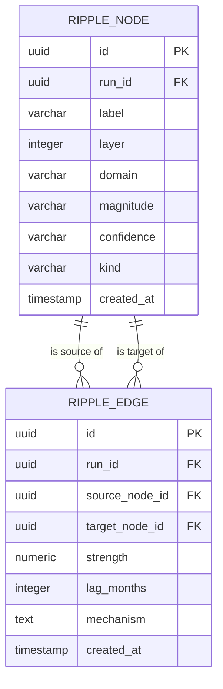

# Ripple Graph Database Schema

This document details the PostgreSQL schema for the Ripple Graph domain (nodes, edges, and their causal relationships) used to represent policy simulation ripple effects.

## Mermaid ERD

## Tables

### `ripple_node`
Stores the causal nodes generated during a simulation run.

| Column | Type | Constraints | Description |
|--------|------|-------------|-------------|
| `id` | `UUID` | Primary Key | Unique identifier for the ripple node. |
| `run_id` | `UUID` | Not Null, FK | Foreign key referencing the simulation run. |
| `label` | `VARCHAR(255)` | Not Null | Human-readable label for the node (e.g., "Fuel Price Increase"). |
| `layer` | `INTEGER` | Not Null | The causal depth layer (0 for direct policy impact, 1 for first-order, etc.). |
| `domain` | `VARCHAR(50)` | Not Null | Domain category (e.g., `policy`, `transport`, `agriculture`, etc.). |
| `magnitude` | `VARCHAR(255)` | Not Null | Description of the magnitude (e.g., "+10%"). |
| `confidence` | `VARCHAR(20)` | Not Null | Confidence level (`high`, `medium`, `low`). |
| `kind` | `VARCHAR(20)` | Not Null | Evidence provenance (`measured`, `modelled`, `judged`). |
| `created_at` | `TIMESTAMP` | Default NOW() | Timestamp of record creation. |

**Indexes**:
- `idx_ripple_node_run_id` on `run_id` (for fast filtering by run)
- `idx_ripple_node_domain` on `domain`
- `idx_ripple_node_layer` on `layer`

### `ripple_edge`
Stores the directed causal links between ripple nodes.

| Column | Type | Constraints | Description |
|--------|------|-------------|-------------|
| `id` | `UUID` | Primary Key | Unique identifier for the ripple edge. |
| `run_id` | `UUID` | Not Null, FK | Foreign key referencing the simulation run. |
| `source_node_id` | `UUID` | Not Null, FK | The cause node (references `ripple_node.id`). |
| `target_node_id` | `UUID` | Not Null, FK | The effect node (references `ripple_node.id`). |
| `strength` | `NUMERIC(5,4)` | Not Null | Causal strength score (-1.0 to 1.0). |
| `lag_months` | `INTEGER` | Not Null | Time delay in months for the effect to manifest. |
| `mechanism` | `TEXT` | Not Null | Explanation of the transmission mechanism. |
| `created_at` | `TIMESTAMP` | Default NOW() | Timestamp of record creation. |

**Indexes**:
- `idx_ripple_edge_run_id` on `run_id`
- `idx_ripple_edge_source` on `source_node_id`
- `idx_ripple_edge_target` on `target_node_id`
