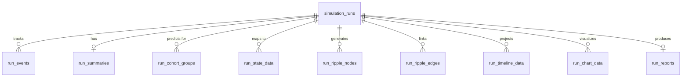

# Database Schema for Runs Domain

This document describes the PostgreSQL schema for the **Runs** domain, which covers simulation runs, predictions, reports, dashboard metrics, and timeline data.

## Tables & Architecture

### 1. `simulation_runs`
The core entity representing a single execution of a policy simulation.
- `id` (UUID, Primary Key)
- `notebook_id` (UUID, Foreign Key to notebooks)
- `policy_text` (TEXT, user input)
- `cohort_config` (JSONB, tracks the selected demographic filters)
- `status` (VARCHAR, Enum: 'loading', 'research', 'simulation', 'analysis', 'complete')
- `progress` (INTEGER, 0-100)
- `created_at` (TIMESTAMP)
- `updated_at` (TIMESTAMP)

### 2. `run_events`
Stores SSE events and milestones for the loading/progress screen.
- `id` (UUID, Primary Key)
- `run_id` (UUID, Foreign Key to simulation_runs)
- `event_type` (VARCHAR)
- `payload` (JSONB)
- `created_at` (TIMESTAMP)
- **Index**: `run_id`, `created_at`

### 3. `run_summaries`
Stores the AI-generated executive summaries and high-level dashboard metrics for a run.
- `id` (UUID, Primary Key)
- `run_id` (UUID, Unique Foreign Key to simulation_runs)
- `sections` (JSONB, array of SummarySection)
- `metrics` (JSONB, array of DashboardMetric)

### 4. `run_cohort_groups`
Stores aggregated impacts on specific demographic clusters.
- `id` (UUID, Primary Key)
- `run_id` (UUID, Foreign Key to simulation_runs)
- `group_id` (VARCHAR)
- `name` (VARCHAR)
- `population` (VARCHAR)
- `description` (TEXT)
- `stance_support` (FLOAT)
- `stance_neutral` (FLOAT)
- `stance_oppose` (FLOAT)
- `income_change` (FLOAT)
- `behaviors` (JSONB, array of strings)
- `confidence` (VARCHAR, 'High' | 'Medium' | 'Low')
- **Index**: `run_id`

### 5. `run_state_data`
Stores geographic/state-level impacts for map visualizations.
- `id` (UUID, Primary Key)
- `run_id` (UUID, Foreign Key to simulation_runs)
- `state_code` (VARCHAR)
- `state_name` (VARCHAR)
- `income_change` (FLOAT)
- `inflation_impact` (FLOAT)
- `acceptance` (FLOAT)
- `jobs_affected` (INTEGER)
- **Index**: `run_id`, `state_code`

### 6. `run_ripple_nodes`
Stores causal graph nodes for a run.
- `id` (UUID, Primary Key)
- `run_id` (UUID, Foreign Key to simulation_runs)
- `node_id` (VARCHAR)
- `label` (VARCHAR)
- `layer` (INTEGER)
- `domain` (VARCHAR)
- `magnitude` (VARCHAR)
- `confidence` (VARCHAR, 'High' | 'Medium' | 'Low')
- `kind` (VARCHAR, 'measured' | 'modelled' | 'judged')
- **Index**: `run_id`

### 7. `run_ripple_edges`
Stores causal graph relationships between nodes.
- `id` (UUID, Primary Key)
- `run_id` (UUID, Foreign Key to simulation_runs)
- `source_node` (VARCHAR)
- `target_node` (VARCHAR)
- `strength` (FLOAT)
- `lag_months` (INTEGER)
- `mechanism` (TEXT)
- **Index**: `run_id`

### 8. `run_timeline_data`
Stores temporal 12-month projections.
- `id` (UUID, Primary Key)
- `run_id` (UUID, Foreign Key to simulation_runs)
- `month` (INTEGER)
- `label` (VARCHAR)
- `income_change` (FLOAT)
- `inflation_impact` (FLOAT)
- `acceptance` (FLOAT)
- `employment` (FLOAT)
- **Index**: `run_id`, `month`

### 9. `run_chart_data`
Stores visualization points (income, jobs, cost of living).
- `id` (UUID, Primary Key)
- `run_id` (UUID, Foreign Key to simulation_runs)
- `chart_type` (VARCHAR, 'income' | 'cost_of_living' | 'jobs')
- `data_payload` (JSONB)
- **Index**: `run_id`, `chart_type`

### 10. `run_reports`
Stores final AI-written detailed markdown reports.
- `id` (UUID, Primary Key)
- `run_id` (UUID, Unique Foreign Key to simulation_runs)
- `markdown_content` (TEXT)

## Entity-Relationship Diagram

