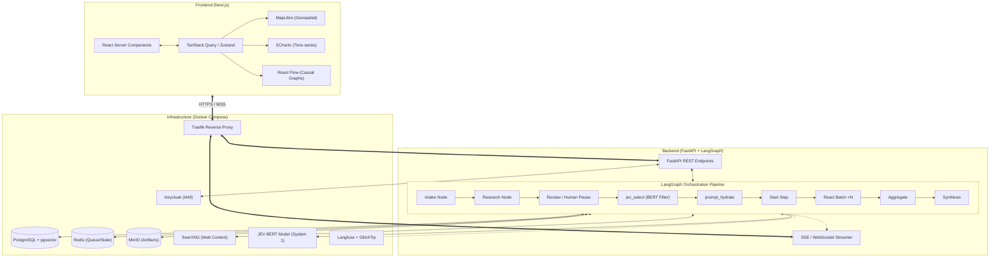
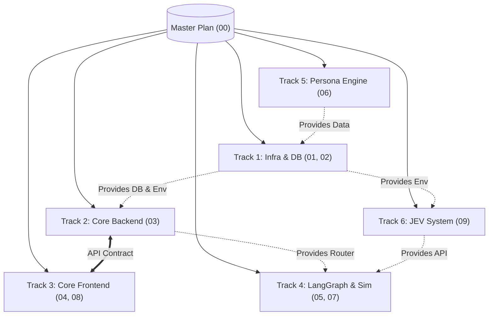
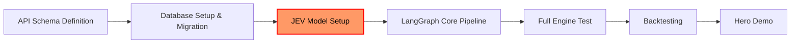

# Master Implementation Plan: LegiSim

This document serves as the master blueprint and single source of truth for the entire LegiSim project. Any AI coding agent or human developer working on this project MUST read this document thoroughly before starting any task. It outlines the architectural vision, implementation strategy, detailed phased approach, agent orchestration, and all fundamental technical decisions.

---

## 1. Project Vision

LegiSim is an AI-powered policy simulation platform designed specifically for the socio-economic context of India, with a scalable architecture capable of supporting global contexts in the future. The fundamental premise of LegiSim is that abstract policies (e.g., "Diesel subsidy removal, ₹12-15/L increase") have complex, multi-layered ripple effects across demographics, economies, and political landscapes that are notoriously difficult to predict using traditional mathematical modeling alone.

### What LegiSim Does:
- **Policy Ingestion**: Takes natural language policy descriptions, proposed legislation texts, or economic shock scenarios as input. Example: "Implement a universal basic income of ₹2000 per month for all landless agricultural laborers."
- **Cohort-Based Simulation**: Instead of simulating a billion individual agents (which is computationally intractable and financially impossible with LLMs), LegiSim simulates the reactions of *weighted population cohorts*. These cohorts represent macro-groups, such as "rural female farmers in Karnataka, low-income, high agreeableness." 
- **Causal Ripple Effects**: It propagates the initial reactions of these cohorts through a causal economic and social graph. A direct impact on transportation costs ripples into food inflation, which ripples into reduced discretionary spending, which ripples into retail sector job losses, etc.
- **Interactive Outputs**: Produces comprehensive interactive dashboards featuring state-level heat maps, time-series charts, and dependency graphs (ripple chains). 
- **Grounded Evidence**: It shows its homework. Every number, prediction, and simulated outcome carries a source, historical analogue, or rigorous chain of thought. If the AI predicts a 5% drop in approval ratings among urban millennials, it must justify this with synthetic citations mapped to real-world behavioral precedents.

The ultimate goal of LegiSim is to empower policymakers, journalists, think tanks, and citizens to "test drive" policies in a safe, high-fidelity sandbox before they affect real lives.

---

## 2. Core Design Principles

Our design philosophy is anchored in seven core principles that balance computational feasibility with simulation fidelity.

| # | Principle | Implementation |
|---|-----------|---------------|
| 1 | **Weighted cohorts, not agents** | The system models ~200-2000 distinct demographic and socio-economic cohorts rather than simulating millions of individual agents. Each cohort is assigned a population weight (e.g., Cohort A represents 12 million people). This ensures statistical significance while keeping LLM inference costs and latency within manageable bounds. |
| 2 | **Hybrid brain** | We strictly divide responsibilities. Mathematics, statistical aggregations, and deterministic data queries are handled by traditional code (NumPy/SciPy, PostgreSQL, Next.js). AI/LLMs are reserved exclusively for semantic reasoning, behavioral prediction, and unstructured data synthesis. Never ask the LLM to do math; ask it to assess sentiment. |
| 3 | **Grounded** | Every claim carries a source or historical analogue. The synthesis nodes in our pipeline explicitly map predicted outcomes to similar historical events (e.g., the 1991 economic reforms, demonetization) or established economic theories, ensuring the simulation is anchored in reality rather than hallucination. |
| 4 | **Streamed & resumable** | We utilize LangGraph for state checkpointing and Server-Sent Events (SSE) or WebSockets to stream progress to the frontend in real-time. If a simulation takes 5 minutes to run, the user sees a live feed of cohorts being analyzed, intermediate findings, and system thoughts. Long-running tasks can be paused, resumed, or recovered from crashes. |
| 5 | **Precomputed data cube** | Once a simulation finishes, the results are compiled into a multidimensional data cube. The frontend UI sliders (e.g., adjusting time horizons or filtering by state) respond instantly by slicing this local cube, requiring absolutely zero additional server calls or LLM inferences. |
| 6 | **Data contract first** | The unified API schema (defined via OpenAPI/Pydantic/TypeScript interfaces) is the absolute single source of truth. Frontend and Backend teams (or agents) work independently against these strict contracts. If the contract is respected, integration is seamless. |
| 7 | **JEV System One** | A fast, local, self-hosted BERT-based binary filter is used for semantic cohort selection. Instead of writing complex SQL `WHERE` clauses to find relevant cohorts for a given policy, the JEV model rapidly scores all cohorts on relevance (0 or 1). This acts as a semantic "System 1" brain, filtering down the context window before the expensive "System 2" LLM evaluates the subset. |

---

## 3. Architecture Overview

The system architecture is strictly decoupled into three main subgraphs. 



### Subgraph Responsibilities
- **Frontend**: Handles all user interactions, visual rendering, and instantaneous local data slicing. Built on Next.js App Router for SEO and performance.
- **Backend**: Exposes standard REST APIs for CRUD operations and manages the complex LangGraph state machine. It streams real-time updates back to the client.
- **Infrastructure**: All services are self-hosted via Docker Compose. No external dependencies other than the Z.ai GLM API for the main "System 2" LLM.

---

## 4. Plan Directory Structure

The repository maintains a strict directory structure for implementation plans. Each directory corresponds to a specific technical track. Agents must refer to the specific plan document for their assigned track.

```text
├── plans/
│   ├── 00-master/
│   │   └── README.md                ← This document (You are here)
│   ├── 01-infrastructure/
│   │   └── plan.md                  ← Docker Compose, Traefik, Keycloak, Observability
│   ├── 02-database/
│   │   └── plan.md                  ← Postgres schemas, migrations, pgvector setup
│   ├── 03-backend-core/
│   │   └── plan.md                  ← FastAPI setup, Pydantic models, Auth middleware
│   ├── 04-frontend-core/
│   │   └── plan.md                  ← Next.js setup, Tailwind, routing, state management
│   ├── 05-langgraph-pipeline/
│   │   └── plan.md                  ← LangGraph state definitions, nodes, conditional edges
│   ├── 06-persona-engine/
│   │   └── plan.md                  ← Data generation scripts for the 2000 baseline cohorts
│   ├── 07-simulation-engine/
│   │   └── plan.md                  ← Batch inference logic, aggregation math, token limits
│   ├── 08-visualization/
│   │   └── plan.md                  ← MapLibre tile serving, React Flow causal graphs
│   └── 09-jev-system/               
│       └── plan.md                  ← JEV System One (BERT) selection engine & Python service
```

---

## 5. Agent Orchestration Strategy

Given the complexity of LegiSim, we employ an **Independent Parallel Tracks with Shared Contract** strategy. Multiple specialized AI agents (or human developers) work concurrently on different tracks. The unified API schema and database schemas act as the hard boundaries between these tracks.

### Track Mapping



### Track Dependencies

| Track | Name | Depends On | Unblocks |
|-------|------|------------|----------|
| Track 1 | Infra & Database | None (Standalone) | All other tracks |
| Track 2 | Core Backend | Track 1 | Track 3 (Frontend), Track 4 |
| Track 3 | Core Frontend | Track 2 (API Schema only) | User Testing |
| Track 4 | LangGraph & Sim | Track 2, Track 6 | Final Demo |
| Track 5 | Persona Engine | None (Data generation) | Track 1 (Seeding) |
| Track 6 | JEV System | Track 1 (Docker runtime) | Track 4 (`jev_select` node) |

---

## 6. Implementation Phases

We execute this project in four strict phases. An agent must not start tasks in Phase N+1 until all critical tasks in Phase N are marked complete.

### Phase 0: Foundation (Days 1-2)
Goal: Get the infrastructure running and the database seeded.

| Task | Owner Agent | Deliverable |
|------|-------------|-------------|
| Docker Compose Setup | Infra Agent | Working `docker-compose.yml` with Traefik, Keycloak, Postgres, Redis, MinIO, Langfuse. |
| JEV Docker Setup | Infra Agent / JEV Agent | Standalone container for the JEV BERT model running via FastAPI/ONNX. |
| DB Schema & Migrations | Data Agent | Alembic migrations for `users`, `policies`, `runs`, `cohorts`. |
| Persona Database Seeding | Data Agent | Script to insert 2,000 baseline Indian demographic cohorts into Postgres. |

### Phase 1: Thin Slice (Days 3-5)
Goal: End-to-end communication from UI to Backend without the AI brain.

| Task | Owner Agent | Deliverable |
|------|-------------|-------------|
| FastAPI Scaffolding | Backend Agent | Core routers, Keycloak token validation, CRUD endpoints. |
| Next.js Scaffolding | Frontend Agent | App router setup, layout, auth context, API client (TanStack). |
| `jev_select` implementation | AI Agent / JEV Agent | Python function to call JEV container and filter cohorts based on semantic relevance. |
| `prompt_hydrate` implementation | AI Agent | Template engine to merge policy data with selected cohort data for the LLM. |

### Phase 2: Real Engine (Days 6-10)
Goal: The LangGraph pipeline actually runs a simulation.

| Task | Owner Agent | Deliverable |
|------|-------------|-------------|
| Full Pipeline Graph | AI Agent | Compiled LangGraph with Intake, Research, JEV, Hydrate, React, Aggregate. |
| SSE Streaming | Backend Agent | FastAPI StreamingResponse pushing LangGraph state updates to client. |
| React Batching | AI Agent | Async concurrency logic to run cohort prompts against Z.ai GLM API. |
| Causal Synthesis | AI Agent | Final node that generates the ripple effect graph and citations. |

### Phase 3: Depth & Polish (Days 11-14)
Goal: Data visualization and user experience refinement.

| Task | Owner Agent | Deliverable |
|------|-------------|-------------|
| MapLibre Integration | Frontend Agent | GeoJSON state-level map dynamically colored by simulation impact scores. |
| React Flow Graph | Frontend Agent | Interactive UI for the causal ripple chains (e.g., policy -> transport -> food). |
| ECharts Analytics | Frontend Agent | Demographics breakdown charts, timeline sliders for short/long term impact. |
| Result Data Cube | Backend Agent | Formatting LangGraph output into the standardized JSON cube for the UI. |

### Phase 4: Trust & Demo (Days 15-16)
Goal: Proving the simulation works with backtesting and preparing the hero demo.

| Task | Owner Agent | Deliverable |
|------|-------------|-------------|
| Confidence & Evidence | AI Agent | UI tooltips showing exactly *why* the AI made a prediction (citations). |
| Backtesting 3 Policies | QA Agent | Run historical policies (e.g., Demonetization) and compare AI output to real data. |
| Hero Demo | All Agents | Polish the "Diesel subsidy removal, ₹12-15/L increase" simulation for showcase. |
| Performance Pass | Backend / JEV | Optimize GPU passthrough for JEV, tune batch sizes. |

---

## 7. Subagent Roster & Assignments

The master orchestration agent ("parent") will spawn specialized subagents to handle specific tasks. Agents must adhere to their roles and communicate strictly via standard protocols.

### Primary Implementation Agents

| Agent Persona | Responsibilities | Target Directories |
|---------------|------------------|--------------------|
| **Infra Agent** | Docker, proxy configuration, CI/CD, Keycloak, environment variables, Redis. | `infra/`, `docker-compose.yml` |
| **Data Agent** | Database models (SQLAlchemy), Alembic migrations, Pydantic schemas, data generation. | `backend/app/models/`, `backend/app/schemas/` |
| **Backend Agent**| FastAPI routes, WebSockets/SSE, controller logic, auth middleware. | `backend/app/api/`, `backend/app/core/` |
| **AI Agent** | LangGraph construction, prompt engineering, external LLM API integration. | `backend/app/engine/`, `backend/app/prompts/` |
| **JEV Agent** | BERT model serving, tokenizer setup, optimization, ONNX runtime. | `jev_system/` |
| **Frontend Agent**| Next.js, React components, Tailwind styling, visualization libraries. | `frontend/` |

### Agent Communication Protocol
1. **Subagent Autonomy**: Subagents operate independently based on the specific plan for their track.
2. **Strict Messaging**: Subagents MUST use the `send_message` tool to report completion, blockers, or critical architectural changes back to the "parent" orchestrator.
3. **Artifact Generation**: When designing schemas or APIs, agents should generate markdown artifacts (e.g., OpenAPI specs) to share with other agents across tracks.
4. **No Assumption Policy**: If a dependency is missing (e.g., Frontend Agent needs an API endpoint that doesn't exist), the agent must mock the data contract and notify the parent, rather than halting execution.

---

## 8. Critical Path Analysis

The critical path determines the absolute shortest time the project can be completed. Delays on these nodes delay the entire launch.



**CRITICAL BOTTLENECK IDENTIFIED: JEV Setup**
The JEV System One filter is on the critical path between basic infrastructure and any meaningful AI orchestration. If cohort filtering fails or is slow, the LangGraph pipeline cannot proceed without blowing through token limits and API budgets. The JEV Agent must prioritize deploying a functioning, mockable endpoint on Day 1.

---

## 9. Risk Register

| Risk | Impact | Likelihood | Mitigation Strategy |
|------|--------|------------|---------------------|
| Context Window Exhaustion | High | Medium | Enforce strict Pydantic token validation; use batching. |
| API Rate Limiting (External LLM) | High | High | Implement exponential backoff; use Redis queue for concurrency limits. |
| **JEV model too slow on CPU** | Medium | High | Enable GPU passthrough in Docker; implement batch inference for ONNX. |
| **JEV selection too aggressive** | High | Medium | Expose threshold parameter in UI; add "Human Review" pause node to audit selections. |
| **JEV needs fine-tuning for India** | Medium | High | Start with a generalized zero-shot BERT NLI model. Log bad selections for future fine-tuning dataset. |
| WebSocket Disconnects | Low | High | Use SSE (Server-Sent Events) instead of raw WS for unidirectional status streaming to simplify reconnection logic. |

---

## 10. Decided Open Questions (From Notion)

These decisions are final and must be respected by all agents during implementation:

1. **What does AI predict?** Exactly the top 6 metrics: Household income change, Cost of living, Jobs & wages, Public acceptance, Political backlash risk, and Ripple chains.
2. **Inputs:** Population parameters, Social Attitudes, Parsed Policy Text, Macro Conditions, and specific Simulation settings (time horizon).
3. **Cohort Selection Mechanism:** JEV (BERT-based semantic filtering). Replaces complex SQL logic.
4. **Personality Model:** Based on Big Five "Agreeableness" (using open data mappings), easily editable via UI assumptions.
5. **Geographic Scope:** India only for the frontend UI and initial demo, but the DB schema MUST be generic (country-neutral) for future expansion.
6. **Execution Model:** Background tasks (Redis/Celery or LangGraph natively) with live progress streamed to the client.
7. **Hero Demo Scenario:** "Fuel price hike (Diesel subsidy removal, ₹12-15/L increase)."
8. **Cost Control:** JEV solves the scaling cost issue by dramatically reducing the number of cohorts sent to the expensive LLM.
9. **Map Granularity:** State level first. District level is pushed to v2.
10. **Backtesting Validation:** We will test against 3 past policies (e.g., Demonetization, GST rollout). The AI prompt MUST be instructed to heavily weigh historical sources.

---

## 11. Team Mapping

Human team members are assigned to oversee specific tracks and agent outputs.

| Team Member | Role | Primary Tracks |
|-------------|------|----------------|
| **Dikshit Rishi Jain** | Backend + AI Arch | Tracks 1, 2, 4 |
| **Vaishnavi Saraf** | Data Collection | Track 5 |
| **Sowmiyanathan Raja** | Frontend Arch | Track 3 |
| **Sayan Maity** | Design + Frontend | Track 3 |
| **Shreya Devendra** | Validation & QA | Track 6 |

---

## 12. Quick Start for Agents

If you are an AI agent assigned to begin work, follow this sequence exactly:

1. **Identify Your Track**: Determine which track (1-6) you are assigned to based on your instructions.
2. **Read Your Track Plan**: Read the specific markdown file in `plans/<your-track-directory>/plan.md`. Do not rely solely on this master document for technical specifics.
3. **Check Environment**: Use the `run_command` tool to check if your required dependencies (e.g., Docker, Python environment) are available. 
4. **Acknowledge Contract**: If you are building an API or a UI, check `backend/app/schemas/` or the OpenAPI spec to ensure you are aligning with the defined data contracts.
5. **Execute Step-by-Step**: Do not try to build everything at once. Use tools incrementally. Write a file, run a test, verify output, then move to the next.
6. **Report Status**: Upon completing a milestone, use the `send_message` tool to notify the orchestrator agent with a summary of what was accomplished and any blockers encountered. 

***END OF MASTER PLAN***
