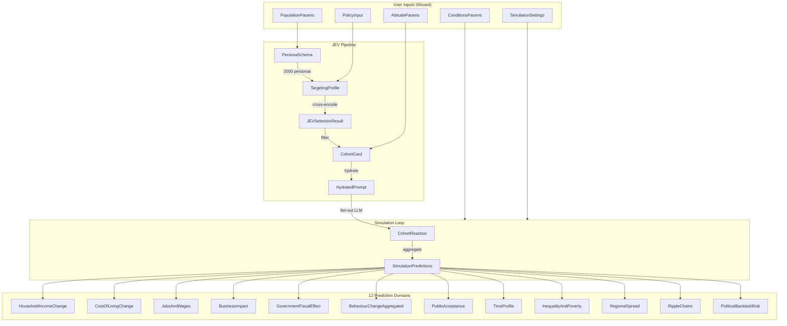

# Data Models — Complete Pydantic Schema Reference

> **This file is the single source of truth for every Pydantic model in LegiSim.**
> All backend services, LangGraph nodes, and API routes import from `backend/app/schemas/`.
> Frontend TypeScript mirrors are auto-generated via `datamodel-code-generator`.

---

## Table of Contents

1. [File Layout](#1-file-layout)
2. [Enumerations & Constants](#2-enumerations--constants)
3. [JEV System-One Models](#3-jev-system-one-models)
4. [Cohort & Persona Models](#4-cohort--persona-models)
5. [Simulation Input Parameters](#5-simulation-input-parameters)
6. [Simulation State](#6-simulation-state)
7. [Cohort Reaction Output](#7-cohort-reaction-output)
8. [Prediction Output Models (12 Domains)](#8-prediction-output-models-12-domains)
9. [Ripple Graph Models](#9-ripple-graph-models)
10. [Report & Dashboard Models](#10-report--dashboard-models)
11. [Notebook & Session Models](#11-notebook--session-models)
12. [Visualization Data Point Models](#12-visualization-data-point-models)

---

## 1. File Layout

```
backend/app/schemas/
├── __init__.py              # Re-exports everything
├── enums.py                 # All enumerations
├── jev.py                   # PersonaSchema, TargetingProfile, JEVSelectionResult, HydratedPrompt
├── cohort.py                # CohortCard, Demographics, SpendMix
├── reactions.py             # CohortReaction, BehaviourChange, StanceDistribution
├── inputs.py                # PopulationParams, AttitudeParams, PolicyInput, ConditionsParams, SimulationSettings
├── state.py                 # SimulationState (LangGraph TypedDict)
├── predictions.py           # All 12 prediction output models
├── ripple.py                # RippleNode, RippleEdge
├── report.py                # SummarySection, DashboardMetric
├── notebook.py              # Notebook, session-level models
└── viz.py                   # Chart data point models (Income, CostOfLiving, Jobs, Timeline)
```

---

## 2. Enumerations & Constants

```python
# backend/app/schemas/enums.py
from enum import Enum


class ConfidenceLevel(str, Enum):
    """Three-tier confidence used across all predictions and ripple nodes."""
    HIGH = "high"
    MEDIUM = "medium"
    LOW = "low"


class EvidenceKind(str, Enum):
    """Provenance tag for every number in the system.
    - measured: from official data (Census, NSS, RBI)
    - modelled: computed deterministically by math templates
    - judged:   LLM-reasoned (cohort reactions, qualitative)
    """
    MEASURED = "measured"
    MODELLED = "modelled"
    JUDGED = "judged"


class StanceLabel(str, Enum):
    """Discrete stance a cohort can take toward a policy."""
    SUPPORT = "support"
    NEUTRAL = "neutral"
    OPPOSE = "oppose"


class UrbanRural(str, Enum):
    """Settlement classification following Census 2011 definitions."""
    URBAN_TIER1 = "urban_tier1"      # Metro cities (pop > 1M)
    URBAN_TIER2 = "urban_tier2"      # Cities (pop 100K-1M)
    URBAN_TIER3 = "urban_tier3"      # Statutory/Census towns (pop < 100K)
    RURAL = "rural"                  # Revenue villages


class IncomeBand(str, Enum):
    """Wealth quintile aligned to NSSO Consumer Expenditure Survey."""
    BOTTOM_20 = "bottom_20"           # ≤ ₹5,000/month (2023 prices)
    LOWER_MID = "lower_mid"           # ₹5,001–₹10,000
    MIDDLE = "middle"                 # ₹10,001–₹20,000
    UPPER_MID = "upper_mid"           # ₹20,001–₹50,000
    TOP_20 = "top_20"                 # > ₹50,000


class AgeBand(str, Enum):
    """Age cohorts aligned to Census age groups."""
    CHILD = "0-6"
    ADOLESCENT = "7-14"
    YOUTH = "15-24"
    YOUNG_ADULT = "25-34"
    ADULT = "35-44"
    MIDDLE_AGED = "45-59"
    ELDERLY = "60+"


class OccupationCategory(str, Enum):
    """Occupation categories from Census 2011 economic tables."""
    CULTIVATOR = "cultivator"
    AGRI_LABOURER = "agricultural_labourer"
    HOUSEHOLD_INDUSTRY = "household_industry"
    OTHER_WORKER = "other_worker"
    SALARIED_FORMAL = "salaried_formal"
    SALARIED_INFORMAL = "salaried_informal"
    SELF_EMPLOYED = "self_employed"
    GIG_WORKER = "gig_worker"
    STUDENT = "student"
    HOMEMAKER = "homemaker"
    UNEMPLOYED = "unemployed"
    RETIRED = "retired"


class EducationLevel(str, Enum):
    """Education attainment levels from Census 2011."""
    ILLITERATE = "illiterate"
    BELOW_PRIMARY = "below_primary"
    PRIMARY = "primary"
    MIDDLE = "middle"
    SECONDARY = "secondary"
    HIGHER_SECONDARY = "higher_secondary"
    GRADUATE = "graduate"
    POSTGRADUATE_PLUS = "postgraduate_plus"


class RippleDomain(str, Enum):
    """Domains for the causal ripple graph."""
    POLICY = "policy"
    TRANSPORT = "transport"
    AGRICULTURE = "agriculture"
    BUSINESS = "business"
    CONSUMER = "consumer"
    INCOME = "income"
    ECONOMY = "economy"
    SOCIAL = "social"
    POLITICAL = "political"
    FISCAL = "fiscal"
    HEALTH = "health"
    EDUCATION = "education"
    ENERGY = "energy"
    EMPLOYMENT = "employment"


class NotebookStatus(str, Enum):
    """Lifecycle status of a simulation notebook."""
    ACTIVE = "active"
    ARCHIVED = "archived"
```

---

## 3. JEV System-One Models

These models power the JEV (Joint Embedding Vector) BERT-based binary relevance filter.
JEV evaluates 2,000 baseline personas against a policy's targeting profile in <250ms.

```python
# backend/app/schemas/jev.py
from __future__ import annotations
from pydantic import BaseModel, Field
from typing import List, Optional


class PersonaDemographics(BaseModel):
    """Demographic slice of a persona — maps to Census / NSSO categories."""

    age: str = Field(
        ...,
        description="Age band string, e.g. '18-25', '45-60'. Aligns with AgeBand enum values.",
        examples=["18-25", "35-44", "60+"],
    )
    income: str = Field(
        ...,
        description="Income quintile label from IncomeBand enum.",
        examples=["lower_mid", "middle", "top_20"],
    )
    location: str = Field(
        ...,
        description="Settlement type from UrbanRural enum.",
        examples=["urban_tier1", "rural"],
    )
    education: str = Field(
        default="",
        description="Education attainment from EducationLevel enum. Empty if not specified.",
        examples=["secondary", "graduate"],
    )
    occupation: str = Field(
        default="",
        description="Occupation from OccupationCategory enum. Empty if not specified.",
        examples=["gig_worker", "cultivator"],
    )
    region: str = Field(
        default="",
        description="State or sub-state region label, e.g. 'Karnataka', 'UP-Western'.",
        examples=["Karnataka", "Maharashtra"],
    )


class PersonaSchema(BaseModel):
    """Fixed schema for each of the 2,000 baseline personas stored in PostgreSQL.
    
    A persona is a synthetic representative individual capturing a unique intersection
    of demographics, economic vulnerabilities, and dependency channels. JEV uses
    the flattened text_representation of this schema for cross-attention scoring.
    
    Example persona:
        id:                      "urban_gig_worker_tier1_youth_01"
        demographics.age:        "18-25"
        demographics.income:     "lower_mid"
        demographics.location:   "urban_tier1"
        assets_and_vulnerabilities: ["no_health_insurance", "two_wheeler_loan", "shared_rental"]
        economic_dependency:     ["fuel_prices", "smartphone_data_costs", "platform_commission_rates"]
    """

    id: str = Field(
        ...,
        description="Globally unique persona slug. Convention: {urban_rural}_{occupation}_{tier}_{age_slug}_{seq}",
        examples=["urban_gig_worker_tier1_youth_01", "rural_farmer_large_elderly_03"],
    )
    demographics: PersonaDemographics = Field(
        ...,
        description="Structured demographic attributes of this persona.",
    )
    assets_and_vulnerabilities: List[str] = Field(
        ...,
        description=(
            "Tags describing what the persona owns (assets) and what exposes them to risk "
            "(vulnerabilities). Used by JEV to match indirect policy impacts. "
            "Examples: 'land_owner', 'no_health_insurance', 'two_wheeler_loan', 'ration_card_holder'."
        ),
        examples=[["no_health_insurance", "two_wheeler_loan"], ["land_owner", "tractor", "bore_well"]],
    )
    economic_dependency: List[str] = Field(
        ...,
        description=(
            "Channels through which economic shocks reach this persona. "
            "Maps to ripple-graph node IDs where possible. "
            "Examples: 'fuel_prices', 'msp', 'monsoon', 'platform_commission_rates'."
        ),
        examples=[["fuel_prices", "smartphone_data_costs"], ["monsoon", "msp", "fertilizer_cost"]],
    )

    def to_text_representation(self) -> str:
        """Flatten persona into a single string for JEV cross-encoder input.
        
        Returns:
            A compact text like:
            "Demographics: age=18-25, income=lower_mid, location=urban_tier1, 
             education=secondary, occupation=gig_worker, region=Karnataka. 
             Assets/Vulnerabilities: no_health_insurance, two_wheeler_loan. 
             Dependencies: fuel_prices, smartphone_data_costs."
        """
        d = self.demographics
        demo_parts = [f"age={d.age}", f"income={d.income}", f"location={d.location}"]
        if d.education:
            demo_parts.append(f"education={d.education}")
        if d.occupation:
            demo_parts.append(f"occupation={d.occupation}")
        if d.region:
            demo_parts.append(f"region={d.region}")

        return (
            f"Demographics: {', '.join(demo_parts)}. "
            f"Assets/Vulnerabilities: {', '.join(self.assets_and_vulnerabilities)}. "
            f"Dependencies: {', '.join(self.economic_dependency)}."
        )


class TargetingProfile(BaseModel):
    """Output of Phase 1 — Context Consolidation.
    
    The Strong LLM (Z.ai GLM) reads the raw policy text + wizard configuration
    and produces this structured targeting profile. JEV uses the concatenation of
    `summary`, `direct_impact_criteria`, and `indirect_impact_criteria` as the
    query side of its cross-encoder.
    
    Example:
        policy_id:               "pol_fuel_hike_2024"
        summary:                 "Central excise duty on petrol and diesel increased by ₹10/litre."
        direct_impact_criteria:  "Commercial vehicle operators, auto-rickshaw drivers, ..."
        indirect_impact_criteria:"Urban commuters, food supply chain workers, ..."
        geographic_focus:        "Nationwide, disproportionate impact on Tier 2/3 cities ..."
        economic_channels:       ["fuel_prices", "freight_cost", "food_basket_cost"]
    """

    policy_id: str = Field(
        ...,
        description="References the policy run this targeting profile belongs to.",
        examples=["pol_fuel_hike_2024", "pol_gig_health_mandate"],
    )
    summary: str = Field(
        ...,
        description="1-3 sentence plain-English summary of the policy change.",
        examples=["Central excise duty on petrol and diesel increased by ₹10/litre, effective immediately."],
    )
    direct_impact_criteria: str = Field(
        ...,
        description=(
            "Natural-language description of populations DIRECTLY affected by the policy. "
            "This is the primary matching text for JEV."
        ),
        examples=["Commercial vehicle operators, auto-rickshaw drivers, delivery riders, "
                   "truck fleet owners, and fuel retailers."],
    )
    indirect_impact_criteria: str = Field(
        ...,
        description=(
            "Natural-language description of populations INDIRECTLY affected via supply chains, "
            "price pass-through, or behavioral spillovers."
        ),
        examples=["Urban commuters, food supply chain workers, rural consumers "
                   "facing higher agricultural input costs, and low-income households."],
    )
    geographic_focus: str = Field(
        ...,
        description="Geographic scope: nationwide, state-specific, or urban/rural focus.",
        examples=["Nationwide. Disproportionate impact on Tier 2/3 cities with limited public transit."],
    )
    economic_channels: List[str] = Field(
        default_factory=list,
        description=(
            "List of ripple-graph node IDs representing the primary economic transmission "
            "channels for this policy. Used to seed the ripple engine."
        ),
        examples=[["fuel_prices", "freight_cost", "food_basket_cost", "cpi_inflation"]],
    )


class JEVPersonaScore(BaseModel):
    """Score for a single persona returned by JEV inference."""

    id: str = Field(
        ...,
        description="Persona ID that was evaluated.",
        examples=["urban_gig_worker_tier1_youth_01"],
    )
    score: float = Field(
        ...,
        ge=0.0,
        le=1.0,
        description="Relevance probability from sigmoid(cross-encoder logit). Range [0, 1].",
        examples=[0.92],
    )
    relevant: bool = Field(
        ...,
        description="True if score >= threshold. This persona will be included in the active cohort set.",
        examples=[True],
    )


class JEVSelectionResult(BaseModel):
    """Complete output of Phase 2 — Massive Parallel Selection.
    
    Contains the boolean-filtered array of persona IDs and metadata about the
    JEV evaluation run (timing, threshold, counts).
    
    Example:
        policy_id:          "pol_fuel_hike_2024"
        threshold:          0.65
        total_evaluated:    2000
        total_selected:     347
        results:            [JEVPersonaScore(...), ...]
        execution_time_ms:  42
    """

    policy_id: str = Field(
        ...,
        description="Policy run this selection belongs to.",
        examples=["pol_fuel_hike_2024"],
    )
    threshold: float = Field(
        default=0.65,
        ge=0.0,
        le=1.0,
        description="Relevance threshold used. Personas with score >= threshold are selected.",
        examples=[0.65],
    )
    total_evaluated: int = Field(
        ...,
        description="Total number of personas sent to JEV (always ~2000).",
        examples=[2000],
    )
    total_selected: int = Field(
        ...,
        description="Number of personas passing the threshold.",
        examples=[347],
    )
    results: List[JEVPersonaScore] = Field(
        ...,
        description="Per-persona scores. Includes ALL evaluated personas (both relevant and not).",
    )
    execution_time_ms: int = Field(
        ...,
        description="Wall-clock time for the JEV inference batch, in milliseconds.",
        examples=[42],
    )

    @property
    def selected_ids(self) -> List[str]:
        """Convenience: return only the IDs of personas marked relevant."""
        return [r.id for r in self.results if r.relevant]


class HydratedPrompt(BaseModel):
    """Output of Phase 3 — Prompt Hydration.
    
    For each selected persona, a bespoke LLM prompt is constructed by injecting:
    - The persona's full CohortCard (demographics, spend_mix, trust, etc.)
    - Local economic context (mandi prices, fuel prices, weather, etc.)
    - Step memory from previous simulation steps (if multi-step)
    - Historical analogue summaries
    - Guardrail instructions (no caste/religion, cite data, probability distribution)
    
    Example:
        persona_id:        "urban_gig_worker_tier1_youth_01"
        system_prompt:     "You are a precise demographic simulator. RULES: ..."
        user_prompt:       "COHORT: {...}  POLICY STEP: {...}  CONTEXT: {...}"
        local_context:     {"petrol_price_inr": 106.31, "avg_daily_earnings_inr": 450, ...}
        memory_summary:    "Step 1: reduced daily trips by 15%. Step 2: switched to CNG."
        analogue_ids:      ["analogue_fuel_2018", "analogue_lpg_ujjwala"]
    """

    persona_id: str = Field(
        ...,
        description="ID of the persona this prompt was built for.",
        examples=["urban_gig_worker_tier1_youth_01"],
    )
    system_prompt: str = Field(
        ...,
        description=(
            "System-level instructions for the LLM including guardrails: "
            "no caste/religion inference, must produce probability distributions, "
            "must cite analogues or data, acknowledge uncertainty."
        ),
    )
    user_prompt: str = Field(
        ...,
        description=(
            "The user-turn prompt containing the serialised CohortCard, policy details, "
            "local economic context, and step memory."
        ),
    )
    local_context: dict = Field(
        default_factory=dict,
        description=(
            "Key-value pairs of hyper-local economic data injected into the prompt. "
            "Sourced from Mandi API, fuel price feeds, NSSO micro-data, etc."
        ),
        examples=[{"petrol_price_inr": 106.31, "avg_daily_earnings_inr": 450,
                    "nearest_mandi_wheat_price_inr_per_quintal": 2275}],
    )
    memory_summary: str = Field(
        default="",
        description="Summarised text of this persona's reactions in previous simulation steps.",
        examples=["Step 1: reduced daily trips by 15%. Step 2: switched to CNG auto."],
    )
    analogue_ids: List[str] = Field(
        default_factory=list,
        description="IDs of historical policy analogues injected into the prompt for grounding.",
        examples=[["analogue_fuel_2018", "analogue_lpg_ujjwala"]],
    )
```

---

## 4. Cohort & Persona Models

The `CohortCard` is the runtime representation of a persona enriched with attitudinal
and spending data. It extends `PersonaSchema` with fields needed by the react-batch LLM.

```python
# backend/app/schemas/cohort.py
from __future__ import annotations
from pydantic import BaseModel, Field
from typing import List, Optional
from .enums import (
    UrbanRural, IncomeBand, AgeBand, OccupationCategory,
    EducationLevel, ConfidenceLevel,
)


class SpendMix(BaseModel):
    """Household expenditure shares by category.
    
    Must sum to 1.0 (±0.01 tolerance for rounding).
    Sourced from NSSO Household Consumer Expenditure Survey 2022-23.
    
    Example:
        food=0.42, fuel=0.08, transport=0.12, housing=0.15,
        healthcare=0.05, education=0.04, clothing=0.04, other=0.10
    """

    food: float = Field(
        ..., ge=0.0, le=1.0,
        description="Share of expenditure on food and beverages.",
        examples=[0.42],
    )
    fuel: float = Field(
        ..., ge=0.0, le=1.0,
        description="Share on cooking fuel, electricity, and household energy.",
        examples=[0.08],
    )
    transport: float = Field(
        ..., ge=0.0, le=1.0,
        description="Share on transportation (fuel, fares, vehicle maintenance).",
        examples=[0.12],
    )
    housing: float = Field(
        default=0.0, ge=0.0, le=1.0,
        description="Share on rent / imputed rent.",
        examples=[0.15],
    )
    healthcare: float = Field(
        default=0.0, ge=0.0, le=1.0,
        description="Share on healthcare and out-of-pocket medical expenses.",
        examples=[0.05],
    )
    education: float = Field(
        default=0.0, ge=0.0, le=1.0,
        description="Share on education, tuition, books.",
        examples=[0.04],
    )
    clothing: float = Field(
        default=0.0, ge=0.0, le=1.0,
        description="Share on clothing and footwear.",
        examples=[0.04],
    )
    other: float = Field(
        default=0.0, ge=0.0, le=1.0,
        description="Share on miscellaneous (communication, entertainment, personal care).",
        examples=[0.10],
    )


class CohortCard(BaseModel):
    """Full cohort card — the runtime unit for the react-batch fan-out.
    
    Combines JEV-compatible persona data with attitudinal dimensions and spending
    profiles. Each card represents a synthetic cohort weighted by `weight` to
    reflect real population proportions.
    
    Naming convention for cohort_id:
        {state_code}-{urban_rural}-{income_band}-{occupation_short}-{age_range}
        Example: "KA-rural-lowinc-farm-30to45"
    
    IMPORTANT: Caste and religion are EXCLUDED by design — the system must never
    infer, store, or reason about these attributes.
    """

    cohort_id: str = Field(
        ...,
        description=(
            "Primary key. Structured slug encoding region, settlement, income, occupation, and age. "
            "Example: 'KA-rural-lowinc-farm-30to45'"
        ),
        examples=["KA-rural-lowinc-farm-30to45", "MH-urban_tier1-uppermid-salaried-25to34"],
    )
    weight: int = Field(
        ...,
        ge=1,
        description=(
            "Population multiplier. If weight=50000, this single card represents 50,000 real people "
            "with similar characteristics. Used to scale reactions in aggregation."
        ),
        examples=[50000, 120000],
    )
    region: str = Field(
        ...,
        description="Indian state or sub-state region code.",
        examples=["KA", "MH", "UP-Western", "TN"],
    )
    urban_rural: UrbanRural = Field(
        ...,
        description="Settlement classification.",
        examples=["rural", "urban_tier1"],
    )
    income_band: IncomeBand = Field(
        ...,
        description="Household income quintile.",
        examples=["lower_mid", "middle"],
    )
    occupation: OccupationCategory = Field(
        ...,
        description="Primary occupation of the household head.",
        examples=["cultivator", "gig_worker"],
    )
    age_band: AgeBand = Field(
        ...,
        description="Age group of the primary earner.",
        examples=["25-34", "45-59"],
    )
    education: EducationLevel = Field(
        ...,
        description="Highest education attainment of the primary earner.",
        examples=["secondary", "graduate"],
    )
    spend_mix: SpendMix = Field(
        ...,
        description="Household expenditure shares by category. Must approximately sum to 1.0.",
    )
    trust_in_govt: float = Field(
        ...,
        ge=0.0,
        le=1.0,
        description=(
            "Baseline trust in government institutions. 0 = no trust, 1 = full trust. "
            "Sourced from Lokniti-CSDS surveys, with adjustments for region and education."
        ),
        examples=[0.45, 0.72],
    )
    agreeableness_lean: float = Field(
        ...,
        ge=-1.0,
        le=1.0,
        description=(
            "Big Five agreeableness dimension. -1 = highly disagreeable (confrontational), "
            "+1 = highly agreeable (compliant). Editable assumption — the 'Personality Lens' "
            "feature lets users shift this value to explore sensitivity."
        ),
        examples=[0.3, -0.2],
    )
    assets_and_vulnerabilities: List[str] = Field(
        default_factory=list,
        description="Same as PersonaSchema. Tags for JEV matching.",
        examples=[["ration_card_holder", "no_health_insurance", "one_acre_land"]],
    )
    economic_dependency: List[str] = Field(
        default_factory=list,
        description="Same as PersonaSchema. Ripple-graph node IDs this cohort depends on.",
        examples=[["monsoon", "msp", "fertilizer_cost"]],
    )
```

---

## 5. Simulation Input Parameters

These models represent the user-facing wizard configuration. The frontend sends these
as the request body when creating a new simulation run.

```python
# backend/app/schemas/inputs.py
from __future__ import annotations
from pydantic import BaseModel, Field
from typing import List, Optional, Literal
from datetime import date


class PopulationParams(BaseModel):
    """Demographic filters for the simulated population.
    
    Users can narrow the population scope. If all fields are empty/null,
    the full 2,000-persona baseline is used. JEV will further filter
    based on policy relevance regardless of these settings.
    
    Example:
        age_groups:  ["25-34", "35-44", "45-59"]
        income:      ["lower_mid", "middle"]
        occupation:  ["cultivator", "agricultural_labourer"]
        urban_rural: ["rural"]
        education:   ["primary", "middle", "secondary"]
        regions:     ["KA", "TN", "AP"]
    """

    age_groups: List[str] = Field(
        default_factory=list,
        description="Filter to specific age bands. Empty = all ages.",
        examples=[["25-34", "35-44", "45-59"]],
    )
    income: List[str] = Field(
        default_factory=list,
        description="Filter to specific income quintiles. Empty = all quintiles.",
        examples=[["lower_mid", "middle"]],
    )
    occupation: List[str] = Field(
        default_factory=list,
        description="Filter to specific occupation categories. Empty = all occupations.",
        examples=[["cultivator", "agricultural_labourer"]],
    )
    urban_rural: List[str] = Field(
        default_factory=list,
        description="Filter by settlement type. Empty = all settlement types.",
        examples=[["rural"]],
    )
    education: List[str] = Field(
        default_factory=list,
        description="Filter by education level. Empty = all levels.",
        examples=[["primary", "middle", "secondary"]],
    )
    regions: List[str] = Field(
        default_factory=list,
        description="Filter to specific Indian states/regions. Empty = nationwide.",
        examples=[["KA", "TN", "AP"]],
    )


class AttitudeParams(BaseModel):
    """Attitudinal/personality assumptions applied to the simulation.
    
    These are editable assumptions — the user can explore how different
    personality profiles change simulation outcomes (the 'Personality Lens' feature).
    
    Example:
        trust_in_govt_override:     0.5   (moderate trust)
        agreeableness_override:     null  (use per-cohort defaults)
        agreeableness_sensitivity:  true  (run ±0.3 variants)
    """

    trust_in_govt_override: Optional[float] = Field(
        default=None,
        ge=0.0,
        le=1.0,
        description=(
            "If set, overrides all cohorts' trust_in_govt to this value. "
            "Null = use per-cohort baseline values from data."
        ),
        examples=[0.5],
    )
    agreeableness_override: Optional[float] = Field(
        default=None,
        ge=-1.0,
        le=1.0,
        description=(
            "If set, overrides all cohorts' agreeableness_lean to this value. "
            "Null = use per-cohort baseline values."
        ),
        examples=[0.3],
    )
    agreeableness_sensitivity: bool = Field(
        default=False,
        description=(
            "If true, run two additional simulation variants: one with agreeableness shifted "
            "+0.3 ('compliant society') and one shifted -0.3 ('confrontational society'). "
            "Results are shown as sensitivity bands."
        ),
    )


class PolicyInput(BaseModel):
    """Structured representation of the policy being simulated.
    
    The intake node uses the Strong LLM to parse raw policy text into this schema.
    Users can also fill this manually in the wizard's advanced mode.
    
    Example (Fuel price hike):
        what_changes:          "Central excise duty on petrol and diesel"
        size_of_change:        "₹10 per litre increase"
        change_type:           "tax_increase"
        target_group:          "All fuel consumers nationwide"
        geographic_coverage:   "Nationwide"
        start_date:            "2024-04-01"
        rollout_phases:        ["Immediate: full ₹10 increase on petrol",
                                "Month 3: ₹5 increase on diesel",
                                "Month 6: remaining ₹5 on diesel"]
    """

    what_changes: str = Field(
        ...,
        description="Plain-English description of the policy change.",
        examples=["Central excise duty on petrol and diesel increased"],
    )
    size_of_change: str = Field(
        ...,
        description=(
            "Magnitude of the change in natural language. Include units and direction. "
            "The math model engine will parse this into numeric shock values."
        ),
        examples=["₹10 per litre increase", "15% reduction in import duty", "₹6000/year direct transfer"],
    )
    change_type: Literal[
        "tax_increase", "tax_decrease",
        "subsidy_introduction", "subsidy_removal",
        "price_control", "deregulation",
        "transfer_payment", "regulation",
        "infrastructure", "other"
    ] = Field(
        ...,
        description="Categorical type of the policy intervention.",
        examples=["tax_increase"],
    )
    target_group: str = Field(
        ...,
        description="Who is directly targeted by the policy (natural language).",
        examples=["All fuel consumers nationwide", "BPL families in rural areas"],
    )
    geographic_coverage: str = Field(
        ...,
        description="Geographic scope: nationwide, state-specific, district-specific, etc.",
        examples=["Nationwide", "6 aspirational districts in Jharkhand"],
    )
    start_date: Optional[date] = Field(
        default=None,
        description="When the policy takes effect. Null = assume immediate.",
        examples=["2024-04-01"],
    )
    rollout_phases: List[str] = Field(
        default_factory=list,
        description=(
            "If the policy is phased, describe each phase. "
            "The simulation engine uses these to model time-varying shocks."
        ),
        examples=[["Immediate: full ₹10 increase on petrol",
                    "Month 3: ₹5 increase on diesel",
                    "Month 6: remaining ₹5 on diesel"]],
    )


class ConditionsParams(BaseModel):
    """Macroeconomic and political context at the time of simulation.
    
    These baseline conditions influence how cohorts react and how math
    models calibrate. All values have sensible defaults sourced from
    the latest available RBI/MOSPI data.
    
    Example:
        inflation_cpi_yoy:     5.2
        unemployment_rate:     7.8
        budget_room_pct_gdp:   -6.4
        election_months_away:  18
        monsoon_forecast:      "normal"
        global_oil_price_usd:  82.5
    """

    inflation_cpi_yoy: float = Field(
        default=5.0,
        description="Current CPI inflation rate (% year-over-year). Source: MOSPI.",
        examples=[5.2, 4.8],
    )
    unemployment_rate: float = Field(
        default=7.5,
        description="Current unemployment rate (%). Source: CMIE CPHS.",
        examples=[7.8, 6.1],
    )
    budget_room_pct_gdp: float = Field(
        default=-6.0,
        description=(
            "Fiscal deficit as % of GDP. Negative = deficit, positive = surplus. "
            "Source: Union Budget estimates."
        ),
        examples=[-6.4, -5.8],
    )
    election_months_away: Optional[int] = Field(
        default=None,
        ge=0,
        description=(
            "Months until the next major election (state or national). "
            "Null if no known upcoming election. Affects political backlash sensitivity."
        ),
        examples=[18, 6],
    )
    monsoon_forecast: Literal["excess", "above_normal", "normal", "below_normal", "deficient"] = Field(
        default="normal",
        description="IMD monsoon forecast category. Affects agricultural cohorts.",
        examples=["normal", "below_normal"],
    )
    global_oil_price_usd: float = Field(
        default=80.0,
        description="Brent crude oil price (USD/barrel). Affects fuel price pass-through models.",
        examples=[82.5, 75.0],
    )
    repo_rate: float = Field(
        default=6.5,
        description="RBI repo rate (%). Affects lending, investment, and housing models.",
        examples=[6.5, 6.25],
    )


class SimulationSettings(BaseModel):
    """Meta-parameters controlling how the simulation engine runs.
    
    These do NOT describe the policy — they describe the simulation methodology.
    
    Example:
        horizon_months:        12
        step_size_months:      1
        ripple_depth:          4
        repeat_runs:           1
        personality_lens:      "default"
        monte_carlo_samples:   200
    """

    horizon_months: int = Field(
        default=12,
        ge=1,
        le=60,
        description="How many months into the future to simulate.",
        examples=[12, 24, 6],
    )
    step_size_months: int = Field(
        default=1,
        ge=1,
        le=12,
        description="Granularity of each simulation step (in months).",
        examples=[1, 3],
    )
    ripple_depth: int = Field(
        default=4,
        ge=1,
        le=8,
        description=(
            "Maximum BFS depth for ripple chain expansion. "
            "Depth 1 = direct effects only. Depth 4 = up to 3rd-order indirect effects."
        ),
        examples=[4, 3],
    )
    repeat_runs: int = Field(
        default=1,
        ge=1,
        le=5,
        description=(
            "Number of independent simulation runs to execute and average. "
            "More runs reduce LLM stochasticity but increase cost linearly."
        ),
        examples=[1, 3],
    )
    personality_lens: Literal["default", "agreeable", "confrontational", "sensitivity"] = Field(
        default="default",
        description=(
            "Which personality configuration to use: "
            "'default' = per-cohort baselines, "
            "'agreeable' = shift all agreeableness +0.3, "
            "'confrontational' = shift all agreeableness -0.3, "
            "'sensitivity' = run all three and compare."
        ),
        examples=["default", "sensitivity"],
    )
    monte_carlo_samples: int = Field(
        default=200,
        ge=50,
        le=1000,
        description="Number of Monte Carlo samples for math model uncertainty quantification.",
        examples=[200, 500],
    )
```

---

## 6. Simulation State

The `SimulationState` is the LangGraph graph state. It uses `TypedDict` (not Pydantic)
because LangGraph requires mutable dict-like state with `Annotated` reducers.

```python
# backend/app/schemas/state.py
from __future__ import annotations
from typing import TypedDict, Annotated, List, Dict, Any, Optional
import operator

from .cohort import CohortCard
from .jev import TargetingProfile, JEVSelectionResult, HydratedPrompt
from .reactions import CohortReaction
from .inputs import PolicyInput, ConditionsParams, SimulationSettings, PopulationParams, AttitudeParams


class SimulationState(TypedDict, total=False):
    """Master state object for the LangGraph simulation pipeline.
    
    Fields marked with `Annotated[..., operator.add]` are append-only accumulators —
    each node returns a list, and LangGraph merges them via concatenation.
    
    All other fields are overwrite-on-update.
    """

    # ── Run Identity ──
    run_id: str                             # UUID for this simulation run
    user_id: str                            # Keycloak subject ID
    notebook_id: str                        # Parent notebook ID

    # ── Policy & Configuration (set at intake) ──
    policy_text: str                        # Raw policy text from user
    policy: PolicyInput                     # Structured policy parsed by intake node
    population_params: PopulationParams     # Demographic filters from wizard
    attitude_params: AttitudeParams         # Personality lens settings
    conditions: ConditionsParams            # Macro context
    settings: SimulationSettings            # Simulation meta-parameters

    # ── Research (set by research node) ──
    research: Dict[str, Any]                # Facts, past policies, analogues
    #   Expected shape:
    #   {
    #     "facts": [{"claim": str, "source": str, "confidence": str}],
    #     "past_policies": [{"id": str, "title": str, "similarity": float}],
    #     "data_tables": [{"label": str, "rows": list}]
    #   }

    # ── JEV Pipeline (Phases 1-3) ──
    targeting_profile: TargetingProfile     # Phase 1 output
    jev_result: JEVSelectionResult          # Phase 2 output (full scores)
    active_cohorts: List[CohortCard]        # Phase 2 → enriched personas passing JEV filter
    hydrated_prompts: List[HydratedPrompt]  # Phase 3 output

    # ── Simulation Loop ──
    step: int                               # Current simulation step (1-indexed)
    horizon: int                            # Total steps (derived from settings)
    reactions: Annotated[List[CohortReaction], operator.add]  # Accumulated reactions from all steps
    metrics: Annotated[List[Dict[str, Any]], operator.add]    # Accumulated math model outputs
    ripple: Dict[str, Any]                  # Current ripple graph state (nodes + edges + magnitudes)

    # ── Post-Simulation ──
    viz_specs: List[Dict[str, Any]]         # Chart/map/graph specifications from viz_planner
    report: Dict[str, Any]                  # Final markdown report from write_report
    revisions: int                          # Number of critic revision cycles completed
    warnings: Annotated[List[str], operator.add]  # Accumulated warnings/caveats
```

---

## 7. Cohort Reaction Output

```python
# backend/app/schemas/reactions.py
from __future__ import annotations
from pydantic import BaseModel, Field
from typing import List
from .enums import StanceLabel, ConfidenceLevel


class BehaviourChange(BaseModel):
    """A single behavioural shift predicted for a cohort.
    
    Example:
        what:   "Reduce daily auto-rickshaw trips"
        share:  0.35   (35% of this cohort expected to adopt this behaviour)
    """

    what: str = Field(
        ...,
        description=(
            "Plain-English description of the behavioural change. "
            "Should be specific and actionable, not vague."
        ),
        examples=[
            "Reduce daily auto-rickshaw trips",
            "Switch from petrol to CNG vehicle",
            "Increase home-cooked meals, reduce restaurant visits",
            "Delay planned two-wheeler purchase",
        ],
    )
    share: float = Field(
        ...,
        ge=0.0,
        le=1.0,
        description=(
            "Fraction of the cohort expected to adopt this behaviour. "
            "All behaviour_changes.share values for a cohort need NOT sum to 1.0 "
            "(behaviours are not mutually exclusive)."
        ),
        examples=[0.35, 0.12, 0.55],
    )


class StanceDistribution(BaseModel):
    """Probability distribution over support/neutral/oppose.
    
    Must sum to 1.0 (±0.01 tolerance).
    
    Example:
        support=0.15, neutral=0.25, oppose=0.60
    """

    support: float = Field(
        ..., ge=0.0, le=1.0,
        description="Fraction of cohort that supports the policy at this step.",
        examples=[0.15],
    )
    neutral: float = Field(
        ..., ge=0.0, le=1.0,
        description="Fraction of cohort that is neutral/indifferent.",
        examples=[0.25],
    )
    oppose: float = Field(
        ..., ge=0.0, le=1.0,
        description="Fraction of cohort that opposes the policy.",
        examples=[0.60],
    )


class CohortReaction(BaseModel):
    """Output of a single cohort agent in the react-batch fan-out.
    
    One CohortReaction is produced per active cohort per simulation step.
    The aggregate node weights these by CohortCard.weight to produce
    population-level predictions.
    
    Example:
        cohort_id:         "KA-rural-lowinc-farm-30to45"
        step:              1
        stance:            { support: 0.10, neutral: 0.20, oppose: 0.70 }
        behaviour_changes: [
            { what: "Reduce fertilizer usage", share: 0.40 },
            { what: "Shift to rain-fed crops", share: 0.15 }
        ]
        reasoning:         "Historical analogue: 2018 fuel hike saw 38% of small farmers ..."
        analogue_ids:      ["analogue_fuel_2018"]
        confidence:        0.72
    """

    cohort_id: str = Field(
        ...,
        description="The CohortCard.cohort_id this reaction belongs to.",
        examples=["KA-rural-lowinc-farm-30to45"],
    )
    step: int = Field(
        ...,
        ge=1,
        description="Simulation step number (1-indexed).",
        examples=[1, 3, 12],
    )
    stance: StanceDistribution = Field(
        ...,
        description="Probability distribution over support/neutral/oppose for this step.",
    )
    behaviour_changes: List[BehaviourChange] = Field(
        ...,
        description=(
            "List of predicted behavioural shifts. Typically 2-5 items. "
            "Ordered by share (most common first)."
        ),
    )
    reasoning: str = Field(
        ...,
        description=(
            "1-3 sentences citing the analogue, data source, or logical chain "
            "that justifies this reaction. Must reference concrete evidence."
        ),
        examples=[
            "Historical analogue: 2018 fuel hike saw 38% of small farmers in Karnataka "
            "reduce fertilizer usage within 2 months (NABARD survey). Similar income profile."
        ],
    )
    analogue_ids: List[str] = Field(
        default_factory=list,
        description="IDs of historical policy analogues cited in the reasoning.",
        examples=[["analogue_fuel_2018", "analogue_lpg_ujjwala"]],
    )
    confidence: float = Field(
        ...,
        ge=0.0,
        le=1.0,
        description=(
            "Model confidence in this reaction (0-1). "
            "Based on analogue match quality, data availability, and reasoning coherence."
        ),
        examples=[0.72, 0.85, 0.45],
    )
```

---

## 8. Prediction Output Models (12 Domains)

These are the top-level prediction summaries surfaced to the user on the dashboard.
Each is produced by the `aggregate` + `economic_step` nodes and represents a
distinct facet of the policy's impact.

```python
# backend/app/schemas/predictions.py
from __future__ import annotations
from pydantic import BaseModel, Field
from typing import List, Dict, Optional, Literal
from .enums import ConfidenceLevel, EvidenceKind


# ─────────────────────────────────────────────────────────────────────
# 1. Household Income Change
# ─────────────────────────────────────────────────────────────────────

class IncomeChangeByGroup(BaseModel):
    """Income impact for a single demographic group."""

    group: str = Field(
        ...,
        description="Group label (income band, occupation, or region).",
        examples=["Bottom 20%", "Cultivators", "Urban Tier 1"],
    )
    change_pct: float = Field(
        ...,
        description="Percentage change in real household income.",
        examples=[-3.2, 1.5],
    )
    low_pct: float = Field(
        ...,
        description="10th percentile estimate (Monte Carlo p10).",
        examples=[-5.1],
    )
    high_pct: float = Field(
        ...,
        description="90th percentile estimate (Monte Carlo p90).",
        examples=[-1.8],
    )


class HouseholdIncomeChange(BaseModel):
    """Prediction 1: How household incomes change across groups.
    
    Computed by the BudgetIdentity + Elasticity math templates.
    Kind: modelled.
    
    Example:
        overall_change_pct:  -1.8
        by_group: [
            { group: "Bottom 20%", change_pct: -3.2, low_pct: -5.1, high_pct: -1.8 },
            { group: "Top 20%",    change_pct: -0.4, low_pct: -0.8, high_pct: -0.1 }
        ]
    """

    overall_change_pct: float = Field(
        ...,
        description="Population-weighted average change in real household income (%).",
        examples=[-1.8],
    )
    by_group: List[IncomeChangeByGroup] = Field(
        ...,
        description="Breakdown by demographic group (typically 5 income quintiles).",
    )
    kind: EvidenceKind = Field(
        default=EvidenceKind.MODELLED,
        description="Provenance: always 'modelled' — computed via math templates.",
    )
    confidence: ConfidenceLevel = Field(
        default=ConfidenceLevel.MEDIUM,
        description="Overall confidence in this prediction.",
    )
    source_citations: List[str] = Field(
        default_factory=list,
        description="Data sources used in the computation.",
        examples=[["NSSO CES 2022-23", "RBI Handbook of Statistics"]],
    )


# ─────────────────────────────────────────────────────────────────────
# 2. Cost of Living Change
# ─────────────────────────────────────────────────────────────────────

class CostOfLivingCategory(BaseModel):
    """Price change for a single expenditure category."""

    category: str = Field(
        ...,
        description="Expenditure category (matches SpendMix fields).",
        examples=["Food", "Fuel", "Transport", "Healthcare"],
    )
    change_pct: float = Field(
        ...,
        description="Percentage change in prices for this category.",
        examples=[4.2, 12.5, -1.0],
    )
    weight_in_basket: float = Field(
        default=0.0,
        ge=0.0, le=1.0,
        description="CPI weight of this category in the consumption basket.",
        examples=[0.39, 0.07],
    )


class CostOfLivingChange(BaseModel):
    """Prediction 2: Impact on the consumer price basket.
    
    Computed by LinearPassThrough + MultiplePriceTransmission templates.
    Kind: modelled.
    
    Example:
        overall_cpi_impact_pct:  2.1
        by_category: [
            { category: "Food",      change_pct: 3.5, weight_in_basket: 0.39 },
            { category: "Transport", change_pct: 12.0, weight_in_basket: 0.07 }
        ]
    """

    overall_cpi_impact_pct: float = Field(
        ...,
        description="Estimated impact on CPI inflation (percentage points).",
        examples=[2.1],
    )
    by_category: List[CostOfLivingCategory] = Field(
        ...,
        description="Breakdown by expenditure category.",
    )
    kind: EvidenceKind = Field(default=EvidenceKind.MODELLED)
    confidence: ConfidenceLevel = Field(default=ConfidenceLevel.MEDIUM)
    source_citations: List[str] = Field(default_factory=list)


# ─────────────────────────────────────────────────────────────────────
# 3. Jobs & Wages
# ─────────────────────────────────────────────────────────────────────

class SectorJobImpact(BaseModel):
    """Employment impact for a single sector."""

    sector: str = Field(
        ...,
        description="Economic sector name.",
        examples=["Transport & Logistics", "Agriculture", "Manufacturing"],
    )
    jobs_change_count: int = Field(
        ...,
        description="Estimated change in number of jobs (positive = creation, negative = loss).",
        examples=[-45000, 12000],
    )
    jobs_change_pct: float = Field(
        ...,
        description="Percentage change relative to baseline sector employment.",
        examples=[-2.3, 0.8],
    )
    wage_change_pct: float = Field(
        ...,
        description="Percentage change in average wages in this sector.",
        examples=[-1.5, 0.0],
    )


class JobsAndWages(BaseModel):
    """Prediction 3: Employment and wage impacts by sector.
    
    Computed by InputOutputMultiplier + Elasticity templates.
    Kind: modelled.
    
    Example:
        net_jobs_change:   -120000
        by_sector: [...]
    """

    net_jobs_change: int = Field(
        ...,
        description="Net change in total employment across all sectors.",
        examples=[-120000],
    )
    net_jobs_change_pct: float = Field(
        ...,
        description="Net change as percentage of total workforce.",
        examples=[-0.03],
    )
    by_sector: List[SectorJobImpact] = Field(
        ...,
        description="Breakdown by economic sector.",
    )
    kind: EvidenceKind = Field(default=EvidenceKind.MODELLED)
    confidence: ConfidenceLevel = Field(default=ConfidenceLevel.MEDIUM)
    source_citations: List[str] = Field(default_factory=list)


# ─────────────────────────────────────────────────────────────────────
# 4. Business Impact
# ─────────────────────────────────────────────────────────────────────

class BusinessSectorImpact(BaseModel):
    """Business impact for a single sector."""

    sector: str = Field(
        ...,
        description="Business sector name.",
        examples=["Trucking & Freight", "E-commerce Delivery", "Small Retail"],
    )
    revenue_change_pct: float = Field(
        ...,
        description="Estimated change in sector revenue (%).",
        examples=[-5.2, 2.1],
    )
    cost_change_pct: float = Field(
        ...,
        description="Estimated change in operating costs (%).",
        examples=[8.5, 1.2],
    )
    margin_squeeze_pct: float = Field(
        ...,
        description="Change in profit margin (percentage points). Negative = margin compression.",
        examples=[-3.8, -0.5],
    )


class BusinessImpact(BaseModel):
    """Prediction 4: Impact on business sectors.
    
    Computed by MultiplePriceTransmission + InputOutputMultiplier templates.
    Kind: modelled.
    
    Example:
        most_affected_sector:  "Trucking & Freight"
        by_sector: [...]
    """

    most_affected_sector: str = Field(
        ...,
        description="Name of the single most negatively affected sector.",
        examples=["Trucking & Freight"],
    )
    by_sector: List[BusinessSectorImpact] = Field(
        ...,
        description="Breakdown by business sector.",
    )
    kind: EvidenceKind = Field(default=EvidenceKind.MODELLED)
    confidence: ConfidenceLevel = Field(default=ConfidenceLevel.MEDIUM)
    source_citations: List[str] = Field(default_factory=list)


# ─────────────────────────────────────────────────────────────────────
# 5. Government Fiscal Effect
# ─────────────────────────────────────────────────────────────────────

class FiscalLineItem(BaseModel):
    """A single line item in the government fiscal impact."""

    item: str = Field(
        ...,
        description="Fiscal item name.",
        examples=["Excise duty revenue", "Subsidy savings", "GST revenue loss"],
    )
    change_inr_crore: float = Field(
        ...,
        description="Change in INR crore per annum. Positive = revenue gain / savings.",
        examples=[48000, -12000],
    )
    change_pct_gdp: float = Field(
        ...,
        description="Change as percentage of GDP.",
        examples=[0.15, -0.04],
    )


class GovernmentFiscalEffect(BaseModel):
    """Prediction 5: Net fiscal impact on the central/state government.
    
    Computed by BudgetIdentity + LinearPassThrough templates.
    Kind: modelled.
    
    Example:
        net_fiscal_impact_inr_crore:  36000
        net_fiscal_impact_pct_gdp:    0.11
        line_items: [...]
    """

    net_fiscal_impact_inr_crore: float = Field(
        ...,
        description="Net fiscal impact (INR crore/year). Positive = improvement.",
        examples=[36000],
    )
    net_fiscal_impact_pct_gdp: float = Field(
        ...,
        description="Net impact as percentage of GDP.",
        examples=[0.11],
    )
    line_items: List[FiscalLineItem] = Field(
        ...,
        description="Itemised breakdown of revenue and expenditure changes.",
    )
    kind: EvidenceKind = Field(default=EvidenceKind.MODELLED)
    confidence: ConfidenceLevel = Field(default=ConfidenceLevel.MEDIUM)
    source_citations: List[str] = Field(default_factory=list)


# ─────────────────────────────────────────────────────────────────────
# 6. Behaviour Change (Aggregated)
# ─────────────────────────────────────────────────────────────────────

class AggregatedBehaviourShift(BaseModel):
    """A single population-level behavioural shift."""

    behaviour: str = Field(
        ...,
        description="Description of the behavioural change.",
        examples=["Reduce private vehicle usage", "Increase use of public transport"],
    )
    affected_population_pct: float = Field(
        ...,
        ge=0.0, le=1.0,
        description="Fraction of total population expected to exhibit this behaviour.",
        examples=[0.18],
    )
    affected_population_count: int = Field(
        ...,
        description="Estimated absolute count of people.",
        examples=[25000000],
    )
    dominant_cohorts: List[str] = Field(
        default_factory=list,
        description="Top 3 cohort_ids most strongly exhibiting this behaviour.",
        examples=[["KA-urban_tier1-lowinc-gig-25to34", "MH-urban_tier2-lowermid-informal-35to44"]],
    )


class BehaviourChangeAggregated(BaseModel):
    """Prediction 6: Population-level behavioural shifts.
    
    Aggregated from individual CohortReaction.behaviour_changes, weighted by CohortCard.weight.
    Kind: judged (sourced from LLM cohort agents).
    
    Example:
        top_shifts: [
            { behaviour: "Reduce private vehicle usage", affected_population_pct: 0.18, ... }
        ]
    """

    top_shifts: List[AggregatedBehaviourShift] = Field(
        ...,
        description="Top 5-10 most significant behavioural shifts, ordered by affected_population_pct.",
    )
    kind: EvidenceKind = Field(default=EvidenceKind.JUDGED)
    confidence: ConfidenceLevel = Field(default=ConfidenceLevel.MEDIUM)


# ─────────────────────────────────────────────────────────────────────
# 7. Public Acceptance
# ─────────────────────────────────────────────────────────────────────

class AcceptanceByGroup(BaseModel):
    """Acceptance breakdown for a demographic slice."""

    group: str = Field(
        ...,
        description="Group label.",
        examples=["Rural farmers", "Urban salaried", "Youth (15-24)"],
    )
    support_pct: float = Field(..., ge=0.0, le=1.0, examples=[0.12])
    neutral_pct: float = Field(..., ge=0.0, le=1.0, examples=[0.23])
    oppose_pct: float = Field(..., ge=0.0, le=1.0, examples=[0.65])


class PublicAcceptance(BaseModel):
    """Prediction 7: Overall public acceptance of the policy.
    
    Aggregated from CohortReaction.stance, weighted by CohortCard.weight.
    Kind: judged.
    
    Example:
        overall_support:   0.22
        overall_neutral:   0.28
        overall_oppose:    0.50
        net_approval:      -0.28  (support - oppose)
    """

    overall_support: float = Field(
        ..., ge=0.0, le=1.0,
        description="Population-weighted support fraction.",
        examples=[0.22],
    )
    overall_neutral: float = Field(
        ..., ge=0.0, le=1.0,
        description="Population-weighted neutral fraction.",
        examples=[0.28],
    )
    overall_oppose: float = Field(
        ..., ge=0.0, le=1.0,
        description="Population-weighted oppose fraction.",
        examples=[0.50],
    )
    net_approval: float = Field(
        ...,
        ge=-1.0, le=1.0,
        description="Net approval score = support - oppose. Range [-1, 1].",
        examples=[-0.28],
    )
    by_group: List[AcceptanceByGroup] = Field(
        default_factory=list,
        description="Breakdown by demographic group.",
    )
    time_series: List[Dict[str, float]] = Field(
        default_factory=list,
        description=(
            "Acceptance over time. Each entry: {step: int, support: float, neutral: float, oppose: float}."
        ),
    )
    kind: EvidenceKind = Field(default=EvidenceKind.JUDGED)
    confidence: ConfidenceLevel = Field(default=ConfidenceLevel.MEDIUM)


# ─────────────────────────────────────────────────────────────────────
# 8. Time Profile
# ─────────────────────────────────────────────────────────────────────

class TimeProfilePoint(BaseModel):
    """A single time-step snapshot of key metrics."""

    step: int = Field(
        ..., ge=0,
        description="Simulation step (0 = baseline before policy).",
        examples=[0, 1, 6, 12],
    )
    month_label: str = Field(
        ...,
        description="Human-readable month label.",
        examples=["Baseline", "Month 1", "Month 6", "Month 12"],
    )
    income_change_pct: float = Field(
        ...,
        description="Cumulative household income change at this step (%).",
        examples=[-1.2],
    )
    inflation_impact_pct: float = Field(
        ...,
        description="CPI inflation impact at this step (percentage points).",
        examples=[2.5],
    )
    acceptance_score: float = Field(
        ...,
        ge=-1.0, le=1.0,
        description="Net approval at this step.",
        examples=[-0.28],
    )
    employment_change_pct: float = Field(
        ...,
        description="Cumulative employment change at this step (%).",
        examples=[-0.5],
    )


class TimeProfile(BaseModel):
    """Prediction 8: How key metrics evolve over the simulation horizon.
    
    Combines math model outputs (income, inflation, employment) with LLM outputs
    (acceptance). Each point represents one simulation step.
    Kind: mixed (modelled + judged).
    
    Example:
        points: [
            { step: 0, month_label: "Baseline", ... },
            { step: 1, month_label: "Month 1", ... },
            ...
        ]
    """

    points: List[TimeProfilePoint] = Field(
        ...,
        description="Time series of key metrics. Length = horizon + 1 (includes baseline).",
    )
    kind: EvidenceKind = Field(default=EvidenceKind.MODELLED)
    confidence: ConfidenceLevel = Field(default=ConfidenceLevel.MEDIUM)


# ─────────────────────────────────────────────────────────────────────
# 9. Inequality & Poverty
# ─────────────────────────────────────────────────────────────────────

class InequalityAndPoverty(BaseModel):
    """Prediction 9: Impact on inequality and poverty metrics.
    
    Computed from differential income changes across quintiles using
    Gini coefficient approximation and poverty line thresholds.
    Kind: modelled.
    
    Example:
        gini_change:                +0.008
        poverty_headcount_change:   +1200000
        bottom_40_income_change:    -2.8
        top_10_income_change:       -0.3
    """

    gini_change: float = Field(
        ...,
        description=(
            "Change in Gini coefficient (positive = more unequal). "
            "Computed from differential income changes across quintiles."
        ),
        examples=[0.008, -0.002],
    )
    poverty_headcount_change: int = Field(
        ...,
        description=(
            "Estimated change in number of people below poverty line. "
            "Positive = more people in poverty."
        ),
        examples=[1200000, -500000],
    )
    poverty_headcount_change_pct: float = Field(
        ...,
        description="Change in poverty headcount ratio (percentage points).",
        examples=[0.8, -0.3],
    )
    bottom_40_income_change_pct: float = Field(
        ...,
        description="Average income change for the bottom 40% of the population (%).",
        examples=[-2.8],
    )
    top_10_income_change_pct: float = Field(
        ...,
        description="Average income change for the top 10% of the population (%).",
        examples=[-0.3],
    )
    shared_prosperity_premium: float = Field(
        ...,
        description=(
            "World Bank shared prosperity metric: income growth of bottom 40% minus "
            "average income growth. Negative = regressive policy."
        ),
        examples=[-1.0, 0.5],
    )
    kind: EvidenceKind = Field(default=EvidenceKind.MODELLED)
    confidence: ConfidenceLevel = Field(default=ConfidenceLevel.MEDIUM)
    source_citations: List[str] = Field(default_factory=list)


# ─────────────────────────────────────────────────────────────────────
# 10. Regional Spread
# ─────────────────────────────────────────────────────────────────────

class StateImpact(BaseModel):
    """Impact summary for a single Indian state."""

    state_code: str = Field(
        ...,
        description="2-letter state code (ISO 3166-2:IN without 'IN-' prefix).",
        examples=["KA", "MH", "UP", "TN"],
    )
    state_name: str = Field(
        ...,
        description="Full state name.",
        examples=["Karnataka", "Maharashtra"],
    )
    income_change_pct: float = Field(
        ...,
        description="Average household income change in this state (%).",
        examples=[-2.1],
    )
    inflation_impact_pct: float = Field(
        ...,
        description="CPI impact in this state (percentage points).",
        examples=[2.8],
    )
    acceptance_score: float = Field(
        ...,
        ge=-1.0, le=1.0,
        description="Net approval score in this state.",
        examples=[-0.35],
    )
    jobs_affected: int = Field(
        ...,
        description="Net job change in this state.",
        examples=[-15000],
    )
    vulnerability_rank: int = Field(
        ...,
        ge=1,
        description="Rank among all states (1 = most affected).",
        examples=[1, 5, 28],
    )


class RegionalSpread(BaseModel):
    """Prediction 10: Geographic distribution of policy impacts.
    
    Maps to the MapLibre choropleth visualization on the dashboard.
    Kind: modelled.
    
    Example:
        most_affected_state:   "Bihar"
        least_affected_state:  "Goa"
        states: [...]
    """

    most_affected_state: str = Field(
        ...,
        description="State code of the most negatively affected state.",
        examples=["BR"],
    )
    least_affected_state: str = Field(
        ...,
        description="State code of the least affected state.",
        examples=["GA"],
    )
    states: List[StateImpact] = Field(
        ...,
        description="Per-state impact summaries. One entry per Indian state/UT (~36 entries).",
    )
    kind: EvidenceKind = Field(default=EvidenceKind.MODELLED)
    confidence: ConfidenceLevel = Field(default=ConfidenceLevel.MEDIUM)


# ─────────────────────────────────────────────────────────────────────
# 11. Ripple Chains
# ─────────────────────────────────────────────────────────────────────

class RippleChainLink(BaseModel):
    """A single link in a cause-effect chain."""

    from_node: str = Field(
        ...,
        description="Source variable (ripple graph node ID).",
        examples=["fuel_price"],
    )
    to_node: str = Field(
        ...,
        description="Target variable (ripple graph node ID).",
        examples=["freight_cost"],
    )
    mechanism: str = Field(
        ...,
        description="Causal mechanism in one sentence.",
        examples=["Fuel is ~40% of freight operating costs; direct cost pass-through."],
    )
    magnitude_pct: float = Field(
        ...,
        description="Estimated magnitude of transmission (%).",
        examples=[4.0],
    )
    lag_months: int = Field(
        ..., ge=0,
        description="Months until this effect manifests.",
        examples=[0, 1, 3],
    )


class RippleChain(BaseModel):
    """A single end-to-end causal chain from policy to outcome."""

    chain_id: str = Field(
        ...,
        description="Unique identifier for this chain.",
        examples=["chain_fuel_to_food_inflation"],
    )
    description: str = Field(
        ...,
        description="One-line summary of the full chain.",
        examples=["Fuel price → Freight cost → Food basket cost → CPI inflation"],
    )
    links: List[RippleChainLink] = Field(
        ...,
        description="Ordered sequence of cause-effect links.",
    )
    total_lag_months: int = Field(
        ..., ge=0,
        description="Sum of all link lags (total time from policy to final effect).",
        examples=[3],
    )
    end_magnitude_pct: float = Field(
        ...,
        description="Final magnitude at the end of the chain (%).",
        examples=[2.1],
    )
    confidence: ConfidenceLevel = Field(default=ConfidenceLevel.MEDIUM)
    kind: EvidenceKind = Field(
        ...,
        description="'modelled' if all links are from seed map, 'judged' if any are AI-proposed.",
    )


class RippleChains(BaseModel):
    """Prediction 11: Key causal chains identified in the ripple graph.
    
    The top N most significant end-to-end chains, extracted by following
    highest-magnitude paths in the ripple graph.
    
    Example:
        chains: [
            { chain_id: "chain_fuel_to_food_inflation", ... },
            { chain_id: "chain_fuel_to_rural_income", ... }
        ]
    """

    chains: List[RippleChain] = Field(
        ...,
        description="Top 5-10 most significant causal chains.",
    )
    total_nodes_activated: int = Field(
        ...,
        description="Total number of ripple graph nodes with non-zero magnitude.",
        examples=[47],
    )
    total_edges_activated: int = Field(
        ...,
        description="Total number of ripple graph edges with non-zero transmission.",
        examples=[82],
    )
    max_depth_reached: int = Field(
        ...,
        description="Maximum BFS depth reached in the ripple graph.",
        examples=[4],
    )


# ─────────────────────────────────────────────────────────────────────
# 12. Political Backlash Risk
# ─────────────────────────────────────────────────────────────────────

class BacklashFactor(BaseModel):
    """A single factor contributing to political backlash risk."""

    factor: str = Field(
        ...,
        description="Risk factor description.",
        examples=["High opposition among rural farmers (>60% oppose)"],
    )
    severity: Literal["low", "medium", "high", "critical"] = Field(
        ...,
        description="Severity of this risk factor.",
        examples=["high"],
    )
    affected_voter_pct: float = Field(
        ...,
        ge=0.0, le=1.0,
        description="Fraction of the electorate affected by this factor.",
        examples=[0.35],
    )


class PoliticalBacklashRisk(BaseModel):
    """Prediction 12: Risk of political backlash and protest.
    
    Computed from opposition intensity, protest likelihood (from analogues),
    media sentiment predictions, and election proximity.
    Kind: judged.
    
    Example:
        overall_risk:          "high"
        risk_score:            0.78
        protest_probability:   0.45
        media_negativity:      0.62
        electoral_sensitivity: "high"
        factors: [...]
        mitigation_suggestions: ["Phase the increase over 6 months", ...]
    """

    overall_risk: Literal["low", "medium", "high", "critical"] = Field(
        ...,
        description="Categorical risk assessment.",
        examples=["high"],
    )
    risk_score: float = Field(
        ...,
        ge=0.0, le=1.0,
        description="Continuous risk score (0 = no risk, 1 = maximum risk).",
        examples=[0.78],
    )
    protest_probability: float = Field(
        ...,
        ge=0.0, le=1.0,
        description=(
            "Estimated probability of significant public protests within 3 months. "
            "Based on historical analogues and opposition intensity."
        ),
        examples=[0.45],
    )
    media_negativity: float = Field(
        ...,
        ge=0.0, le=1.0,
        description="Predicted fraction of media coverage that will be negative.",
        examples=[0.62],
    )
    electoral_sensitivity: Literal["low", "medium", "high"] = Field(
        ...,
        description="How sensitive the political impact is given election proximity.",
        examples=["high"],
    )
    factors: List[BacklashFactor] = Field(
        ...,
        description="Individual risk factors contributing to the overall assessment.",
    )
    mitigation_suggestions: List[str] = Field(
        default_factory=list,
        description="AI-suggested ways to reduce political backlash.",
        examples=[["Phase the increase over 6 months",
                    "Pair with targeted cash transfer to bottom 2 quintiles",
                    "Announce infrastructure investment funded by new revenue"]],
    )
    kind: EvidenceKind = Field(default=EvidenceKind.JUDGED)
    confidence: ConfidenceLevel = Field(default=ConfidenceLevel.MEDIUM)


# ─────────────────────────────────────────────────────────────────────
# Aggregate Prediction Envelope
# ─────────────────────────────────────────────────────────────────────

class SimulationPredictions(BaseModel):
    """Top-level container for all 12 prediction domains.
    
    Returned as part of the final simulation results. Each field may be None
    if the simulation did not produce that prediction (e.g., short horizon
    might skip time_profile).
    """

    household_income: Optional[HouseholdIncomeChange] = None
    cost_of_living: Optional[CostOfLivingChange] = None
    jobs_and_wages: Optional[JobsAndWages] = None
    business_impact: Optional[BusinessImpact] = None
    govt_fiscal: Optional[GovernmentFiscalEffect] = None
    behaviour_change: Optional[BehaviourChangeAggregated] = None
    public_acceptance: Optional[PublicAcceptance] = None
    time_profile: Optional[TimeProfile] = None
    inequality_poverty: Optional[InequalityAndPoverty] = None
    regional_spread: Optional[RegionalSpread] = None
    ripple_chains: Optional[RippleChains] = None
    political_backlash: Optional[PoliticalBacklashRisk] = None
```

---

## 9. Ripple Graph Models

These models are used by the React Flow visualization on the frontend and are
produced by the `ripple_expand` node + `exporter.py`.

```python
# backend/app/schemas/ripple.py
from __future__ import annotations
from pydantic import BaseModel, Field
from typing import Literal, Optional
from .enums import ConfidenceLevel, EvidenceKind, RippleDomain


class RippleNode(BaseModel):
    """A node in the causal ripple graph, formatted for React Flow rendering.
    
    Example:
        id:          "freight_cost"
        label:       "Freight Cost"
        layer:       1
        domain:      "transport"
        magnitude:   "+4.0%"
        confidence:  "high"
        kind:        "modelled"
    """

    id: str = Field(
        ...,
        description="Unique slug matching the seed map or AI-proposed node ID.",
        examples=["freight_cost", "food_basket_cost"],
    )
    label: str = Field(
        ...,
        description="Human-readable display name.",
        examples=["Freight Cost", "Food Basket Cost"],
    )
    layer: int = Field(
        ...,
        ge=0,
        description="BFS depth from the policy node. Layer 0 = policy input.",
        examples=[0, 1, 2, 3],
    )
    domain: RippleDomain = Field(
        ...,
        description="Domain category for colour-coding in the UI.",
        examples=["transport", "consumer"],
    )
    magnitude: str = Field(
        ...,
        description="Formatted magnitude string for display (e.g., '+4.0%', '-1.2%').",
        examples=["+4.0%", "-1.2%", "+14.2%"],
    )
    confidence: ConfidenceLevel = Field(
        default=ConfidenceLevel.MEDIUM,
        description="Confidence in this node's magnitude.",
    )
    kind: EvidenceKind = Field(
        default=EvidenceKind.MODELLED,
        description="Provenance of the magnitude estimate.",
    )
    is_ai_proposed: bool = Field(
        default=False,
        description="True if this node was proposed by the AI (Layer 2), not from the seed map.",
    )


class RippleEdge(BaseModel):
    """A causal edge in the ripple graph, formatted for React Flow rendering.
    
    Example:
        id:         "fuel_price->freight_cost"
        source:     "fuel_price"
        target:     "freight_cost"
        strength:   0.4
        lagMonths:  0
        mechanism:  "Fuel is ~40% of freight costs"
    """

    id: str = Field(
        ...,
        description="Edge ID, typically '{source}->{target}'.",
        examples=["fuel_price->freight_cost"],
    )
    source: str = Field(
        ...,
        description="Source node ID.",
        examples=["fuel_price"],
    )
    target: str = Field(
        ...,
        description="Target node ID.",
        examples=["freight_cost"],
    )
    strength: float = Field(
        ...,
        ge=-1.0,
        le=1.0,
        description="Elasticity / transmission strength. Maps to edge thickness in UI.",
        examples=[0.4, -0.3],
    )
    lagMonths: int = Field(
        ...,
        ge=0,
        description="Lag in months. Shown as edge label in UI.",
        examples=[0, 1, 3],
    )
    mechanism: str = Field(
        ...,
        description="Causal mechanism explanation. Shown in edge tooltip.",
        examples=["Fuel is ~40% of freight operating costs; direct cost pass-through."],
    )
    is_ai_proposed: bool = Field(
        default=False,
        description="True if this edge was proposed by the AI (Layer 2).",
    )
```

---

## 10. Report & Dashboard Models

```python
# backend/app/schemas/report.py
from __future__ import annotations
from pydantic import BaseModel, Field
from typing import Literal
from .enums import ConfidenceLevel, EvidenceKind


class SummarySection(BaseModel):
    """A section in the final simulation report.
    
    Example:
        title:      "Household Income Impact"
        content:    "The policy is estimated to reduce average household income by 1.8%..."
        confidence: "medium"
        kind:       "modelled"
    """

    title: str = Field(
        ...,
        description="Section heading.",
        examples=["Household Income Impact", "Political Backlash Assessment"],
    )
    content: str = Field(
        ...,
        description="Markdown-formatted section content.",
    )
    confidence: ConfidenceLevel = Field(
        default=ConfidenceLevel.MEDIUM,
        description="Confidence level for claims in this section.",
    )
    kind: EvidenceKind = Field(
        ...,
        description="Primary evidence type for this section.",
    )


class DashboardMetric(BaseModel):
    """A single metric card displayed on the simulation dashboard.
    
    Example:
        label:     "Avg. Income Change"
        value:     "-1.8%"
        range:     "[-3.2%, -0.4%]"
        direction: "negative"
        kind:      "modelled"
    """

    label: str = Field(
        ...,
        description="Metric display name.",
        examples=["Avg. Income Change", "CPI Impact", "Net Approval"],
    )
    value: str = Field(
        ...,
        description="Formatted metric value.",
        examples=["-1.8%", "+2.1 pp", "-0.28"],
    )
    range: str = Field(
        ...,
        description="Uncertainty range string from Monte Carlo p10-p90.",
        examples=["[-3.2%, -0.4%]", "[1.5%, 3.0%]"],
    )
    direction: Literal["positive", "negative", "neutral"] = Field(
        ...,
        description="Whether this metric value is positive or negative for the population.",
        examples=["negative"],
    )
    kind: EvidenceKind = Field(
        ...,
        description="Provenance of this metric.",
    )
```

---

## 11. Notebook & Session Models

```python
# backend/app/schemas/notebook.py
from __future__ import annotations
from pydantic import BaseModel, Field
from typing import Literal
from .enums import NotebookStatus


class Notebook(BaseModel):
    """A simulation notebook — the top-level container for a policy analysis session.
    
    Example:
        id:          "nb_fuel_hike_2024"
        title:       "Fuel Price Hike Analysis"
        description: "Simulating impact of ₹10/L excise increase"
        sources:     12
        modifiedAt:  "2024-04-15T10:30:00Z"
        status:      "active"
    """

    id: str = Field(
        ...,
        description="Unique notebook ID.",
        examples=["nb_fuel_hike_2024"],
    )
    title: str = Field(
        ...,
        description="User-defined notebook title.",
        examples=["Fuel Price Hike Analysis"],
    )
    description: str = Field(
        ...,
        description="Brief description of the analysis.",
        examples=["Simulating impact of ₹10/L excise duty increase on petrol and diesel"],
    )
    sources: int = Field(
        ...,
        ge=0,
        description="Number of data sources referenced in this notebook.",
        examples=[12],
    )
    modifiedAt: str = Field(
        ...,
        description="ISO 8601 timestamp of last modification.",
        examples=["2024-04-15T10:30:00Z"],
    )
    status: NotebookStatus = Field(
        ...,
        description="Current lifecycle status.",
        examples=["active"],
    )
```

---

## 12. Visualization Data Point Models

These are the low-level data structures consumed by ECharts and the frontend
chart components. They mirror the original prototype's data format.

```python
# backend/app/schemas/viz.py
from __future__ import annotations
from pydantic import BaseModel, Field


class IncomeChartDataPoint(BaseModel):
    """Data point for the income distribution bar chart.
    
    Example:
        group:  "Bottom 20%"
        change: -3.2
        low:    -5.1
        high:   -1.8
    """

    group: str = Field(
        ...,
        description="Demographic group label for the x-axis.",
        examples=["Bottom 20%", "Middle", "Top 20%"],
    )
    change: float = Field(
        ...,
        description="Central estimate of income change (%).",
        examples=[-3.2],
    )
    low: float = Field(
        ...,
        description="Lower bound (Monte Carlo p10).",
        examples=[-5.1],
    )
    high: float = Field(
        ...,
        description="Upper bound (Monte Carlo p90).",
        examples=[-1.8],
    )


class CostOfLivingDataPoint(BaseModel):
    """Data point for the cost-of-living breakdown chart.
    
    Example:
        category: "Food"
        change:   3.5
    """

    category: str = Field(
        ...,
        description="Expenditure category.",
        examples=["Food", "Fuel", "Transport"],
    )
    change: float = Field(
        ...,
        description="Price change for this category (%).",
        examples=[3.5, 12.0, -1.0],
    )


class JobsDataPoint(BaseModel):
    """Data point for the employment impact chart.
    
    Example:
        sector:     "Transport & Logistics"
        change:     -45000
        percentage: -2.3
    """

    sector: str = Field(
        ...,
        description="Economic sector.",
        examples=["Transport & Logistics", "Agriculture"],
    )
    change: float = Field(
        ...,
        description="Absolute job change count.",
        examples=[-45000, 12000],
    )
    percentage: float = Field(
        ...,
        description="Percentage change in sector employment.",
        examples=[-2.3, 0.8],
    )


class TimelineDataPoint(BaseModel):
    """Data point for the multi-metric time-series chart.
    
    Example:
        month:           3
        label:           "Month 3"
        incomeChange:    -1.5
        inflationImpact: 2.8
        acceptance:      -0.32
        employment:      -0.3
    """

    month: int = Field(
        ...,
        ge=0,
        description="Month number (0 = baseline).",
        examples=[0, 3, 6, 12],
    )
    label: str = Field(
        ...,
        description="Human-readable label.",
        examples=["Baseline", "Month 3", "Month 6"],
    )
    incomeChange: float = Field(
        ...,
        description="Cumulative income change at this month (%).",
        examples=[-1.5],
    )
    inflationImpact: float = Field(
        ...,
        description="CPI impact at this month (percentage points).",
        examples=[2.8],
    )
    acceptance: float = Field(
        ...,
        ge=-1.0, le=1.0,
        description="Net approval score at this month.",
        examples=[-0.32],
    )
    employment: float = Field(
        ...,
        description="Cumulative employment change at this month (%).",
        examples=[-0.3],
    )
```

---

## Model Relationship Diagram


