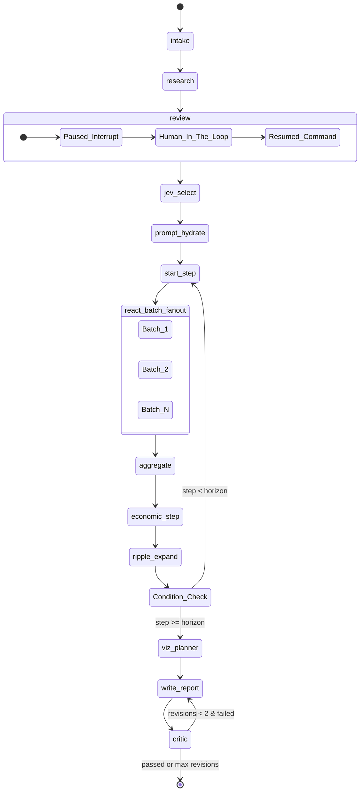

# LegiSim: LangGraph Pipeline Orchestrator Implementation Plan

## 1. Overview & Purpose
This component acts as the central brain of LegiSim. It orchestrates the entire simulation lifecycle using LangGraph. The pipeline is responsible for parsing policy text, conducting autonomous research, pausing for human review, filtering active personas via the JEV (System 1) model, and then running the core economic and behavioral simulation loops. 

Key features include:
- Checkpointing and pausing via `PostgresSaver` and `interrupt()`.
- Resuming workflows via `Command(resume=...)`.
- Highly parallel batch processing using LangGraph's `Send()` API.
- Streaming custom Server-Sent Events (SSE) via `get_stream_writer()` and `stream_mode=["updates", "custom"]`.

## 2. Architecture Diagrams

### Core Orchestration Flow


## 3. Data Schemas

Fully typed representations based on the `SimState` skeleton.

```python
from typing import TypedDict, Annotated, List, Dict, Any, Optional
import operator

class Policy(TypedDict):
    changes: str
    size_of_change: float
    tax_subsidy_flag: str
    target_group: str
    geographic_coverage: str
    start_date: str
    rollout_phases: List[str]

class Cohort(TypedDict):
    id: str
    region: str
    size: int
    age_band: str
    gender: str
    income_band: str
    occupation: str
    urban_rural: str
    education: str
    literacy: str
    trust_in_govt: float
    ideological_lean: float
    agreeableness: float # Big Five model
    weight: float

class Reaction(TypedDict):
    cohort_id: str
    behavior_change: str
    public_acceptance: float
    confidence: float
    source: str # e.g., 'judged (AI reasoning)'

class Metric(TypedDict):
    step: int
    household_income_change: float
    cost_of_living_change: float
    jobs_and_wages_impact: float
    business_impact: float
    govt_fiscal_effect: float
    inequality_poverty: float
    regional_spread: Dict[str, float]
    source: str # e.g., 'modelled (equations)'

class SimState(TypedDict, total=False):
    run_id: str
    policy_text: str
    policy: Policy
    population_spec: Dict[str, Any]
    conditions: Dict[str, Any] # inflation, unemployment, budget_room, etc.
    research: Dict[str, Any]
    cohorts: List[Cohort]       # ALL 2000 baseline personas
    active_cohorts: List[Cohort] # JEV-filtered subset
    hydrated_prompts: List[Dict[str, Any]] # prompt_hydrate output
    step: int
    horizon: int
    reactions: Annotated[List[Reaction], operator.add]
    metrics: Annotated[List[Metric], operator.add]
    ripple: Dict[str, Any]
    viz_specs: List[Dict[str, Any]]
    report: Dict[str, Any]
    revisions: int
    warnings: Annotated[List[str], operator.add]
```

## 4. Detailed Implementation

### Graph Construction & Node Definitions

```python
import operator
import httpx
from typing import Annotated, Literal
from langgraph.graph import StateGraph, START, END
from langgraph.types import interrupt, Command, Send
from langchain_core.runnables.config import RunnableConfig
from langchain_core.callbacks import get_stream_writer
from schemas import SimState # imported from schemas above

def intake(state: SimState, config: RunnableConfig):
    # Parse policy text into structured policy object (Strong LLM)
    writer = get_stream_writer()
    writer({"event": "node_update", "node": "intake", "status": "running"})
    # ... LLM call to structure policy_text ...
    return {"policy": {"changes": state["policy_text"], "size_of_change": 1.0}}

def research(state: SimState):
    # AI 1: plan searches, fetch data, extract facts, find similar past policies
    return {"research": {"facts": [], "past_policies": []}}

def review(state: SimState) -> Command[Literal["jev_select"]]:
    writer = get_stream_writer()
    # Emits a custom SSE so the frontend knows we are waiting for human input
    writer({"event": "interrupt", "message": "Please review assumptions", "data": state.get("research")})
    
    # Pauses the graph. User will resume it by submitting a payload.
    human_feedback = interrupt("Human-in-the-loop checkpoint. Review research assumptions.")
    
    # human_feedback will contain the updated conditions/research passed from Command(resume=...)
    updated_research = human_feedback.get("research", state.get("research"))
    
    return Command(
        update={"research": updated_research},
        resume="jev_select"
    )

def jev_select(state: SimState):
    # JEV System 1 Binary Filter via HTTP POST
    active = []
    try:
        response = httpx.post(
            "http://jev:8000/api/v1/filter", 
            json={"policy": state["policy"], "cohorts": state["cohorts"]},
            timeout=30.0
        )
        response.raise_for_status()
        active = response.json().get("active_cohorts", [])
    except Exception as e:
        # Fallback or error handling
        pass
    return {"active_cohorts": active}

def prompt_hydrate(state: SimState):
    # Strong LLM builds bespoke prompts for active personas
    prompts = [{"cohort_id": c["id"], "prompt": f"Act as {c['region']} resident..."} for c in state["active_cohorts"]]
    return {"hydrated_prompts": prompts}

def start_step(state: SimState):
    # Advances clock
    current_step = state.get("step", 0) + 1
    return {"step": current_step}

def continue_to_react(state: SimState):
    # Map active cohorts to the react_batch node using LangGraph Send() for parallel fan-out
    sends = []
    for prompt_data in state.get("hydrated_prompts", []):
        # We pass only what the batch node needs to avoid bloating state
        sends.append(Send("react_batch", {"prompt_data": prompt_data, "conditions": state["conditions"]}))
    return sends

def react_batch(state: dict):
    # AI 2: Cohorts react (Small fast model)
    # state contains prompt_data and conditions
    reaction = {"cohort_id": state["prompt_data"]["cohort_id"], "behavior_change": "decreased consumption"}
    return {"reactions": [reaction]} # Reducer will merge these

def aggregate(state: SimState):
    # Sum up reactions by group and region
    return {}

def economic_step(state: SimState):
    # Math models using numpy/scipy
    return {"metrics": [{"step": state["step"], "household_income_change": -1.2, "source": "modelled (equations)"}]}

def ripple_expand(state: SimState):
    # Adds new effects to causal graph (code + strong model)
    return {"ripple": {}}

def check_loop(state: SimState) -> Literal["start_step", "viz_planner"]:
    if state["step"] < state["horizon"]:
        return "start_step"
    return "viz_planner"

def viz_planner(state: SimState):
    return {"viz_specs": [{"type": "line", "data": "income"}]}

def write_report(state: SimState):
    revisions = state.get("revisions", 0)
    return {"report": {"text": "Simulation complete."}, "revisions": revisions + 1}

def critic(state: SimState) -> Literal["write_report", "__end__"]:
    # Checks claims match data
    if state["revisions"] < 2:
        return "write_report" # Assume failure for this stub
    return "__end__"

# Graph Assembly
workflow = StateGraph(SimState)
workflow.add_node("intake", intake)
workflow.add_node("research", research)
workflow.add_node("review", review)
workflow.add_node("jev_select", jev_select)
workflow.add_node("prompt_hydrate", prompt_hydrate)
workflow.add_node("start_step", start_step)
workflow.add_node("react_batch", react_batch)
workflow.add_node("aggregate", aggregate)
workflow.add_node("economic_step", economic_step)
workflow.add_node("ripple_expand", ripple_expand)
workflow.add_node("viz_planner", viz_planner)
workflow.add_node("write_report", write_report)
workflow.add_node("critic", critic)

workflow.add_edge(START, "intake")
workflow.add_edge("intake", "research")
workflow.add_edge("research", "review")
# review resumes into jev_select automatically via Command
workflow.add_edge("jev_select", "prompt_hydrate")
workflow.add_edge("prompt_hydrate", "start_step")

# Fan-out to react_batch
workflow.add_conditional_edges("start_step", continue_to_react, ["react_batch"])
workflow.add_edge("react_batch", "aggregate")
workflow.add_edge("aggregate", "economic_step")
workflow.add_edge("economic_step", "ripple_expand")

# Loop check
workflow.add_conditional_edges("ripple_expand", check_loop)

workflow.add_edge("viz_planner", "write_report")
workflow.add_edge("write_report", "critic")
# critic loops or ends conditionally

```

## 5. API Contracts

FastAPI endpoints interacting with the LangGraph state.

**1. POST `/api/v1/simulate`**
Starts the graph.
- **Request**: `{ "policy_text": "...", "horizon": 12, "cohorts": [...] }`
- **Response**: `{ "run_id": "uuid-1234", "status": "started" }`

**2. GET `/api/v1/simulate/{run_id}/stream`**
Streams SSE events from LangGraph `astream_events` / `astream`.
- Uses `stream_mode=["updates", "custom"]`.
- Yields custom events like `review_required` or `node_update`.

**3. POST `/api/v1/simulate/{run_id}/resume`**
Resumes the paused graph from the `review` node.
- **Request**: `{ "human_feedback": { "research": { ... updated assumptions ... } } }`
- **Handler Logic**:
  ```python
  # Interacts with checkpointer to resume
  thread = {"configurable": {"thread_id": run_id}}
  await graph.ainvoke(Command(resume=payload.human_feedback), config=thread)
  ```

## 6. File Structure
```text
legisim-backend/
├── app/
│   ├── api/
│   │   ├── routes.py          # FastAPI endpoints
│   │   └── dependencies.py    # PG Checkpointer injection
│   ├── graph/
│   │   ├── orchestrator.py    # Graph definition and edges
│   │   ├── state.py           # SimState and TypedDicts
│   │   ├── nodes/
│   │   │   ├── initial.py     # intake, research, review
│   │   │   ├── jev_filter.py  # jev_select, prompt_hydrate
│   │   │   ├── loop.py        # start_step, aggregate, economic, ripple
│   │   │   └── reporter.py    # viz_planner, write_report, critic
│   │   └── edges.py           # Conditional routing logic
│   ├── models/
│   │   └── math_engine.py     # Numpy/scipy logic for economic_step
│   └── main.py                # App factory
```

## 7. Docker & Infrastructure
The system uses Docker Compose with PostgresSaver.

```yaml
services:
  backend:
    build: ./backend
    environment:
      - PG_URI=postgresql://user:pass@db:5432/legisim
      - JEV_URL=http://jev:8000
    depends_on:
      - db
      - jev

  jev:
    image: legisim/jev:latest
    deploy:
      resources:
        reservations:
          devices:
            - driver: nvidia # Uses GPU for BERT inference
              count: 1
              capabilities: [gpu]

  db:
    image: pgvector/pgvector:pg16
    volumes:
      - pgdata:/var/lib/postgresql/data
```

## 8. Integration Points
- **PostgreSQL**: Stores checkpoint state (`langgraph.checkpoint.postgres.PostgresSaver`). Thread IDs map to `run_id`.
- **JEV**: External call to `http://jev:8000/api/v1/filter`. Sends 2000 cohorts, receives boolean mask or active subset.
- **SearXNG**: Used in the `research` node via LangChain's `SearxSearchWrapper`.
- **Z.ai GLM API**: Used for `prompt_hydrate`, `react_batch`, and `write_report`. Accessible via standard OpenAI-compatible client.
- **Frontend**: Subscribes to SSE endpoint. MapLibre / ECharts consume the final `viz_specs` and `report` arrays.

## 9. Environment Variables
- `OPENAI_API_KEY` (Used for Z.ai GLM routing)
- `OPENAI_API_BASE` (Set to Z.ai endpoint)
- `PG_URI` (Postgres connection string)
- `JEV_URL` (Internal Docker network URL)
- `SEARXNG_URL` (Internal Docker network URL)
- `LANGFUSE_PUBLIC_KEY` & `LANGFUSE_SECRET_KEY` & `LANGFUSE_HOST` (Observability)

## 10. Testing Requirements
- **Unit Tests (`pytest`)**:
  - Test `SimState` schema validation.
  - Mock `httpx.post` to test `jev_select` returns valid active subsets.
  - Test `check_loop` edge correctly routes based on `step < horizon`.
  - Validate `react_batch` processes correctly without mutating global state inappropriately.
- **Integration Tests**:
  - Run the graph in memory with a mocked checkpointer.
  - Verify that `interrupt()` raises the correct state pause.
  - Verify `Command(resume=...)` properly injects data and continues to `jev_select`.

## 11. Subagent Assignments
- **Agent 1 (State & Infra)**: Implement `schemas.py`, setup PostgresSaver, and build the basic FastAPI shell.
- **Agent 2 (Graph & Flow)**: Implement `orchestrator.py` with dummy nodes, wire up all edges including `Send()` fan-out and `interrupt()`.
- **Agent 3 (Math & Integration)**: Implement actual HTTP calls in `jev_select` and the numpy logic in `economic_step`.
- **Agent 4 (API & Streaming)**: Build the SSE endpoint, translating graph stream events into frontend-ready JSON updates.
