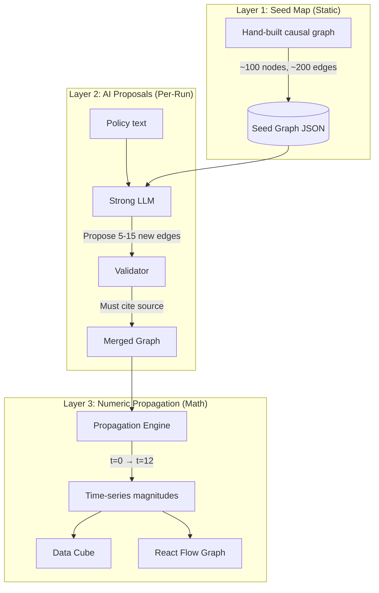

# Ripple Effect Engine — Implementation Plan

> The signature feature of LegiSim. Policies don't have one effect — they have cascading chains of cause and effect.

## Overview

The Ripple Engine models how a single policy change (e.g., "fuel price +₹10/L") cascades through the economy and society in waves. It operates in **3 layers**:

1. **Seed Map** — Hand-built, trusted causal graph of established economic relationships
2. **AI Proposals** — Strong LLM suggests policy-specific extra causal links (validated)
3. **Numeric Propagation** — Deterministic mathematical calculation of magnitudes over time steps

---

## Architecture



---

## Layer 1: Seed Map

### Purpose
A **static, curated** directed graph of trusted causal relationships in the Indian economy. This is the backbone — it should be correct, well-sourced, and comprehensive enough to capture the major transmission channels.

### Node Schema
```python
from pydantic import BaseModel, Field
from typing import Literal
from enum import Enum

class DomainEnum(str, Enum):
    POLICY = "policy"
    TRANSPORT = "transport"
    AGRICULTURE = "agriculture"
    BUSINESS = "business"
    CONSUMER = "consumer"
    INCOME = "income"
    ECONOMY = "economy"
    SOCIAL = "social"
    POLITICAL = "political"
    FISCAL = "fiscal"
    HEALTH = "health"
    EDUCATION = "education"
    ENERGY = "energy"
    EMPLOYMENT = "employment"

class RippleNodeSchema(BaseModel):
    """A node in the causal graph representing an economic/social variable."""
    id: str = Field(..., description="Unique slug, e.g. 'fuel_price', 'food_inflation'")
    label: str = Field(..., description="Human-readable name")
    domain: DomainEnum
    unit: str = Field(..., description="e.g. 'percent', 'INR/L', 'index', 'count'")
    baseline_value: float | None = Field(None, description="Current real-world value if known")
    description: str = Field("", description="One-line explanation of this variable")

class RippleEdgeSchema(BaseModel):
    """A causal link between two nodes."""
    source: str = Field(..., description="Source node ID")
    target: str = Field(..., description="Target node ID")
    strength: float = Field(..., ge=-1.0, le=1.0, description="Elasticity: -1 to 1. Positive = same direction, negative = inverse")
    lag_months: int = Field(..., ge=0, le=24, description="How many months the effect takes to manifest")
    mechanism: str = Field(..., description="One-sentence causal explanation")
    source_citation: str = Field("", description="Academic paper, RBI report, or policy analogue ID")
    confidence: Literal["high", "medium", "low"] = "medium"
    is_feedback: bool = Field(False, description="True if this edge creates a cycle")
    damping: float = Field(0.0, ge=0.0, le=1.0, description="Damping factor for feedback loops (0 = no damping)")
```

### Initial Seed Map Categories (100+ nodes)
Build the seed map in these domain clusters:

| Domain | Example Nodes | Count |
|--------|--------------|-------|
| Energy | fuel_price, electricity_price, lpg_price, coal_price | ~8 |
| Transport | freight_cost, public_transit_fare, road_toll | ~6 |
| Agriculture | agri_input_cost, crop_price, fertilizer_cost, irrigation_cost, farm_income | ~10 |
| Consumer | food_basket_cost, clothing_cost, housing_rent, healthcare_cost | ~8 |
| Income | rural_wage, urban_salary, informal_income, pension_value | ~8 |
| Employment | agri_employment, manufacturing_jobs, service_jobs, informal_employment | ~8 |
| Economy (Macro) | cpi_inflation, wpi_inflation, gdp_growth, fiscal_deficit, interest_rate | ~10 |
| Fiscal | tax_revenue, subsidy_expenditure, govt_spending, budget_deficit | ~8 |
| Social | migration_rate, school_enrollment, crime_rate, protest_frequency | ~8 |
| Political | public_approval, voter_turnout, media_sentiment | ~5 |
| Health | malnutrition_rate, healthcare_access, out_of_pocket_health_spend | ~6 |
| Finance | bank_lending, npa_rate, stock_market, fdi_inflow | ~6 |

### Key Causal Chains (Examples)
```
fuel_price → freight_cost → food_basket_cost → cpi_inflation
fuel_price → agri_input_cost → farm_income → rural_wage
fuel_price → public_transit_fare → commute_cost → urban_salary (effective)
subsidy_removal → fiscal_savings → govt_spending → public_infrastructure
interest_rate → bank_lending → manufacturing_investment → manufacturing_jobs
```

### Storage
```sql
-- Seed map stored in PostgreSQL for versioning
CREATE TABLE seed_map_nodes (
    id TEXT PRIMARY KEY,
    label TEXT NOT NULL,
    domain TEXT NOT NULL,
    unit TEXT NOT NULL,
    baseline_value FLOAT,
    description TEXT,
    version INT DEFAULT 1,
    created_at TIMESTAMPTZ DEFAULT NOW()
);

CREATE TABLE seed_map_edges (
    id SERIAL PRIMARY KEY,
    source_id TEXT REFERENCES seed_map_nodes(id),
    target_id TEXT REFERENCES seed_map_nodes(id),
    strength FLOAT NOT NULL CHECK (strength BETWEEN -1.0 AND 1.0),
    lag_months INT NOT NULL CHECK (lag_months >= 0),
    mechanism TEXT NOT NULL,
    source_citation TEXT,
    confidence TEXT DEFAULT 'medium',
    is_feedback BOOLEAN DEFAULT FALSE,
    damping FLOAT DEFAULT 0.0,
    version INT DEFAULT 1,
    UNIQUE(source_id, target_id, version)
);
```

---

## Layer 2: AI Proposals

### Purpose
For each specific policy, the Strong LLM identifies **additional causal links** that aren't in the seed map but are relevant to this particular policy.

### Process
1. **Input to LLM:**
   - Policy description (structured object from `intake` node)
   - Full seed map graph (as adjacency list)
   - Research facts gathered by the research agent
   - Historical analogues found

2. **LLM Prompt:**
```python
RIPPLE_PROPOSAL_PROMPT = """
You are an economic policy analyst. Given a policy and an existing causal graph,
propose additional causal links that this specific policy would activate.

## Policy
{policy_description}

## Existing Causal Graph
{seed_map_adjacency}

## Research Facts
{research_facts}

## Historical Analogues
{analogues}

## Instructions
Propose 5-15 NEW causal edges not already in the graph.
For each edge, you MUST provide:
- source: existing or new node ID
- target: existing or new node ID  
- strength: elasticity between -1.0 and 1.0
- lag_months: integer 0-24
- mechanism: one sentence explaining the causal mechanism
- source_citation: reference to a data source, academic paper, or analogue ID
- confidence: "high", "medium", or "low"

If you propose a NEW node (not in the existing graph), also include:
- id, label, domain, unit

RULES:
- Every edge MUST have a source_citation. If you cannot cite a source, mark confidence as "low".
- Do NOT propose edges that are already in the seed map.
- Prefer well-established economic relationships over speculative ones.
- If proposing a feedback loop, set is_feedback=true and damping > 0.

Return a JSON array of proposed edges (and optional new nodes).
"""
```

3. **Validation Rules:**
```python
def validate_ai_proposal(proposal: dict, seed_map: dict) -> bool:
    """Validate an AI-proposed causal edge."""
    # Rule 1: Must have a mechanism explanation
    if not proposal.get("mechanism") or len(proposal["mechanism"]) < 10:
        return False
    
    # Rule 2: Must cite a source (or be marked low confidence)
    if not proposal.get("source_citation") and proposal.get("confidence") != "low":
        return False
    
    # Rule 3: Strength must be reasonable
    if abs(proposal.get("strength", 0)) > 1.0:
        return False
    
    # Rule 4: Lag must be non-negative
    if proposal.get("lag_months", -1) < 0:
        return False
    
    # Rule 5: No duplicate edges
    edge_key = (proposal["source"], proposal["target"])
    if edge_key in seed_map.get("existing_edges", set()):
        return False
    
    # Rule 6: Source and target must exist (or be newly proposed)
    valid_nodes = set(seed_map.get("node_ids", [])) | set(proposal.get("new_node_ids", []))
    if proposal["source"] not in valid_nodes or proposal["target"] not in valid_nodes:
        return False
    
    return True
```

4. **Merge into Active Graph:**
```python
def merge_proposals(seed_graph: dict, proposals: list[dict]) -> dict:
    """Merge validated AI proposals into the active ripple graph."""
    active_graph = copy.deepcopy(seed_graph)
    
    for proposal in proposals:
        if validate_ai_proposal(proposal, seed_graph):
            # Add new nodes if any
            for new_node in proposal.get("new_nodes", []):
                active_graph["nodes"][new_node["id"]] = new_node
            
            # Add the edge
            active_graph["edges"].append({
                **proposal,
                "is_ai_proposed": True,  # Flag for UI
                "layer": 2,  # AI-proposed layer
            })
    
    return active_graph
```

---

## Layer 3: Numeric Propagation

### Purpose
Given the causal graph and an initial shock (the policy), **deterministically calculate** how magnitudes change across all nodes over 12 time steps (months).

### Algorithm: Weighted Causal Propagation

```python
import numpy as np
from scipy.sparse import lil_matrix

class RipplePropagator:
    """Deterministic causal propagation engine using sparse matrices."""
    
    def __init__(self, nodes: list[dict], edges: list[dict], total_steps: int = 12):
        self.nodes = {n["id"]: i for i, n in enumerate(nodes)}
        self.node_list = nodes
        self.n = len(nodes)
        self.total_steps = total_steps
        
        # Build adjacency and lag matrices
        self.adj = lil_matrix((self.n, self.n))  # strength matrix
        self.lag = np.zeros((self.n, self.n), dtype=int)  # lag matrix
        self.damping = np.ones(self.n) * 0.95  # default damping per node
        
        for edge in edges:
            i = self.nodes[edge["source"]]
            j = self.nodes[edge["target"]]
            self.adj[i, j] = edge["strength"]
            self.lag[i, j] = edge["lag_months"]
            if edge.get("is_feedback"):
                self.damping[j] = min(self.damping[j], 1.0 - edge.get("damping", 0.1))
        
        self.adj = self.adj.tocsr()
        
        # History: shape (total_steps + 1, n_nodes)
        self.history = np.zeros((total_steps + 1, self.n))
    
    def set_initial_shock(self, node_id: str, magnitude: float):
        """Set the policy shock at t=0."""
        idx = self.nodes[node_id]
        self.history[0, idx] = magnitude
    
    def propagate(self) -> np.ndarray:
        """Run propagation for all time steps."""
        for t in range(1, self.total_steps + 1):
            for j in range(self.n):
                # Decay from previous step
                val = self.history[t-1, j] * self.damping[j]
                
                # Add incoming effects from all sources, respecting lag
                for i in range(self.n):
                    if self.adj[i, j] != 0:
                        lag = self.lag[i, j]
                        source_t = t - lag
                        if source_t >= 0:
                            val += self.history[source_t, i] * self.adj[i, j]
                
                self.history[t, j] = val
        
        return self.history
    
    def get_node_timeline(self, node_id: str) -> list[float]:
        """Get the time series for a specific node."""
        idx = self.nodes[node_id]
        return self.history[:, idx].tolist()
    
    def get_snapshot(self, time_step: int) -> dict[str, float]:
        """Get all node magnitudes at a specific time step."""
        return {
            node_id: self.history[time_step, idx]
            for node_id, idx in self.nodes.items()
        }
    
    def to_react_flow(self, time_step: int) -> dict:
        """Export current state as React Flow compatible format."""
        nodes = []
        edges = []
        
        for node in self.node_list:
            idx = self.nodes[node["id"]]
            magnitude = self.history[time_step, idx]
            nodes.append({
                "id": node["id"],
                "label": node["label"],
                "layer": self._compute_layer(node["id"]),
                "domain": node["domain"],
                "magnitude": f"{magnitude:+.1f}%",
                "confidence": node.get("confidence", "medium"),
                "kind": "measured" if abs(magnitude) > 0.1 else "modelled",
            })
        
        # ... edge conversion
        return {"nodes": nodes, "edges": edges}
    
    def _compute_layer(self, node_id: str) -> int:
        """BFS from policy node to determine layer depth."""
        # Layer 0 = policy node, Layer 1 = direct effects, etc.
        # Implemented via BFS
        pass
```

### Monte Carlo Uncertainty

```python
def run_monte_carlo(
    nodes: list[dict],
    edges: list[dict],
    policy_shock: tuple[str, float],
    n_runs: int = 100,
    noise_std: float = 0.1,
) -> dict:
    """Run multiple propagations with perturbed strengths for uncertainty bands."""
    results = []
    
    for _ in range(n_runs):
        # Perturb edge strengths by ±noise_std
        perturbed_edges = []
        for edge in edges:
            noisy = {**edge}
            noisy["strength"] = np.clip(
                edge["strength"] + np.random.normal(0, noise_std),
                -1.0, 1.0
            )
            perturbed_edges.append(noisy)
        
        prop = RipplePropagator(nodes, perturbed_edges)
        prop.set_initial_shock(*policy_shock)
        prop.propagate()
        results.append(prop.history)
    
    stacked = np.stack(results)  # (n_runs, steps, nodes)
    
    return {
        "mean": np.mean(stacked, axis=0),
        "p10": np.percentile(stacked, 10, axis=0),
        "p90": np.percentile(stacked, 90, axis=0),
        "std": np.std(stacked, axis=0),
    }
```

---

## Frontend Rendering (React Flow)

The ripple graph is displayed using `@xyflow/react`. The backend exports data in the format the frontend expects:

```typescript
// From the prototype — this is the exact format to produce
interface RippleNode {
  id: string;
  label: string;
  layer: number;         // BFS depth from policy node
  domain: string;        // Color-coding in UI
  magnitude: string;     // e.g., "+14.2%"
  confidence: 'High' | 'Medium' | 'Low';
  kind: 'measured' | 'modelled' | 'judged';
}

interface RippleEdge {
  id: string;
  source: string;
  target: string;
  strength: number;      // Edge thickness in UI
  lagMonths: number;     // Shown as label
  mechanism: string;     // Tooltip text
}
```

The frontend positions nodes by layer (left to right) and colors them by domain. The "Play" button animates through time steps, updating magnitudes at each step.

---

## File Structure

```
backend/app/engine/ripple/
├── __init__.py
├── seed_map.py          # Load/validate seed map from DB
├── proposer.py          # AI proposal node (Layer 2)
├── propagator.py        # Numeric propagation (Layer 3)
├── monte_carlo.py       # Uncertainty quantification
├── exporter.py          # Export to React Flow format
└── data/
    └── seed_map_v1.json # Initial hand-built seed map
```

---

## Subagents & Implementation Order

| Step | Agent | Task | Depends On |
|------|-------|------|-----------|
| 1 | `data-analyst` | Research and build initial 100-node seed map JSON | Nothing |
| 2 | `copilot` | Design the AI proposal prompt + validation rules | Step 1 |
| 3 | `backend-implementer` | Implement `RipplePropagator` class with NumPy/SciPy | Step 1 |
| 4 | `backend-implementer` | Implement Monte Carlo runner | Step 3 |
| 5 | `copilot` | Integrate into LangGraph `ripple_expand` node | Steps 2-4 |
| 6 | `test-writer` | Write tests: propagation correctness, cycle detection, damping | Steps 3-4 |
| 7 | `ui-builder` | Connect React Flow to `/runs/:id/ripple` endpoint | Steps 5-6 |

---

## Acceptance Criteria

- [ ] Seed map has 80+ nodes with documented sources
- [ ] AI can propose 5-15 valid new edges per policy
- [ ] Propagation produces 12-month time series for all nodes
- [ ] Monte Carlo produces p10/p90 confidence bands
- [ ] Feedback loops are damped (no infinite growth)
- [ ] React Flow renders the graph with correct layering and colors
- [ ] Play button animates through time steps
- [ ] Every edge tooltip shows its mechanism
