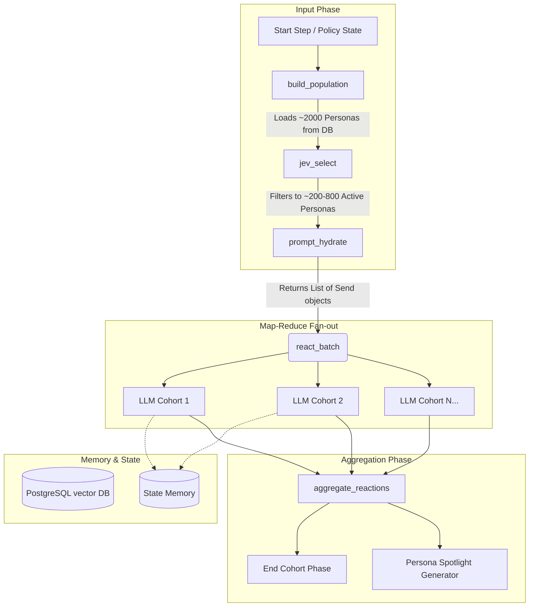

# 03 - Cohort Agents Plan (JEV Integrated)

## 1. Overview & Purpose
This component implements the **Cohort Agents Sub-graph** within the main simulation LangGraph. It is responsible for simulating the reactions and behavioral changes of various demographic groups (cohorts/personas) to a given policy step.

Key responsibilities:
- Fetch baseline personas from PostgreSQL.
- Filter the population to the most relevant personas using the **JEV (Joint Embedding Vector) BERT model**.
- Construct detailed, context-rich prompts (incorporating memory, historical analogues, and guardrails).
- Fan-out to LLMs (via `Send()`) to simulate the reactions for the selected cohorts.
- Aggregate responses into prediction outputs (behavioral changes, public acceptance, backlash risk).
- Handle Personality Lenses (Big Five agreeableness) and generate Persona Spotlights.

## 2. Architecture Diagram



## 3. Data Schemas

### Cohort Card Schema (JEV Compatible & Detailed)
```python
from pydantic import BaseModel, Field
from typing import Dict, List, Optional

class Demographics(BaseModel):
    age: str # Child(0-6), Adolescents(7-14), Youth(15-24), Active Productive(25-59), Elderly(60+)
    income: str # Wealth Quintiles (e.g., lower_mid, low, high)
    location: str # Rural Revenue Villages, Statutory Towns, Census Towns
    education: str # Literate, Illiterate, Primary, Middle, Secondary, Graduate+, etc.
    occupation: str # Main workers, Marginal Workers, Cultivators, Agricultural Labourers, etc.
    region: str # e.g., Karnataka

class SpendMix(BaseModel):
    food: float
    fuel: float
    transport: float
    other: float

class CohortCard(BaseModel):
    id: str # e.g., urban_gig_worker_tier1
    cohort_id: str # e.g., KA-rural-lowinc-farm-30to45
    weight: int = Field(description="Population multiplier")
    demographics: Demographics
    
    assets_and_vulnerabilities: List[str]
    economic_dependency: List[str]
    
    spend_mix: SpendMix
    trust_in_govt: float
    agreeableness_lean: float # Big Five, Editable assumption
    
    # Exclude explicitly from prompts/generation: caste, religion
```

### Reaction Output Schema
```python
class BehaviourChange(BaseModel):
    what: str
    share: float

class Stance(BaseModel):
    support: float
    neutral: float
    oppose: float

class ReactionOutput(BaseModel):
    cohort_id: str
    step: int
    stance: Stance
    behaviour_changes: List[BehaviourChange]
    reasoning: str = Field(description="One or two sentences citing analogue or data")
    analogue_ids: List[str]
    confidence: float
```

## 4. Detailed Implementation

### State Definition
```python
from langgraph.graph import MessagesState
import operator
from typing import Annotated, TypedDict, List

class CohortState(TypedDict):
    policy_id: str
    step: int
    policy_details: dict
    population: List[CohortCard]
    active_cohorts: List[CohortCard] # Filtered by JEV
    prompts: List[dict] # Hydrated prompts
    reactions: Annotated[List[ReactionOutput], operator.add]
    memory: dict # step-by-step memory for each cohort
    predictions: dict
```

### JEV Selection (jev_select)
```python
import httpx

async def jev_select(state: CohortState):
    """
    Uses the JEV BERT model to filter the baseline population based on policy relevance.
    """
    policy_embedding = await get_policy_embedding(state['policy_details'])
    active_cohorts = []
    
    # Send batch to JEV scoring endpoint
    async with httpx.AsyncClient() as client:
        response = await client.post(
            f"{env.JEV_API_URL}/score_batch",
            json={
                "policy_embedding": policy_embedding,
                "cohort_ids": [c.id for c in state['population']]
            }
        )
        scores = response.json()
        
    for cohort, score in zip(state['population'], scores):
        if score > env.JEV_THRESHOLD: # Top 200-800
            active_cohorts.append(cohort)
            
    return {"active_cohorts": active_cohorts}
```

### Prompt Design & Hydration (prompt_hydrate)
Guardrails implemented here:
- NO caste/religion inference
- Must stay within data, AI only adjusts starting estimate

```python
def prompt_hydrate(state: CohortState):
    prompts = []
    for cohort in state['active_cohorts']:
        memory_str = format_memory(state['memory'].get(cohort.id, []))
        
        system_prompt = f"""You are a precise demographic simulator.
        RULES:
        1. Base reactions on data, do not invent from nothing. Adjust data-driven estimates.
        2. DO NOT assume uniform reactions within the cohort. Produce a probability distribution.
        3. DO NOT infer or mention caste or religion.
        4. Acknowledge uncertainty if historical analogues do not match perfectly.
        """
        
        user_prompt = f"""
        COHORT: {cohort.model_dump_json()}
        POLICY STEP: {state['policy_details']}
        PAST MEMORY: {memory_str}
        
        Generate the reaction output for this step.
        """
        prompts.append({"cohort": cohort, "prompt": [("system", system_prompt), ("user", user_prompt)]})
    
    return {"prompts": prompts}
```

### Fan-Out with LangGraph Send API
```python
from langgraph.constants import Send

def start_react_batch(state: CohortState):
    """
    Maps over active cohorts using Send()
    """
    return [Send("react_node", {"prompt_data": p, "step": state["step"]}) for p in state["prompts"]]

async def react_node(inputs: dict):
    # LLM Call to Z.ai GLM API using structured output
    response = await llm.with_structured_output(ReactionOutput).ainvoke(inputs["prompt_data"]["prompt"])
    
    # Handle personality lens (if enabled, run a more/less agreeable variant and compare)
    # ...
    
    return {"reactions": [response]}
```

## 5. Aggregation and Predictions
The `aggregate_reactions` node collects all `ReactionOutput` objects, weighting them by `cohort.weight`.

Outputs produced:
1. **Behavior Change**: Weighted share of groups changing spending, travel, etc.
2. **Public Acceptance**: Overall Support/Neutral/Oppose over time.
3. **Political Backlash Risk**: Low/Medium/High classification based on opposition intensity.
4. **Persona Spotlight**: Pick 3-5 typical cohorts and use a strong LLM to write a short human story based *only* on facts from the simulation records (used on Groups page).

## 6. Integration Points
- **Input**: Database loaded via `psycopg`/`SQLAlchemy` in `build_population`.
- **JEV**: External REST API call to self-hosted JEV BERT container.
- **LLM**: Z.ai GLM API for `react_node`.
- **Output**: Writes back to PostgreSQL (State persistence).

## 7. Environment Variables
- `JEV_API_URL`: URL of the self-hosted JEV service (e.g., `http://jev:8000`).
- `ZAI_GLM_API_KEY`: Key for Z.ai LLM.
- `POSTGRES_URL`: Connection string for pgvector.

## 8. Subagent Assignments
- **Agent A (Data & JEV Integration)**: Build `build_population` and `jev_select` nodes. Setup Pydantic models.
- **Agent B (Prompting & Guardrails)**: Implement `prompt_hydrate`, enforcing the prompt rules and guardrails, including memory loading.
- **Agent C (Graph & LLM)**: Implement `react_node` with structured output, `start_react_batch` using `Send()`, and the aggregation logic (including Persona Spotlight).
