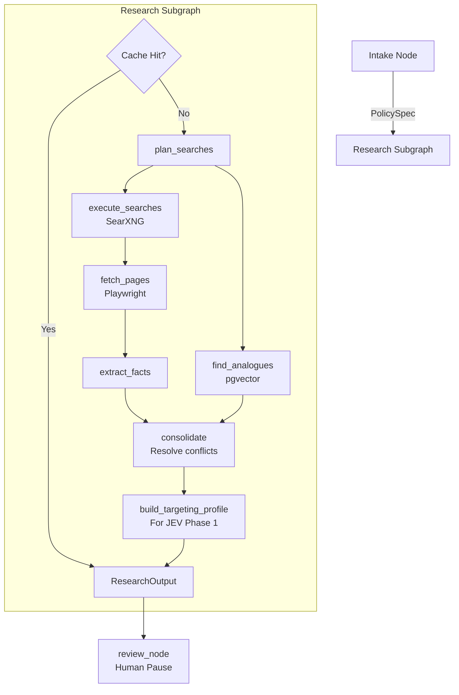

# Research Agent Engine — Implementation Plan

> **Role:** The research engine (AI 1) gathers real-world context, finds historical analogues, and prepares the "Targeting Profile" used by the JEV selection engine. Uses Strong model + Search tools.

---

## 1. Overview & Purpose

The Research node is actually a LangGraph subgraph. When a user submits a policy (e.g., "Increase diesel tax by ₹10"), the Research Agent:
1. Figures out what it needs to know (prices, statistics).
2. Searches the web (via self-hosted SearXNG).
3. Searches the database for similar past policies (via pgvector).
4. Resolves conflicting data.
5. Generates a **Targeting Profile** (Phase 1 of JEV) that describes exactly who is affected.

---

## 2. Architecture & Data Flow



---

## 3. Tool Integrations

### 3.1 SearXNG (Web Search)
- We use a self-hosted SearXNG Docker container to avoid API limits.
- Endpoint: `http://searxng:8080/search?q={query}&format=json`
- The LLM generates 3-5 search queries simultaneously.

### 3.2 pgvector (Historical Analogues)
- The database contains a `policy_analogues` table.
- Each analogue (e.g., "2016 Demonetisation", "2018 Fuel Hike") has an embedding vector.
- The `find_analogues` node embeds the current `PolicySpec` using `sentence-transformers/all-MiniLM-L6-v2` and runs a cosine similarity search to pull the top 3 analogues.

---

## 4. Conflict Resolution

Web searches often return conflicting numbers (e.g., "Current diesel price is ₹90" vs "Current diesel price is ₹94").
The `consolidate` node uses the LLM to:
1. Prefer official government sources (RBI, MoSPI, PPAC) over news articles.
2. If sources have equal weight, take the average or represent it as a range.
3. Output the final resolved data as `Assumptions`, which the user can edit in the `review` node.

---

## 5. The Targeting Profile (JEV Phase 1)

This is the most critical output. The LLM must translate the policy and the research into a semantic profile that JEV can use to filter personas.

```python
# Output required for JEV Phase 1
class TargetingProfile(BaseModel):
    summary: str
    direct_impact_criteria: str     # e.g., "Commercial vehicle operators, farmers"
    indirect_impact_criteria: str   # e.g., "Urban commuters via freight costs"
    geographic_focus: str           # e.g., "Nationwide"
    economic_channels: List[str]    # e.g., ["fuel_prices", "freight"]
```

---

## 6. Subgraph State & Implementation

```python
# backend/app/graph/nodes/research.py
from typing import TypedDict
from langchain_openai import ChatOpenAI
from app.schemas.jev import TargetingProfile

class ResearchState(TypedDict):
    policy: dict
    queries: list[str]
    search_results: list[dict]
    extracted_facts: list[dict]
    analogues: list[dict]
    targeting_profile: dict

async def build_targeting_profile(state: ResearchState) -> dict:
    llm = ChatOpenAI(model="glm-4-plus", temperature=0.1)
    
    prompt = """
    Based on the policy and the research facts gathered, generate a Targeting Profile.
    This profile will be used by a BERT embedding model to find relevant demographic cohorts.
    Be highly descriptive in the direct and indirect impact criteria.
    Use terms like 'rural', 'urban', 'low income', 'gig worker', 'farmer'.
    """
    
    structured_llm = llm.with_structured_output(TargetingProfile)
    result = await structured_llm.ainvoke([
        ("system", prompt),
        ("user", f"Policy: {state['policy']}\nFacts: {state['extracted_facts']}")
    ])
    
    return {"targeting_profile": result.model_dump()}
```

## Subagent Assignments
- `copilot`: Implement the LangGraph subgraph for research.
- `api-integration-specialist`: Set up the SearXNG Docker container and Python HTTP client.
