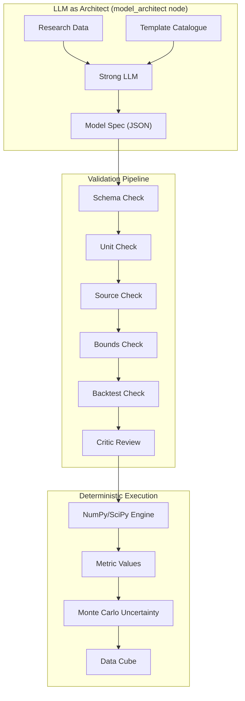

# Mathematical Model Engine — Implementation Plan

> **STRICT RULE: Any output about money, prices, jobs, or the budget MUST be produced deterministically via Python code (NumPy/SciPy). LLMs are FORBIDDEN from guessing numerical economic metrics.**

## Overview

The Math Model Engine is the guardrail that ensures LegiSim's economic numbers are **calculated, not hallucinated**. The LLM acts as an "architect" — it reads research data and selects a template from a fixed catalogue, filling in parameters with sourced values. The actual computation is done by Python/NumPy/SciPy.

---

## Architecture



---

## Template Catalogue

The LLM can ONLY choose from these pre-built templates. Each template has a fixed mathematical form and validated Python implementation.

### Template 1: Linear Pass-Through
```python
class LinearPassThrough:
    """Direct proportional transmission of a shock.
    Example: Fuel price +10% → Freight cost +X%
    """
    def __init__(self, share: float, pass_through_rate: float = 1.0):
        """
        Args:
            share: Cost share (e.g., fuel is 40% of freight cost → 0.4)
            pass_through_rate: How much of the cost is passed on (0-1)
        """
        self.share = share
        self.pass_through_rate = pass_through_rate
    
    def compute(self, shock_percent: float) -> float:
        """Returns the percentage change in the target variable."""
        return shock_percent * self.share * self.pass_through_rate
    
    @property
    def formula(self) -> str:
        return "Δtarget = Δsource × share × pass_through_rate"
```

### Template 2: Elasticity (Log-Log)
```python
class Elasticity:
    """Price elasticity: %ΔQ = ε × %ΔP
    Example: Fuel price +10%, demand elasticity = -0.3 → demand -3%
    """
    def __init__(self, elasticity: float, source_label: str = "price"):
        self.elasticity = elasticity
        self.source_label = source_label
    
    def compute(self, shock_percent: float) -> float:
        return self.elasticity * shock_percent
    
    @property
    def formula(self) -> str:
        return f"%ΔQ = {self.elasticity} × %Δ{self.source_label}"
```

### Template 3: Multiplicative Price Transmission
```python
class MultiplePriceTransmission:
    """Multi-hop price transmission through a supply chain.
    Example: Input cost → wholesale price → retail price
    """
    def __init__(self, stages: list[dict]):
        """
        Args:
            stages: [{"label": "Wholesale", "markup": 0.15, "pass_through": 0.8}, ...]
        """
        self.stages = stages
    
    def compute(self, initial_shock: float) -> list[dict]:
        results = []
        current = initial_shock
        for stage in self.stages:
            transmitted = current * stage["pass_through"]
            final = transmitted * (1 + stage["markup"])
            results.append({
                "stage": stage["label"],
                "input_shock": current,
                "transmitted": transmitted,
                "with_markup": final,
            })
            current = final
        return results
```

### Template 4: Input-Output Multiplier
```python
class InputOutputMultiplier:
    """Leontief input-output model for sector-level impacts.
    Uses India's I-O table to compute indirect effects.
    """
    def __init__(self, io_matrix: np.ndarray, sector_names: list[str]):
        self.io_matrix = io_matrix
        self.sector_names = sector_names
        n = len(sector_names)
        self.leontief_inverse = np.linalg.inv(np.eye(n) - io_matrix)
    
    def compute(self, shock_vector: np.ndarray) -> dict:
        """
        Args:
            shock_vector: Change in final demand by sector
        Returns:
            Total output change by sector (direct + indirect)
        """
        total_impact = self.leontief_inverse @ shock_vector
        return {
            name: {"direct": shock_vector[i], "total": total_impact[i], "multiplier": total_impact[i] / max(shock_vector[i], 1e-10)}
            for i, name in enumerate(self.sector_names)
        }
```

### Template 5: Budget Identity
```python
class BudgetIdentity:
    """Accounting identity: Income = Spending + Savings
    Forces budgets to balance.
    """
    def __init__(self, categories: list[str], baseline_shares: dict[str, float]):
        self.categories = categories
        self.baseline = baseline_shares  # must sum to 1.0
    
    def compute(self, income_change: float, price_changes: dict[str, float]) -> dict:
        """Given income change and category price changes, compute new budget allocation."""
        new_income = 1.0 + income_change / 100
        
        # Each category's real spending = baseline * (1 + price_change)
        real_costs = {}
        total_cost = 0
        for cat in self.categories:
            cost = self.baseline[cat] * (1 + price_changes.get(cat, 0) / 100)
            real_costs[cat] = cost
            total_cost += cost
        
        # If total cost > income, squeeze discretionary
        if total_cost > new_income:
            squeeze_ratio = new_income / total_cost
            real_costs = {k: v * squeeze_ratio for k, v in real_costs.items()}
        
        savings = new_income - sum(real_costs.values())
        return {"spending": real_costs, "savings_rate": savings / new_income}
```

### Template 6: Distributed Lag
```python
class DistributedLag:
    """Effects that manifest over multiple time periods.
    Uses Almon polynomial or geometric lag distribution.
    """
    def __init__(self, lag_type: str = "geometric", decay: float = 0.5, max_lag: int = 12):
        self.lag_type = lag_type
        self.decay = decay
        self.max_lag = max_lag
        self.weights = self._compute_weights()
    
    def _compute_weights(self) -> np.ndarray:
        if self.lag_type == "geometric":
            w = np.array([(1 - self.decay) * self.decay**i for i in range(self.max_lag)])
        elif self.lag_type == "uniform":
            w = np.ones(self.max_lag) / self.max_lag
        elif self.lag_type == "front_loaded":
            w = np.array([1.0 / (i + 1) for i in range(self.max_lag)])
            w /= w.sum()
        return w
    
    def compute(self, total_effect: float) -> list[float]:
        """Distribute the total effect over time periods."""
        return (self.weights * total_effect).tolist()
```

### Template 7: Feedback Loop
```python
class FeedbackLoop:
    """Circular causation with convergence.
    Example: Price rise → demand drop → supply surplus → price correction
    """
    def __init__(self, gain: float, damping: float = 0.1, max_iterations: int = 20):
        assert abs(gain * (1 - damping)) < 1.0, "Feedback loop must converge"
        self.gain = gain
        self.damping = damping
        self.max_iterations = max_iterations
    
    def compute(self, initial: float) -> tuple[float, list[float]]:
        """Returns (steady_state, trajectory)."""
        trajectory = [initial]
        current = initial
        for _ in range(self.max_iterations):
            current = current * self.gain * (1 - self.damping)
            trajectory.append(current)
            if abs(current) < 1e-6:
                break
        steady_state = sum(trajectory)
        return steady_state, trajectory
```

### Template 8: Monte Carlo Wrapper
```python
class MonteCarloWrapper:
    """Wraps any template with parameter uncertainty."""
    def __init__(self, base_template, param_uncertainties: dict[str, tuple[float, float]]):
        """
        Args:
            param_uncertainties: {"param_name": (mean, std)} for each uncertain parameter
        """
        self.base = base_template
        self.uncertainties = param_uncertainties
    
    def run(self, n_samples: int = 200, **compute_kwargs) -> dict:
        results = []
        for _ in range(n_samples):
            # Perturb parameters
            for param, (mean, std) in self.uncertainties.items():
                setattr(self.base, param, np.random.normal(mean, std))
            results.append(self.base.compute(**compute_kwargs))
        
        return {
            "mean": np.mean(results),
            "median": np.median(results),
            "p10": np.percentile(results, 10),
            "p90": np.percentile(results, 90),
            "std": np.std(results),
        }
```

---

## LLM as Architect (`model_architect` node)

### Prompt

```python
MODEL_ARCHITECT_PROMPT = """
You are an economic model architect. Given research data about a policy, select
appropriate mathematical models from the FIXED CATALOGUE below.

## Policy
{policy_description}

## Research Data
{research_facts}

## FIXED TEMPLATE CATALOGUE
1. LinearPassThrough(share, pass_through_rate) — "Δtarget = Δsource × share × rate"
2. Elasticity(elasticity) — "%ΔQ = ε × %ΔP"
3. MultiplePriceTransmission(stages) — Multi-hop supply chain transmission
4. InputOutputMultiplier(sector_shocks) — Leontief I-O model
5. BudgetIdentity(income_change, price_changes) — Household budget balancing
6. DistributedLag(lag_type, decay, total_effect) — Temporal distribution of effects
7. FeedbackLoop(gain, damping, initial) — Circular causation
8. MonteCarloWrapper(template, uncertainties) — Uncertainty bands

## Instructions
For each key economic metric that needs to be computed, specify:
1. Which template to use
2. All parameter values (with sources)
3. Why this template is appropriate

Return a JSON array of model specifications:
```json
[
  {{
    "metric": "freight_cost_change",
    "template": "LinearPassThrough",
    "params": {{"share": 0.4, "pass_through_rate": 0.85}},
    "shock_input": "fuel_price_change",
    "source": "AITD Annual Report 2023: fuel is 35-45% of freight costs",
    "reasoning": "Direct cost share transmission"
  }}
]
```

RULES:
- You MUST use templates from the catalogue. No custom formulas.
- Every parameter MUST cite a data source.
- If uncertain about a parameter, use MonteCarloWrapper with the uncertainty range.
"""
```

### Spec Validation Pipeline

```python
TEMPLATE_REGISTRY = {
    "LinearPassThrough": LinearPassThrough,
    "Elasticity": Elasticity,
    "MultiplePriceTransmission": MultiplePriceTransmission,
    "InputOutputMultiplier": InputOutputMultiplier,
    "BudgetIdentity": BudgetIdentity,
    "DistributedLag": DistributedLag,
    "FeedbackLoop": FeedbackLoop,
    "MonteCarloWrapper": MonteCarloWrapper,
}

def validate_model_spec(spec: dict) -> tuple[bool, str]:
    """Validate an LLM-produced model specification."""
    # 1. Schema check: template exists in registry
    if spec["template"] not in TEMPLATE_REGISTRY:
        return False, f"Unknown template: {spec['template']}"
    
    # 2. Parameter check: all required params present
    template_cls = TEMPLATE_REGISTRY[spec["template"]]
    required = inspect.signature(template_cls.__init__).parameters
    for param in required:
        if param != "self" and param not in spec["params"]:
            return False, f"Missing parameter: {param}"
    
    # 3. Source check: every param has a citation
    if not spec.get("source"):
        return False, "No source citation provided"
    
    # 4. Bounds check: parameters are in reasonable ranges
    bounds = {
        "share": (0, 1),
        "pass_through_rate": (0, 1),
        "elasticity": (-5, 5),
        "decay": (0, 1),
        "damping": (0, 1),
        "gain": (-2, 2),
    }
    for param, value in spec["params"].items():
        if param in bounds:
            lo, hi = bounds[param]
            if not (lo <= value <= hi):
                return False, f"Parameter {param}={value} out of bounds [{lo}, {hi}]"
    
    # 5. Convergence check for feedback loops
    if spec["template"] == "FeedbackLoop":
        gain = spec["params"].get("gain", 0)
        damping = spec["params"].get("damping", 0)
        if abs(gain * (1 - damping)) >= 1.0:
            return False, "Feedback loop won't converge"
    
    return True, "Valid"


def execute_model_specs(specs: list[dict], shock_values: dict) -> dict:
    """Execute all validated model specs and return computed metrics."""
    results = {}
    for spec in specs:
        template_cls = TEMPLATE_REGISTRY[spec["template"]]
        template = template_cls(**spec["params"])
        
        shock = shock_values.get(spec["shock_input"], 0)
        result = template.compute(shock)
        
        results[spec["metric"]] = {
            "value": result,
            "template": spec["template"],
            "source": spec["source"],
            "kind": "modelled",
        }
    
    return results
```

---

## File Structure

```
backend/app/engine/math_models/
├── __init__.py
├── templates/
│   ├── __init__.py
│   ├── linear.py           # LinearPassThrough
│   ├── elasticity.py       # Elasticity
│   ├── price_chain.py      # MultiplePriceTransmission
│   ├── io_model.py          # InputOutputMultiplier
│   ├── budget.py            # BudgetIdentity
│   ├── lag.py               # DistributedLag
│   ├── feedback.py          # FeedbackLoop
│   └── monte_carlo.py       # MonteCarloWrapper
├── architect.py             # LLM architect node
├── validator.py             # Spec validation pipeline
├── executor.py              # Execute validated specs
└── registry.py              # Template registry
```

---

## Subagents & Implementation Order

| Step | Agent | Task | Duration |
|------|-------|------|----------|
| 1 | `backend-implementer` | Implement all 8 template classes with NumPy/SciPy | 3h |
| 2 | `copilot` | Design the model architect prompt | 2h |
| 3 | `backend-implementer` | Implement validation pipeline | 1h |
| 4 | `test-writer` | Write tests for each template (known inputs → expected outputs) | 2h |
| 5 | `copilot` | Integrate into LangGraph `economic_step` node | 1h |
| 6 | `data-analyst` | Validate template outputs against historical data | 2h |

---

## Acceptance Criteria

- [ ] All 8 templates implemented with NumPy/SciPy
- [ ] LLM architect produces valid specs for 3+ test policies
- [ ] Validation pipeline catches invalid specs (100% of injected errors)
- [ ] Monte Carlo produces meaningful confidence intervals
- [ ] Feedback loops converge (no infinite values)
- [ ] All parameters have source citations
- [ ] Results match historical outcomes within 2x for backtested policies
- [ ] No LLM-generated numbers appear in any economic metric
