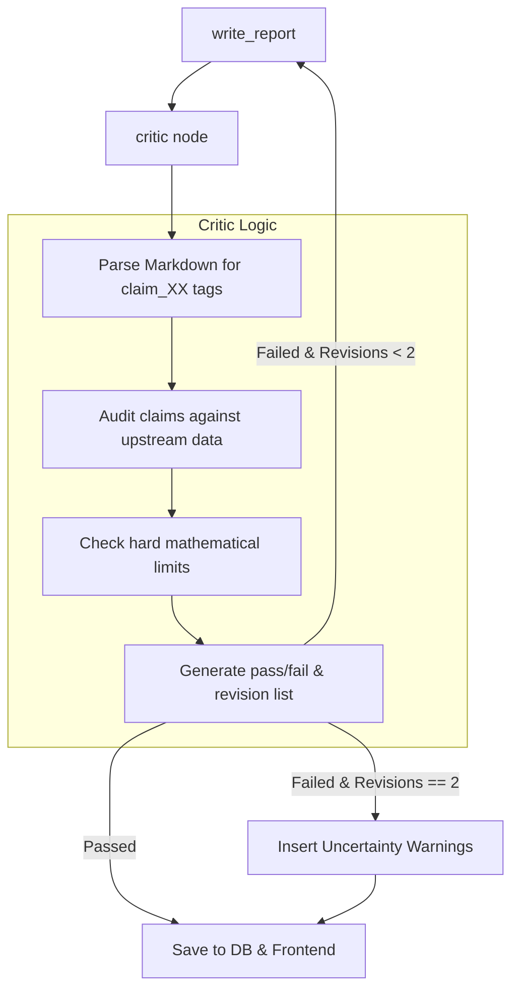

# Critic Agent — Implementation Plan

> **Role:** Validates the report against upstream data, ensures claims are attributed properly, enforces hard sanity limits, and acts as the quality gate before results are saved. Uses the Strong model tier (Z.ai GLM).

---

## 1. Overview & Purpose

The Critic is the final line of defense against AI hallucinations and mathematical anomalies. It intercepts the output of the `write_report` node and audits it.

**Core Responsibilities:**
1. **Factual Verification:** Ensures that every single numerical claim in the report perfectly matches the `economic_history` metrics generated by the deterministic math engine.
2. **Attribution Audit:** Verifies that every qualitative claim is backed by a specific assumption, cohort reaction, or historical analogue.
3. **Hard Sanity Limits:** Checks against absolute bounds (e.g., if the math model spit out "Inflation increased by 500% in a month," the Critic flags it as an anomaly).
4. **Evidence Drawer Mapping:** Builds the mapping structure that powers the frontend's "Click to see evidence" UI.

---

## 2. Architecture & The Revision Loop



**The Loop Rule:**
The Critic can send the report back to `write_report` a MAXIMUM of two times. If the report still fails validation on the third try, the Critic passes the report but automatically injects highly visible UI warnings (e.g., "⚠️ LOW CONFIDENCE: This claim could not be verified by the math engine").

---

## 3. Claim Extraction & Validation

The `write_report` node emits Markdown with tags like `[claim_01]`. 

### Validation Rules
1. **Measured Claims (Data/Math):** The Critic uses regex to extract the sentence containing the claim. It prompts the LLM: *"Does the claim in this sentence match the numbers in this JSON array exactly?"* If not, it fails.
2. **Modelled Claims (AI Cohort):** Must align with the `reactions[]` array.
3. **Judged Claims (Qualitative):** Must align with `research.analogues`.

### Hard Limits (Sanity Checks)
If the math model produces any of the following, the Critic rejects the entire run (this bypasses the revision loop and fails the simulation, alerting the engineers):
- Month-over-month inflation > 50%
- Unemployment rate < 1% or > 40%
- Household income drops to negative numbers
- Budget deficit exceeds GDP

---

## 4. Evidence Drawer Output Schema

The Critic finalizes the `ReportClaim` objects (defined in `data-models.md`) and bundles them into an `EvidenceMapping` dictionary. This powers the frontend sidebar.

```python
# backend/app/schemas/critic.py
from pydantic import BaseModel, Field
from typing import List, Dict

class CriticFeedback(BaseModel):
    passed: bool = Field(..., description="True if the report meets all standards")
    revisions_required: List[str] = Field(
        default_factory=list, 
        description="Exact instructions for the write_report node on what to fix"
    )

class EvidenceMapping(BaseModel):
    claims: Dict[str, dict] = Field(
        ...,
        description="Dictionary mapping 'claim_01' to its evidence payload"
    )
    # Example payload:
    # "claim_01": {
    #    "source_type": "measured",
    #    "source_reference": "math_model.cpi",
    #    "confidence": 0.95,
    #    "upstream_value": "+4.2%"
    # }
```

---

## 5. Implementation Node

```python
# backend/app/graph/nodes/critic.py
from langchain_openai import ChatOpenAI
from app.graph.state import SimState
from app.schemas.critic import CriticFeedback

async def critic(state: SimState) -> dict:
    llm = ChatOpenAI(model="glm-4-plus", temperature=0.0)
    
    report = state["report"]
    revisions = state.get("revisions", 0)
    
    # 1. Check Hard Limits programmatically (no LLM needed)
    if check_hard_limits_failed(state["metrics"]):
        raise ValueError("Simulation hit hard mathematical bounds. Aborting.")
        
    # 2. LLM Audit
    prompt = """
    You are a pedantic, strict data auditor. Review the provided Report against the Upstream Data.
    Verify that EVERY number in the report exactly matches the data.
    If there is a mismatch, set passed=false and list the exact sentences that need fixing.
    """
    
    structured_llm = llm.with_structured_output(CriticFeedback)
    feedback = await structured_llm.ainvoke([
        ("system", prompt),
        ("user", f"Report:\n{report['markdown']}\n\nData:\n{state['metrics']}")
    ])
    
    # Update state
    report["critic_feedback"] = feedback.revisions_required
    
    if not feedback.passed and revisions < 2:
        # Loop back will happen via conditional edge
        return {"report": report}
    elif not feedback.passed and revisions >= 2:
        # Exhausted retries. Inject warnings.
        report = inject_uncertainty_warnings(report, feedback.revisions_required)
        
    return {"report": report, "is_valid": True}
```

## Subagent Assignments
- `copilot`: Implement the Critic node, prompt engineering, and Regex parsers.
