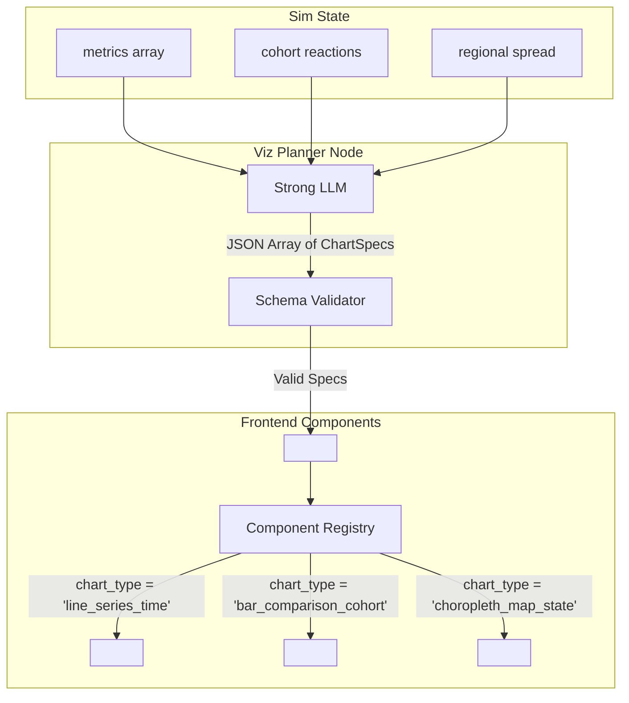

# Viz Planner Engine — Implementation Plan

> **Role:** Chooses the most effective chart configurations to present the simulation data based on a strict catalog of 58 supported charting components. Uses the Strong model tier (Z.ai GLM).

---

## 1. Overview & Purpose

The Viz Planner represents the "AI with free will inside guardrails" concept. Instead of hardcoding a dashboard that always shows the same three charts, the AI analyzes the shape of the simulation results and selects the visualizations that best explain the data to the user.

**Key constraints:**
- The AI **NEVER** outputs UI code (HTML/JS/React).
- The AI **ONLY** outputs JSON configurations (`ChartSpec` objects).
- The frontend has a strict, pre-built component catalog. It reads the JSON config and maps it to a React component (`Recharts`, `Chart.js`, `MapLibre`).
- This guarantees absolute security against XSS or code injection.

---

## 2. Architecture & Data Flow



---

## 3. The Chart Catalog (58 Types)

The system supports exactly 58 chart types, mapped to string enums.

### Time-Series (Recharts)
- `line_series_time`: Multi-line chart over time (e.g., income over 12 steps).
- `area_cumulative`: Stacked area chart showing total accumulated impact.
- `bar_diverging_time`: Above/below zero bars across time.

### Demographic & Cohort (Recharts/Chart.js)
- `bar_comparison_cohort`: Grouped bars comparing cohorts (e.g., Urban vs Rural impact).
- `radar_cohort_profile`: Radar chart showing multi-dimensional spend changes for one group.
- `scatter_elasticity`: X-Y scatter showing price change vs demand drop.
- `stacked_bar_stance`: Proportional 100% stacked bar showing Support/Neutral/Oppose shifts.

### Geographic (MapLibre + Deck.gl)
- `choropleth_map_state`: State-level color-coded map (e.g., inflation by state).
- `choropleth_map_district`: High-resolution district map.
- `heatmap_density`: Points of impact density.

### Financial & Flow
- `waterfall_budget`: Waterfall chart for government fiscal effects.
- `sankey_budget_flow`: Sankey diagram showing tax revenue moving to subsidies.
- `treemap_spending`: Treemap of household spending shifts.
- `sunburst_hierarchy`: Multi-level hierarchical breakdown.

*(The full list of 58 enums must be defined in the frontend registry and backend schema).*

---

## 4. Chart Spec Schema

```python
# backend/app/schemas/viz.py
from pydantic import BaseModel, Field
from typing import List, Dict, Literal, Optional

class DataBinding(BaseModel):
    x_axis: str = Field(..., description="JSON path to the X-axis data key (e.g., 'time_step')")
    y_axes: List[str] = Field(..., description="JSON paths to Y-axis data keys")
    group_by: Optional[str] = Field(None, description="Key to group data series by (e.g., 'region')")

class ChartSpec(BaseModel):
    chart_id: str = Field(..., description="Unique ID for this chart block")
    chart_type: str = Field(..., description="Enum matching one of the 58 supported types")
    title: str = Field(..., description="User-facing title")
    subtitle: Optional[str] = Field(None, description="Contextual subtitle")
    data_source: Literal["metrics", "reactions", "regional_spread", "ripple"] = Field(...)
    data_bindings: DataBinding = Field(...)
    colors: List[str] = Field(default_factory=lambda: ["#1E40AF", "#047857", "#B91C1C"])
    source_label: Optional[str] = Field(None, description="Evidence claim tag (e.g., '[claim_04]')")
    explanation: str = Field(..., description="One sentence explaining what this chart shows.")

class VizPlannerOutput(BaseModel):
    dashboard_charts: List[ChartSpec] = Field(max_items=4, description="Top level summary charts")
    group_charts: List[ChartSpec] = Field(max_items=6, description="Demographic breakdown charts")
    map_charts: List[ChartSpec] = Field(max_items=2, description="Geospatial charts")
```

---

## 5. Implementation Node

```python
# backend/app/graph/nodes/viz_planner.py
from langchain_openai import ChatOpenAI
from app.graph.state import SimState
from app.schemas.viz import VizPlannerOutput

async def viz_planner(state: SimState) -> dict:
    llm = ChatOpenAI(model="glm-4-plus", temperature=0.1)
    
    prompt = """
    You are the lead data visualization designer for LegiSim.
    Review the simulation metrics and cohort reactions.
    Select the BEST chart configurations to explain the story.
    
    RULES:
    1. Only use chart_type enums from the approved list of 58.
    2. Do NOT hallucinate data bindings. Use exact keys from the provided JSON.
    3. Ensure the 'dashboard_charts' cover the top 3 Key Impacts.
    4. Provide exactly 1 'choropleth_map_state' if regional disparities exist.
    """
    
    structured_llm = llm.with_structured_output(VizPlannerOutput)
    
    # Send limited context to avoid token bloat (send summaries, not full raw arrays)
    result = await structured_llm.ainvoke([
        ("system", prompt),
        ("user", f"Metrics Summary: {summarize(state['metrics'])}\nReactions: {summarize(state['reactions'])}")
    ])
    
    return {"viz_specs": result.model_dump()}
```

---

## 6. Frontend Validation Wrapper (React snippet)

```tsx
// frontend/components/charts/ChartWrapper.tsx
import { TimeSeriesLine, CohortBarChart, StateChoropleth } from './registry';

const REGISTRY = {
  line_series_time: TimeSeriesLine,
  bar_comparison_cohort: CohortBarChart,
  choropleth_map_state: StateChoropleth,
  // ... all 58
};

export default function ChartWrapper({ spec, data }) {
  const Component = REGISTRY[spec.chart_type];
  
  if (!Component) {
    return <div className="error">Unsupported chart type: {spec.chart_type}</div>;
  }
  
  return (
    <div className="chart-card">
      <h3>{spec.title}</h3>
      <p>{spec.subtitle}</p>
      <Component data={data[spec.data_source]} bindings={spec.data_bindings} colors={spec.colors} />
      <p className="caption">{spec.explanation} {spec.source_label}</p>
    </div>
  );
}
```

## Subagent Assignments
- `copilot`: Implement the LLM prompt and backend graph node.
- `ui-builder`: Implement the React `ChartWrapper` and the 58 ECharts/Chart.js components.
