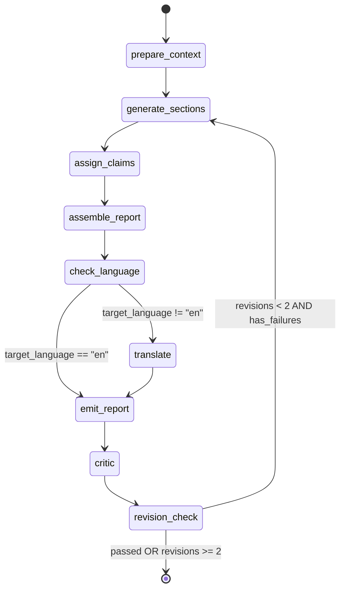
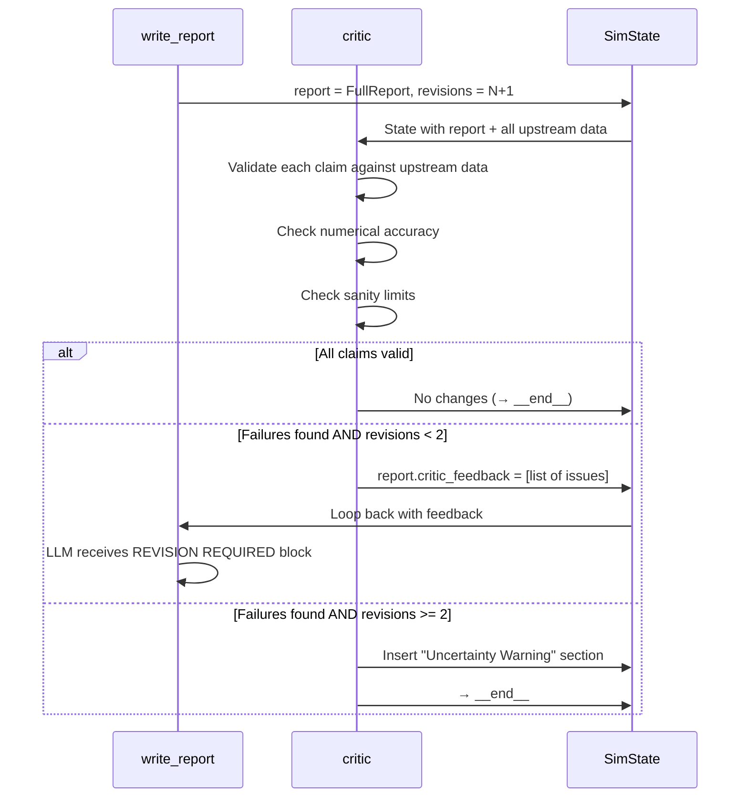
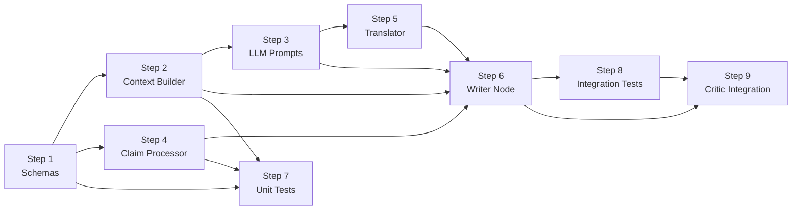

# Report Writer Engine — Implementation Plan

> **Role:** Transforms raw simulation metrics, ripple graphs, cohort reactions, and research context into an accessible, evidence-attributed policy brief. Uses the Strong model tier (Z.ai GLM).

---

## 1. Overview & Purpose

The Report Writer is the final analytical node in the LegiSim pipeline. It sits between `viz_planner` and `critic` in the orchestrator graph. Its job is to synthesise ALL upstream outputs — economic metrics, ripple graph, cohort reactions, research analogues, regional data — into a structured Markdown policy brief that a non-technical policymaker, journalist, or citizen can understand.

**Why it exists:**
- Raw numbers are meaningless without narrative. A ₹2.3/L fuel price increase means nothing until you say *"Rural farming households in MP will spend ₹1,400 more per season on diesel, squeezing margins by ~8%."*
- The report is the primary artifact the user reads. Every other component (charts, maps, ripple graph) supplements it.
- Evidence attribution (`[claim_XX]` tags) is the trust mechanism — the user can click any claim and trace it to a source, model, or judgement.

**Key design constraints:**
- The LLM writes *narrative*, never *numbers*. All numbers come from upstream deterministic computations (math model engine, ripple propagator). The LLM formats and contextualises them.
- Every factual sentence ends with a `[claim_XX]` tag that maps to the Critic's Evidence Drawer.
- The report must be localisable — a `target_language` config produces Hindi, Kannada, Tamil, etc. translations as a final step.

---

## 2. Architecture

### 2.1 Data Flow

```mermaid
flowchart LR
    subgraph Upstream["Upstream Data (SimState)"]
        M[("metrics[]<br/>economic_history")]
        R[("ripple{}<br/>causal graph")]
        C[("reactions[]<br/>cohort outputs")]
        RES[("research{}<br/>facts & analogues")]
        P[("policy{}<br/>structured policy")]
        REG[("regional_spread{}<br/>state-level data")]
    end

    subgraph Writer["write_report Node"]
        direction TB
        PREP["1. prepare_report_context()<br/>Extract, rank, format all data"]
        PREP --> SEC["2. generate_sections()<br/>Strong LLM with structured output"]
        SEC --> TAG["3. assign_claim_tags()<br/>Enumerate all claims"]
        TAG --> ASM["4. assemble_full_report()<br/>Markdown assembly"]
        ASM --> LOC{"target_language<br/>!= 'en'?"}
        LOC -->|Yes| TRANS["5. translate_report()<br/>Strong LLM translation"]
        LOC -->|No| OUT["FullReport output"]
        TRANS --> OUT
    end

    M --> PREP
    R --> PREP
    C --> PREP
    RES --> PREP
    P --> PREP
    REG --> PREP

    subgraph Downstream["Downstream"]
        OUT --> CRIT["critic node"]
        CRIT -->|"revisions < 2 & failed"| SEC
        CRIT -->|"passed or max revisions"| DONE["__end__"]
    end
```



### 2.2 Subgraph Detail (write_report + critic loop)



---

## 3. Report Structure

The report is an ordered list of `ReportSection` objects. Each section has a fixed `section_id` and template. The LLM fills the content; the code enforces the skeleton.

### 3.1 Section Catalogue

| # | `section_id` | Title | Source Data | Style |
|---|-------------|-------|------------|-------|
| 1 | `executive_summary` | Executive Summary | All metrics (aggregated) | BLUF. 3-5 sentences. Plain language. Direction + magnitude + confidence. |
| 2 | `key_impacts` | Key Impacts | Top-N ranked metrics | Two sub-lists: 3 positive, 3 negative. Each: metric name, direction, magnitude range, timing, confidence tag. |
| 3 | `cohort_analysis` | Who Is Affected | `reactions[]`, cohort demographics | Grouped by demographic axis. Includes 3-5 Persona Spotlights. |
| 4 | `economic_indicators` | Economic Impact | `metrics[]`, math model outputs | Narrative around household income, cost of living, jobs, fiscal effect. Uses exact numbers from math engine. |
| 5 | `ripple_effects` | Ripple Effects | `ripple{}` causal graph | Narrative walking through 2-3 key causal chains. References layer depth. |
| 6 | `regional_analysis` | Regional Analysis | `regional_spread{}`, state-level data | State-by-state highlights. Top 3 most affected, bottom 3 least affected. |
| 7 | `historical_context` | Historical Context | `research.analogues[]` | Comparison to 2-3 past policies. What matched, what differed, lessons. |
| 8 | `methodology` | Methodology & Limitations | Pipeline metadata | What the model did and didn't capture. Model types used. Known blind spots. |

### 3.2 Section Content Rules

Each section follows these output rules:

1. **Direction**: Always state whether something goes up or down. Never use "may" or "could" without a directional lean.
2. **Size with range**: `"-3.2% to -4.8%"` not `"about 4%"`. Ranges come from Monte Carlo p10/p90 bands.
3. **Timing**: `"within 2-3 months"` or `"by month 6"`. Derived from lag values in the ripple graph.
4. **Confidence**: One of three phrases based on the source tag:
   - `measured` → *"Our model calculates..."* (from deterministic math engine)
   - `modelled` → *"Behavioral indicators suggest..."* (from AI cohort reactions)
   - `judged` → *"Based on historical patterns..."* (from analogue matching, AI reasoning)
5. **Claim tag**: Every factual sentence ends with `[claim_XX]`.

---

## 4. Evidence Attribution System

### 4.1 Claim Tag Format

Every sentence containing a factual assertion gets a unique claim tag:

```markdown
Household income for rural farming families is projected to decline by 
3.2% to 4.8% within the first quarter [claim_01]. This is primarily 
driven by increased input costs for diesel and fertilizer [claim_02].
```

### 4.2 Claim Registry Schema

```python
from pydantic import BaseModel, Field
from typing import Literal, Optional
from enum import Enum

class ClaimSource(str, Enum):
    """How this claim was produced."""
    MEASURED = "measured"     # From deterministic math engine (NumPy/SciPy)
    MODELLED = "modelled"     # From AI cohort simulation
    JUDGED = "judged"         # From AI reasoning / analogue matching

class ReportClaim(BaseModel):
    """A single evidence-attributed claim in the report."""
    claim_id: str = Field(
        ...,
        description="Unique tag, e.g. 'claim_01'. Sequential within a report.",
        pattern=r"^claim_\d{2,3}$"
    )
    text: str = Field(
        ...,
        description="The exact sentence or clause this claim covers."
    )
    source_type: ClaimSource = Field(
        ...,
        description="How this claim was produced: measured, modelled, or judged."
    )
    source_reference: str = Field(
        ...,
        description=(
            "Pointer to the upstream data. Examples: "
            "'math_model.household_income_change.step_3', "
            "'cohort.KA-rural-lowinc-farm.stance.oppose', "
            "'analogue.demonetisation_2016.outcome_inflation', "
            "'ripple.fuel_price->freight_cost.strength'"
        )
    )
    source_url: Optional[str] = Field(
        None,
        description="External URL if the claim references a web source (SearXNG result)."
    )
    confidence: float = Field(
        ..., ge=0.0, le=1.0,
        description="Confidence score. 0.0 = pure guess, 1.0 = deterministic calculation."
    )
    section_id: str = Field(
        ...,
        description="Which report section this claim belongs to."
    )

    class Config:
        json_schema_extra = {
            "example": {
                "claim_id": "claim_01",
                "text": "Household income for rural farming families is projected to decline by 3.2% to 4.8%",
                "source_type": "measured",
                "source_reference": "math_model.household_income_change.step_3",
                "source_url": None,
                "confidence": 0.85,
                "section_id": "economic_indicators"
            }
        }
```

### 4.3 Claim Generation Process

Claims are **not** generated by the LLM. The LLM writes `[claim_XX]` placeholders. Post-processing code:

1. Parses the LLM output for all `[claim_XX]` tags via regex.
2. For each tag, extracts the preceding sentence.
3. Matches the sentence to upstream data using keyword/metric matching.
4. Builds the `ReportClaim` objects with appropriate `source_type` and `source_reference`.
5. Claims the LLM could not match are flagged as `judged` with lower confidence.

```python
import re
from typing import List, Tuple

CLAIM_PATTERN = re.compile(r'\[claim_(\d{2,3})\]')

def extract_claims_from_markdown(
    markdown: str,
    section_id: str
) -> List[Tuple[str, str]]:
    """
    Extract (claim_id, preceding_sentence) pairs from markdown text.
    Returns list of (claim_tag, sentence_text) tuples.
    """
    claims = []
    # Split on claim tags, keeping the tags
    parts = CLAIM_PATTERN.split(markdown)
    
    for i in range(1, len(parts), 2):
        claim_num = parts[i]
        claim_id = f"claim_{claim_num}"
        # The text before this claim tag is in parts[i-1]
        preceding_text = parts[i - 1].strip()
        # Extract the last sentence (split on period, exclamation, etc.)
        sentences = re.split(r'(?<=[.!?])\s+', preceding_text)
        sentence = sentences[-1] if sentences else preceding_text
        claims.append((claim_id, sentence.strip()))
    
    return claims


def match_claim_to_source(
    sentence: str,
    metrics: dict,
    ripple: dict,
    reactions: list,
    analogues: list,
) -> Tuple[str, str, float]:
    """
    Given a claim sentence, determine its source_type, source_reference, 
    and confidence by matching keywords to upstream data.
    
    Returns (source_type, source_reference, confidence)
    """
    # Priority 1: Check if sentence references a specific metric value
    for metric_key, metric_data in metrics.items():
        if _sentence_references_metric(sentence, metric_key, metric_data):
            return ("measured", f"math_model.{metric_key}", metric_data.get("confidence", 0.9))
    
    # Priority 2: Check if sentence references cohort behavior
    for reaction in reactions:
        if _sentence_references_cohort(sentence, reaction):
            return ("modelled", f"cohort.{reaction['cohort_id']}", reaction.get("confidence", 0.7))
    
    # Priority 3: Check if sentence references an analogue
    for analogue in analogues:
        if _sentence_references_analogue(sentence, analogue):
            return ("judged", f"analogue.{analogue['id']}", 0.5)
    
    # Priority 4: Check ripple graph references
    for node_id, node_data in ripple.get("nodes", {}).items():
        if node_id.replace("_", " ") in sentence.lower():
            return ("modelled", f"ripple.{node_id}", 0.6)
    
    # Fallback: unmatched claim
    return ("judged", "ai_reasoning", 0.3)
```

---

## 5. Pydantic Schemas

### 5.1 ReportSection

```python
from pydantic import BaseModel, Field
from typing import List, Literal, Optional
from enum import Enum

class SectionID(str, Enum):
    EXECUTIVE_SUMMARY = "executive_summary"
    KEY_IMPACTS = "key_impacts"
    COHORT_ANALYSIS = "cohort_analysis"
    ECONOMIC_INDICATORS = "economic_indicators"
    RIPPLE_EFFECTS = "ripple_effects"
    REGIONAL_ANALYSIS = "regional_analysis"
    HISTORICAL_CONTEXT = "historical_context"
    METHODOLOGY = "methodology"

class PersonaSpotlight(BaseModel):
    """A short human story based only on simulation facts."""
    cohort_id: str = Field(..., description="ID of the cohort this persona represents")
    name: str = Field(
        ..., 
        description="Fictional first name only. No surname, no caste/religion inference."
    )
    age: str = Field(..., description="Age band, e.g. '35-year-old'")
    location: str = Field(..., description="Region and urban/rural, e.g. 'rural Karnataka'")
    occupation: str = Field(..., description="e.g. 'smallholder rice farmer'")
    story: str = Field(
        ...,
        description=(
            "2-3 sentences describing how the policy affects this person. "
            "MUST use only facts from the simulation — income change, "
            "cost change, behavioral shift. No invented details."
        ),
        max_length=500
    )
    income_impact: str = Field(
        ..., 
        description="e.g. '-₹1,400/season' — derived from math engine"
    )
    key_behavior_change: str = Field(
        ..., 
        description="e.g. 'Switches from diesel to electric pump irrigation'"
    )

class ImpactItem(BaseModel):
    """A single impact in the Key Impacts section."""
    metric_name: str = Field(..., description="Human-readable metric name")
    direction: Literal["increase", "decrease", "stable"] = Field(
        ..., description="Direction of change"
    )
    magnitude: str = Field(
        ...,
        description="Range string, e.g. '-3.2% to -4.8%'"
    )
    timing: str = Field(
        ..., 
        description="When this manifests, e.g. 'within 2-3 months'"
    )
    confidence: float = Field(
        ..., ge=0.0, le=1.0,
        description="Confidence score"
    )
    source_type: ClaimSource = Field(
        ..., description="measured / modelled / judged"
    )
    affected_groups: List[str] = Field(
        default_factory=list,
        description="Which cohort groups are most affected"
    )

class ReportSection(BaseModel):
    """A single section of the policy report."""
    section_id: SectionID = Field(
        ..., description="Fixed section identifier"
    )
    title: str = Field(
        ..., description="Section heading"
    )
    content_markdown: str = Field(
        ..., 
        description=(
            "Markdown-formatted section content. "
            "Every factual sentence must end with [claim_XX] tag."
        )
    )
    confidence: Literal["High", "Medium", "Low"] = Field(
        ..., 
        description="Overall confidence level for this section"
    )
    dominant_source_type: ClaimSource = Field(
        ..., 
        description="The primary source type for claims in this section"
    )
    # Section-specific optional fields
    positive_impacts: Optional[List[ImpactItem]] = Field(
        None, description="Top 3 positive effects (key_impacts section only)"
    )
    negative_impacts: Optional[List[ImpactItem]] = Field(
        None, description="Top 3 negative effects (key_impacts section only)"
    )
    persona_spotlights: Optional[List[PersonaSpotlight]] = Field(
        None, description="3-5 persona stories (cohort_analysis section only)"
    )
```

### 5.2 FullReport

```python
class FullReport(BaseModel):
    """Complete policy simulation report."""
    report_id: str = Field(
        ..., description="UUID matching the simulation run_id"
    )
    policy_title: str = Field(
        ..., description="Human-readable policy title"
    )
    policy_summary: str = Field(
        ..., description="One-sentence policy description"
    )
    generated_at: str = Field(
        ..., description="ISO 8601 timestamp"
    )
    language: str = Field(
        default="en",
        description="ISO 639-1 language code of the report"
    )
    sections: List[ReportSection] = Field(
        ..., 
        description="Ordered list of report sections",
        min_length=8,
        max_length=8
    )
    claims: List[ReportClaim] = Field(
        default_factory=list,
        description="All evidence-attributed claims in the report"
    )
    # Metadata for the Critic
    revision_number: int = Field(
        default=0, 
        description="How many times the Critic has sent this back"
    )
    critic_feedback: Optional[List[str]] = Field(
        None, 
        description="List of revision instructions from the Critic (if any)"
    )
    # Metadata for display
    total_claims: int = Field(
        default=0, description="Total number of claims in the report"
    )
    measured_claim_pct: float = Field(
        default=0.0,
        description="Percentage of claims sourced from deterministic math"
    )
    modelled_claim_pct: float = Field(
        default=0.0,
        description="Percentage of claims sourced from AI cohort simulation"
    )
    judged_claim_pct: float = Field(
        default=0.0,
        description="Percentage of claims sourced from AI reasoning/analogues"
    )
```

---

## 6. LLM Prompt (Full System Prompt)

### 6.1 Report Generation System Prompt

```python
REPORT_WRITER_SYSTEM_PROMPT = """\
You are a policy analyst writing a simulation report for LegiSim, an AI-powered \
policy simulation platform for India.

## STYLE RULES
- Short research note style. Direct, objective, non-partisan.
- Write for a smart non-economist: a journalist, a legislator's aide, or a \
  civic-minded citizen.
- Use active voice. Avoid hedging words like "may", "might", "could" unless \
  genuinely uncertain — in which case, state the uncertainty explicitly.
- No jargon without immediate definition in parentheses.
- No opinions. No recommendations. You describe what the simulation predicts, \
  not what should be done.
- Numbers are SACRED. You MUST use the exact numbers provided in the data. \
  Do NOT round, estimate, or invent any numerical values.

## OUTPUT RULES — FOR EVERY FACTUAL CLAIM
1. **Direction**: State whether the metric goes up or down.
2. **Size with range**: Use the p10-p90 band. Write "-3.2% to -4.8%", not "about 4%".
3. **Timing**: State when the effect manifests. Use lag data from the ripple graph.
4. **Confidence tag**: Use EXACTLY one of these phrases based on the source type:
   - source_type = "measured" → Start with "Our model calculates..."
   - source_type = "modelled" → Start with "Behavioral indicators suggest..."
   - source_type = "judged"   → Start with "Based on historical patterns..."
5. **Claim tag**: End every factual sentence with [claim_XX] where XX is a \
   sequential two-digit number starting from 01.

## PERSONA SPOTLIGHTS (cohort_analysis section only)
- Write 3-5 short human stories for the most affected cohort groups.
- Use a fictional first name ONLY (no surname). Do NOT infer or mention caste, \
  religion, or political affiliation.
- Each story is 2-3 sentences using ONLY facts from the simulation data: \
  income change, cost change, behavioral shift.
- Format: "**[Name]**, [age], [occupation] in [location]: [story]"
- Example: "**Lakshmi**, 42, smallholder rice farmer in rural Telangana: \
  Her input costs rise by ₹1,400 per season due to diesel price increases \
  [claim_14]. She is among the 34% of similar farming households projected \
  to reduce fertilizer usage in response [claim_15]."

## SECTION STRUCTURE
You MUST produce exactly 8 sections in this order:
1. **Executive Summary**: 3-5 sentences. Bottom-line-up-front. Largest impact \
   first.
2. **Key Impacts**: Two sub-sections: "Top 3 Positive Effects" and \
   "Top 3 Negative Effects". Each item: metric, direction, magnitude range, \
   timing, confidence tag.
3. **Who Is Affected**: Group impacts by demographic axes (income, urban/rural, \
   occupation, age, region). Include persona spotlights.
4. **Economic Impact**: Narrative for each of: household income, cost of living, \
   jobs & wages, business impact, government fiscal effect, inequality & poverty.
5. **Ripple Effects**: Walk through 2-3 key causal chains from the ripple graph. \
   Name each node and the strength/lag of links. Explain the mechanism.
6. **Regional Analysis**: Top 3 most affected states, bottom 3 least affected. \
   One sentence each explaining why.
7. **Historical Context**: Compare to 2-3 analogues from the research data. \
   What matched, what differed, and what lessons apply.
8. **Methodology & Limitations**: What models were used (math templates, cohort \
   simulation, ripple propagation). Known blind spots and caveats. Explicitly \
   state what the simulation did NOT model.

## INPUT DATA FORMAT
You will receive a JSON object with these keys:
- policy: Structured policy definition
- metrics: Array of time-step economic metrics from the math engine
- ripple: Causal graph with nodes, edges, magnitudes, and lags
- reactions: Aggregated cohort reactions with stance, behavior changes
- research: Facts, analogues, and data sources
- regional_data: State-level impact breakdown
- viz_specs: Chart specifications (reference these where relevant)

## CRITICAL CONSTRAINTS
- NEVER invent a number. If a metric is not in the data, say "not modelled".
- NEVER make policy recommendations.
- NEVER infer caste, religion, or political affiliation of any group.
- NEVER use superlatives ("worst", "best", "unprecedented") unless backed by data.
- If the Critic has provided revision feedback, address EVERY item in the \
  feedback list. Do not ignore any.
"""
```

### 6.2 Report Generation User Prompt Template

```python
REPORT_WRITER_USER_PROMPT = """\
Generate the policy simulation report for the following data.

## Policy
{policy_json}

## Economic Metrics (from deterministic math engine)
{metrics_json}

## Ripple Graph (causal chain data)
{ripple_json}

## Cohort Reactions (from AI simulation)
{reactions_json}

## Research Data (facts, analogues, sources)
{research_json}

## Regional Breakdown (state-level data)
{regional_json}

## Visualization Specs (for reference)
{viz_specs_json}

{revision_instructions}

Produce the report now. Remember: every factual sentence ends with [claim_XX].
"""
```

### 6.3 Translation System Prompt

```python
TRANSLATION_SYSTEM_PROMPT = """\
You are a professional translator specializing in Indian policy documents.

Translate the following Markdown policy report from English to {target_language}.

## RULES
1. Preserve ALL Markdown formatting (headers, bold, lists, links).
2. Preserve ALL [claim_XX] tags exactly as-is. Do not translate claim tags.
3. Preserve ALL numerical values exactly. Do not convert units.
4. For technical economic terms, provide the {target_language} term followed \
   by the English term in parentheses on first use. Example in Hindi: \
   "मुद्रास्फीति (inflation)"
5. Currency symbols (₹) remain unchanged.
6. Maintain the same section structure and ordering.
7. Use formal register appropriate for policy documents.
"""
```

---

## 7. Node Implementation

### 7.1 Core `write_report` Node

```python
# File: backend/app/graph/nodes/report_writer.py

import json
import uuid
from datetime import datetime, timezone
from typing import Any, Dict, List, Optional

from langchain_core.runnables.config import RunnableConfig
from langchain_core.callbacks import get_stream_writer
from langchain_openai import ChatOpenAI

from app.graph.state import SimState
from app.engine.report.schemas import (
    FullReport, ReportSection, ReportClaim, SectionID, ClaimSource
)
from app.engine.report.context_builder import prepare_report_context
from app.engine.report.claim_processor import (
    extract_claims_from_markdown,
    match_claim_to_source,
    build_claim_registry,
)
from app.engine.report.prompts import (
    REPORT_WRITER_SYSTEM_PROMPT,
    REPORT_WRITER_USER_PROMPT,
    TRANSLATION_SYSTEM_PROMPT,
)
from app.config import settings


# ── LLM client ─────────────────────────────────────────────────────
def _get_report_llm() -> ChatOpenAI:
    """Initialise the Strong model for report writing."""
    return ChatOpenAI(
        model=settings.STRONG_MODEL_NAME,       # e.g. "glm-4-plus"
        openai_api_key=settings.ZAI_API_KEY,
        openai_api_base=settings.ZAI_API_BASE,
        temperature=0.3,       # Low temperature for factual writing
        max_tokens=8192,       # Reports can be long
        model_kwargs={
            "top_p": 0.9,
            "frequency_penalty": 0.1,  # Slight penalty to reduce repetition
        },
    )


# ── Main node ──────────────────────────────────────────────────────
async def write_report(state: SimState, config: RunnableConfig) -> dict:
    """
    LangGraph node: Generates the policy simulation report.
    
    This node:
    1. Prepares context by extracting and formatting all upstream data.
    2. Calls the Strong LLM to generate 8 report sections.
    3. Post-processes the output to extract and match claim tags.
    4. Optionally translates to the target language.
    5. Returns the FullReport for the Critic to validate.
    """
    writer = get_stream_writer()
    writer({
        "event": "node_update",
        "node": "write_report",
        "status": "running",
        "revision": state.get("revisions", 0),
    })
    
    llm = _get_report_llm()
    
    # ── Step 1: Prepare context ─────────────────────────────────
    # Extract and format all upstream data for the prompt
    context = prepare_report_context(
        policy=state["policy"],
        metrics=state.get("metrics", []),
        ripple=state.get("ripple", {}),
        reactions=state.get("reactions", []),
        research=state.get("research", {}),
        regional_data=_extract_regional_data(state),
        viz_specs=state.get("viz_specs", []),
    )
    
    # ── Step 2: Build the prompt ────────────────────────────────
    revision_instructions = ""
    if state.get("revisions", 0) > 0 and state.get("report", {}).get("critic_feedback"):
        feedback_list = state["report"]["critic_feedback"]
        revision_instructions = (
            "## REVISION REQUIRED\n"
            "The Critic has flagged the following issues. "
            "Address EVERY item:\n"
            + "\n".join(f"- {fb}" for fb in feedback_list)
        )
    
    user_prompt = REPORT_WRITER_USER_PROMPT.format(
        policy_json=json.dumps(context["policy"], indent=2, ensure_ascii=False),
        metrics_json=json.dumps(context["metrics"], indent=2, ensure_ascii=False),
        ripple_json=json.dumps(context["ripple"], indent=2, ensure_ascii=False),
        reactions_json=json.dumps(context["reactions"], indent=2, ensure_ascii=False),
        research_json=json.dumps(context["research"], indent=2, ensure_ascii=False),
        regional_json=json.dumps(context["regional"], indent=2, ensure_ascii=False),
        viz_specs_json=json.dumps(context["viz_specs"], indent=2, ensure_ascii=False),
        revision_instructions=revision_instructions,
    )
    
    messages = [
        ("system", REPORT_WRITER_SYSTEM_PROMPT),
        ("user", user_prompt),
    ]
    
    # ── Step 3: Generate sections via LLM ───────────────────────
    # Use structured output to get reliable JSON
    # The LLM returns a list of ReportSection objects
    structured_llm = llm.with_structured_output(
        _ReportSectionsOutput,
        method="json_mode",
    )
    
    writer({"event": "node_update", "node": "write_report", "status": "generating"})
    
    llm_output = await structured_llm.ainvoke(messages)
    sections: List[ReportSection] = llm_output.sections
    
    # ── Step 4: Extract and match claims ────────────────────────
    all_claims: List[ReportClaim] = []
    claim_counter = 1
    
    for section in sections:
        raw_claims = extract_claims_from_markdown(
            section.content_markdown, 
            section.section_id.value
        )
        for claim_id, sentence_text in raw_claims:
            source_type, source_ref, confidence = match_claim_to_source(
                sentence=sentence_text,
                metrics=_flatten_metrics(state.get("metrics", [])),
                ripple=state.get("ripple", {}),
                reactions=state.get("reactions", []),
                analogues=state.get("research", {}).get("analogues", []),
            )
            all_claims.append(ReportClaim(
                claim_id=claim_id,
                text=sentence_text,
                source_type=ClaimSource(source_type),
                source_reference=source_ref,
                source_url=None,  # Populated by critic if from SearXNG
                confidence=confidence,
                section_id=section.section_id.value,
            ))
            claim_counter += 1
    
    # ── Step 5: Compute claim statistics ────────────────────────
    total = len(all_claims) or 1  # avoid division by zero
    measured_pct = sum(1 for c in all_claims if c.source_type == ClaimSource.MEASURED) / total
    modelled_pct = sum(1 for c in all_claims if c.source_type == ClaimSource.MODELLED) / total
    judged_pct = sum(1 for c in all_claims if c.source_type == ClaimSource.JUDGED) / total
    
    # ── Step 6: Assemble FullReport ─────────────────────────────
    target_language = config.get("configurable", {}).get("target_language", "en")
    
    report = FullReport(
        report_id=state.get("run_id", str(uuid.uuid4())),
        policy_title=state["policy"].get("title", "Untitled Policy"),
        policy_summary=state["policy"].get("changes", ""),
        generated_at=datetime.now(timezone.utc).isoformat(),
        language="en",  # Will be updated if translated
        sections=sections,
        claims=all_claims,
        revision_number=state.get("revisions", 0),
        critic_feedback=None,
        total_claims=len(all_claims),
        measured_claim_pct=round(measured_pct, 3),
        modelled_claim_pct=round(modelled_pct, 3),
        judged_claim_pct=round(judged_pct, 3),
    )
    
    # ── Step 7: Translate if needed ─────────────────────────────
    if target_language != "en":
        writer({
            "event": "node_update",
            "node": "write_report",
            "status": "translating",
            "language": target_language,
        })
        report = await _translate_report(report, target_language, llm)
    
    writer({
        "event": "node_update",
        "node": "write_report",
        "status": "complete",
        "total_claims": len(all_claims),
    })
    
    return {
        "report": report.model_dump(),
        "revisions": state.get("revisions", 0) + 1,
    }


# ── Helper: Structured output wrapper ──────────────────────────
from pydantic import BaseModel as PydanticBaseModel

class _ReportSectionsOutput(PydanticBaseModel):
    """Wrapper for structured LLM output."""
    sections: List[ReportSection]


# ── Helper: Translation ────────────────────────────────────────
async def _translate_report(
    report: FullReport, 
    target_language: str, 
    llm: ChatOpenAI
) -> FullReport:
    """Translate all section content to the target language."""
    LANGUAGE_MAP = {
        "hi": "Hindi",
        "kn": "Kannada",
        "ta": "Tamil",
        "te": "Telugu",
        "mr": "Marathi",
        "bn": "Bengali",
        "gu": "Gujarati",
        "ml": "Malayalam",
        "pa": "Punjabi",
        "or": "Odia",
    }
    language_name = LANGUAGE_MAP.get(target_language, target_language)
    
    system_prompt = TRANSLATION_SYSTEM_PROMPT.format(
        target_language=language_name
    )
    
    for section in report.sections:
        translation_prompt = (
            f"Translate this section:\n\n"
            f"## {section.title}\n\n"
            f"{section.content_markdown}"
        )
        response = await llm.ainvoke([
            ("system", system_prompt),
            ("user", translation_prompt),
        ])
        section.content_markdown = response.content
        # Title translation
        title_response = await llm.ainvoke([
            ("system", system_prompt),
            ("user", f"Translate this section title: {section.title}"),
        ])
        section.title = title_response.content.strip()
    
    report.language = target_language
    return report


# ── Helper: Extract regional data from state ───────────────────
def _extract_regional_data(state: SimState) -> Dict[str, Any]:
    """Pull regional_spread from the latest metrics step."""
    metrics = state.get("metrics", [])
    if not metrics:
        return {}
    latest = metrics[-1]  # Last time step
    return latest.get("regional_spread", {})


# ── Helper: Flatten metrics for claim matching ─────────────────
def _flatten_metrics(metrics: List[dict]) -> Dict[str, Any]:
    """Flatten time-series metrics into a keyed dict for claim matching."""
    flat = {}
    for m in metrics:
        step = m.get("step", 0)
        for key, value in m.items():
            if key not in ("step", "source", "regional_spread"):
                flat[f"{key}.step_{step}"] = {
                    "value": value,
                    "source": m.get("source", "modelled"),
                    "confidence": 0.85 if m.get("source") == "modelled (equations)" else 0.6,
                }
    return flat
```

### 7.2 Context Builder

```python
# File: backend/app/engine/report/context_builder.py

"""
Prepares the upstream simulation data into a compact, LLM-friendly format.
This module is the bridge between the raw SimState and the report LLM prompt.
"""

from typing import Any, Dict, List
import statistics


def prepare_report_context(
    policy: dict,
    metrics: List[dict],
    ripple: dict,
    reactions: List[dict],
    research: dict,
    regional_data: dict,
    viz_specs: List[dict],
) -> Dict[str, Any]:
    """
    Transform raw simulation state into a structured context dict
    that fits within the LLM's context window.
    
    Key transformations:
    - Metrics: Compute summary statistics (first/last step, min/max/avg)
    - Ripple: Extract top causal chains by total magnitude
    - Reactions: Aggregate by demographic group, compute weighted stances
    - Research: Include only top 3 analogues and top 10 facts
    - Regional: Rank states by impact magnitude
    """
    return {
        "policy": _prepare_policy(policy),
        "metrics": _prepare_metrics(metrics),
        "ripple": _prepare_ripple(ripple),
        "reactions": _prepare_reactions(reactions),
        "research": _prepare_research(research),
        "regional": _prepare_regional(regional_data),
        "viz_specs": viz_specs[:10],  # Cap at 10 to save tokens
    }


def _prepare_policy(policy: dict) -> dict:
    """Extract key policy fields."""
    return {
        "title": policy.get("title", "Untitled"),
        "changes": policy.get("changes", ""),
        "size_of_change": policy.get("size_of_change", 0),
        "target_group": policy.get("target_group", "general population"),
        "geographic_coverage": policy.get("geographic_coverage", "national"),
        "start_date": policy.get("start_date", ""),
        "rollout_phases": policy.get("rollout_phases", []),
    }


def _prepare_metrics(metrics: List[dict]) -> dict:
    """
    Summarise time-series metrics into a compact format.
    Include first step, last step, and summary stats for each metric.
    """
    if not metrics:
        return {"steps": 0, "summary": {}}
    
    metric_keys = [
        "household_income_change", "cost_of_living_change",
        "jobs_and_wages_impact", "business_impact",
        "govt_fiscal_effect", "inequality_poverty",
    ]
    
    summary = {}
    for key in metric_keys:
        values = [m.get(key, 0) for m in metrics if key in m]
        if values:
            summary[key] = {
                "first_step": values[0],
                "last_step": values[-1],
                "min": min(values),
                "max": max(values),
                "mean": round(statistics.mean(values), 3),
                "trend": "increasing" if values[-1] > values[0] else "decreasing",
                "source": metrics[0].get("source", "modelled"),
            }
    
    return {
        "total_steps": len(metrics),
        "step_by_step": metrics,  # Full data for precise claim writing
        "summary": summary,
    }


def _prepare_ripple(ripple: dict) -> dict:
    """
    Extract top causal chains from the ripple graph.
    Sort edges by absolute magnitude to find the most impactful chains.
    """
    if not ripple:
        return {"nodes": [], "edges": [], "top_chains": []}
    
    nodes = ripple.get("nodes", {})
    edges = ripple.get("edges", [])
    
    # Sort edges by absolute strength
    sorted_edges = sorted(edges, key=lambda e: abs(e.get("strength", 0)), reverse=True)
    
    # Build top 5 causal chains (simplified for the LLM)
    top_chains = []
    for edge in sorted_edges[:10]:
        source_label = nodes.get(edge["source"], {}).get("label", edge["source"])
        target_label = nodes.get(edge["target"], {}).get("label", edge["target"])
        top_chains.append({
            "chain": f"{source_label} → {target_label}",
            "strength": edge["strength"],
            "lag_months": edge.get("lag_months", 0),
            "mechanism": edge.get("mechanism", ""),
            "is_ai_proposed": edge.get("is_ai_proposed", False),
        })
    
    return {
        "total_nodes": len(nodes),
        "total_edges": len(edges),
        "top_chains": top_chains,
        "nodes": nodes,       # Full data for claim matching
        "edges": edges,
    }


def _prepare_reactions(reactions: List[dict]) -> dict:
    """
    Aggregate cohort reactions by demographic group.
    Compute weighted stance distributions and top behavior changes.
    """
    if not reactions:
        return {"groups": [], "overall_stance": {}}
    
    # Group reactions by broad category
    groups = {}
    for r in reactions:
        # Use occupation or income_band as grouping key
        group_key = r.get("cohort_id", "unknown").rsplit("-", 1)[0]
        if group_key not in groups:
            groups[group_key] = {
                "cohort_ids": [],
                "stances": {"support": [], "neutral": [], "oppose": []},
                "behavior_changes": [],
                "confidences": [],
            }
        groups[group_key]["cohort_ids"].append(r.get("cohort_id"))
        
        stance = r.get("stance", {})
        for k in ("support", "neutral", "oppose"):
            groups[group_key]["stances"][k].append(stance.get(k, 0))
        
        groups[group_key]["behavior_changes"].extend(
            r.get("behaviour_changes", r.get("behavior_changes", []))
        )
        groups[group_key]["confidences"].append(r.get("confidence", 0.5))
    
    # Summarise each group
    summarised = []
    for group_key, data in groups.items():
        summarised.append({
            "group": group_key,
            "size": len(data["cohort_ids"]),
            "avg_support": round(statistics.mean(data["stances"]["support"]), 3),
            "avg_oppose": round(statistics.mean(data["stances"]["oppose"]), 3),
            "top_behavior_changes": _top_n_behaviors(data["behavior_changes"], 3),
            "avg_confidence": round(statistics.mean(data["confidences"]), 3),
        })
    
    # Overall stance
    all_support = [r.get("stance", {}).get("support", 0) for r in reactions]
    all_oppose = [r.get("stance", {}).get("oppose", 0) for r in reactions]
    
    return {
        "groups": summarised,
        "total_cohorts": len(reactions),
        "overall_stance": {
            "support": round(statistics.mean(all_support), 3) if all_support else 0,
            "oppose": round(statistics.mean(all_oppose), 3) if all_oppose else 0,
        },
        "raw_reactions": reactions[:50],  # Cap for token budget
    }


def _prepare_research(research: dict) -> dict:
    """Extract top analogues and facts from research data."""
    return {
        "facts": research.get("facts", [])[:10],
        "analogues": research.get("analogues", research.get("past_policies", []))[:3],
        "data_sources": research.get("data_sources", [])[:5],
        "conflicts": research.get("conflicts", []),
    }


def _prepare_regional(regional_data: dict) -> dict:
    """Rank states by impact magnitude."""
    if not regional_data:
        return {"states": [], "most_affected": [], "least_affected": []}
    
    ranked = sorted(
        regional_data.items(),
        key=lambda x: abs(x[1]) if isinstance(x[1], (int, float)) else 0,
        reverse=True,
    )
    
    return {
        "states": dict(ranked),
        "most_affected": [{"state": k, "impact": v} for k, v in ranked[:3]],
        "least_affected": [{"state": k, "impact": v} for k, v in ranked[-3:]],
    }


def _top_n_behaviors(behaviors: list, n: int) -> List[str]:
    """Get the top N most common behavior changes."""
    if not behaviors:
        return []
    from collections import Counter
    # Behaviors may be dicts or strings
    if isinstance(behaviors[0], dict):
        texts = [b.get("what", str(b)) for b in behaviors]
    else:
        texts = [str(b) for b in behaviors]
    counter = Counter(texts)
    return [item for item, _ in counter.most_common(n)]
```

---

## 8. Integration with Critic

### 8.1 Critic → Writer Feedback Loop

The Critic node (defined in `06-critic-agent/plan.md`) receives the `FullReport` and validates it. The loop works as follows:



### 8.2 Critic Feedback Format

When the Critic loops back, it sets `report.critic_feedback` on the state:

```python
# What the Critic produces when it finds issues:
{
    "critic_feedback": [
        "claim_03 states household income drops 5.2% but math_model shows -4.1%",
        "claim_07 has no matching upstream data source — mark as 'judged' or remove",
        "Regional analysis missing data for Maharashtra — either add or note as 'not modelled'",
        "Executive summary mentions 'unprecedented' — remove superlative or cite analogue",
    ]
}
```

### 8.3 Revision Handling in write_report

When `state["revisions"] > 0`, the `write_report` node:
1. Reads `state["report"]["critic_feedback"]` list.
2. Injects it into the LLM prompt as a `## REVISION REQUIRED` block.
3. The LLM regenerates all 8 sections, focusing on addressing each feedback item.
4. Claims are re-extracted and re-matched.

This is implemented in the node code above (see `revision_instructions` variable).

---

## 9. Localization

### 9.1 Supported Languages

| Code | Language | Script |
|------|----------|--------|
| `en` | English | Latin |
| `hi` | Hindi | Devanagari |
| `kn` | Kannada | Kannada |
| `ta` | Tamil | Tamil |
| `te` | Telugu | Telugu |
| `mr` | Marathi | Devanagari |
| `bn` | Bengali | Bengali |
| `gu` | Gujarati | Gujarati |
| `ml` | Malayalam | Malayalam |
| `pa` | Punjabi | Gurmukhi |
| `or` | Odia | Odia |

### 9.2 How Translation Works

1. The `target_language` is set in the LangGraph config's `configurable` dict:
   ```python
   config = {"configurable": {"thread_id": run_id, "target_language": "hi"}}
   ```
2. The report is ALWAYS generated in English first (for Critic validation).
3. After Critic approval, if `target_language != "en"`, translation runs as a final step.
4. Translation preserves:
   - All `[claim_XX]` tags (untranslated)
   - All numerical values
   - Markdown formatting
   - Currency symbols (₹)
5. Technical terms get bilingual treatment on first use: `मुद्रास्फीति (inflation)`

### 9.3 Translation is NOT re-validated by Critic

The Critic validates the English report only. Translation is a post-Critic step. This avoids the complexity of multi-language Critic prompts and ensures the factual accuracy check happens on the canonical English version.

---

## 10. File Structure

```
backend/app/engine/report/
├── __init__.py
├── schemas.py              # FullReport, ReportSection, ReportClaim, 
│                           # PersonaSpotlight, ImpactItem, SectionID, ClaimSource
├── prompts.py              # REPORT_WRITER_SYSTEM_PROMPT, 
│                           # REPORT_WRITER_USER_PROMPT,
│                           # TRANSLATION_SYSTEM_PROMPT
├── context_builder.py      # prepare_report_context() and all _prepare_* helpers
├── claim_processor.py      # extract_claims_from_markdown(), 
│                           # match_claim_to_source(), build_claim_registry()
├── translator.py           # _translate_report(), LANGUAGE_MAP
└── writer_node.py          # write_report() LangGraph node, _get_report_llm()

backend/app/graph/nodes/
└── reporter.py             # Thin wrapper that imports and exposes write_report
                            # from app.engine.report.writer_node
```

---

## 11. Docker & Infrastructure

The Report Writer runs inside the main `backend` container. No additional services are needed. It relies on:

- **Z.ai GLM API** (external) for the Strong model LLM calls
- **PostgreSQL** (via LangGraph `PostgresSaver`) for state checkpointing
- **Redis** (optional) for caching completed reports

```yaml
# Relevant docker-compose.yml excerpt
services:
  backend:
    build:
      context: ./backend
      dockerfile: Dockerfile
    environment:
      # LLM config (used by Report Writer)
      - ZAI_API_KEY=${ZAI_API_KEY}
      - ZAI_API_BASE=${ZAI_API_BASE}
      - STRONG_MODEL_NAME=${STRONG_MODEL_NAME:-glm-4-plus}
      # Database (for checkpointing)
      - PG_URI=postgresql://user:pass@db:5432/legisim
      # Redis (for report caching)
      - REDIS_URL=redis://redis:6379/0
      # Observability
      - LANGFUSE_PUBLIC_KEY=${LANGFUSE_PUBLIC_KEY}
      - LANGFUSE_SECRET_KEY=${LANGFUSE_SECRET_KEY}
      - LANGFUSE_HOST=${LANGFUSE_HOST:-http://langfuse:3000}
    depends_on:
      - db
      - redis
```

---

## 12. Environment Variables

| Variable | Required | Default | Description |
|----------|----------|---------|-------------|
| `ZAI_API_KEY` | Yes | — | API key for Z.ai GLM (Strong model) |
| `ZAI_API_BASE` | Yes | — | Base URL for Z.ai API |
| `STRONG_MODEL_NAME` | No | `glm-4-plus` | Model name for report generation |
| `PG_URI` | Yes | — | PostgreSQL connection string |
| `REDIS_URL` | No | `redis://redis:6379/0` | Redis URL for report caching |
| `LANGFUSE_PUBLIC_KEY` | No | — | Langfuse observability key |
| `LANGFUSE_SECRET_KEY` | No | — | Langfuse observability secret |
| `LANGFUSE_HOST` | No | `http://langfuse:3000` | Langfuse host URL |
| `REPORT_MAX_TOKENS` | No | `8192` | Max tokens for report generation LLM call |
| `REPORT_TEMPERATURE` | No | `0.3` | Temperature for report generation |
| `TRANSLATION_TEMPERATURE` | No | `0.2` | Temperature for translation (lower = more faithful) |

---

## 13. Testing Requirements

### 13.1 Unit Tests

```python
# File: backend/tests/engine/report/test_schemas.py

import pytest
from app.engine.report.schemas import (
    FullReport, ReportSection, ReportClaim, SectionID,
    ClaimSource, PersonaSpotlight, ImpactItem,
)

class TestReportClaim:
    def test_valid_claim(self):
        claim = ReportClaim(
            claim_id="claim_01",
            text="Income drops by 3.2%",
            source_type=ClaimSource.MEASURED,
            source_reference="math_model.household_income_change.step_3",
            confidence=0.85,
            section_id="economic_indicators",
        )
        assert claim.claim_id == "claim_01"
        assert claim.source_type == ClaimSource.MEASURED

    def test_invalid_claim_id_pattern(self):
        with pytest.raises(ValueError):
            ReportClaim(
                claim_id="claim_A",  # Must be digits
                text="test",
                source_type=ClaimSource.MEASURED,
                source_reference="test",
                confidence=0.5,
                section_id="test",
            )

    def test_confidence_bounds(self):
        with pytest.raises(ValueError):
            ReportClaim(
                claim_id="claim_01",
                text="test",
                source_type=ClaimSource.MEASURED,
                source_reference="test",
                confidence=1.5,  # > 1.0
                section_id="test",
            )

class TestFullReport:
    def test_requires_8_sections(self):
        """FullReport must have exactly 8 sections."""
        with pytest.raises(ValueError):
            FullReport(
                report_id="test",
                policy_title="Test",
                policy_summary="Test",
                generated_at="2024-01-01T00:00:00Z",
                sections=[],  # Too few
                claims=[],
            )

class TestPersonaSpotlight:
    def test_story_max_length(self):
        """Persona spotlight stories must be <= 500 chars."""
        with pytest.raises(ValueError):
            PersonaSpotlight(
                cohort_id="test",
                name="Lakshmi",
                age="42",
                location="rural Telangana",
                occupation="rice farmer",
                story="x" * 501,  # Too long
                income_impact="-₹1,400/season",
                key_behavior_change="reduces fertilizer",
            )
```

```python
# File: backend/tests/engine/report/test_claim_processor.py

import pytest
from app.engine.report.claim_processor import (
    extract_claims_from_markdown,
    match_claim_to_source,
)

class TestExtractClaims:
    def test_single_claim(self):
        md = "Income drops by 3.2% [claim_01]."
        claims = extract_claims_from_markdown(md, "economic_indicators")
        assert len(claims) == 1
        assert claims[0][0] == "claim_01"
        assert "3.2%" in claims[0][1]

    def test_multiple_claims(self):
        md = (
            "Income drops by 3.2% [claim_01]. "
            "Cost of living rises by 2.1% [claim_02]."
        )
        claims = extract_claims_from_markdown(md, "economic_indicators")
        assert len(claims) == 2

    def test_no_claims(self):
        md = "This section has no factual assertions."
        claims = extract_claims_from_markdown(md, "methodology")
        assert len(claims) == 0

class TestMatchClaimToSource:
    def test_matches_metric(self):
        source_type, ref, conf = match_claim_to_source(
            sentence="household income change is -3.2%",
            metrics={"household_income_change.step_3": {"value": -3.2, "confidence": 0.9}},
            ripple={},
            reactions=[],
            analogues=[],
        )
        assert source_type == "measured"
        assert "household_income_change" in ref

    def test_fallback_to_judged(self):
        source_type, ref, conf = match_claim_to_source(
            sentence="this is completely unmatched text",
            metrics={},
            ripple={},
            reactions=[],
            analogues=[],
        )
        assert source_type == "judged"
        assert conf <= 0.3
```

```python
# File: backend/tests/engine/report/test_context_builder.py

import pytest
from app.engine.report.context_builder import (
    prepare_report_context,
    _prepare_metrics,
    _prepare_regional,
)

class TestPrepareMetrics:
    def test_computes_summary_stats(self):
        metrics = [
            {"step": 1, "household_income_change": -1.0, "source": "modelled (equations)"},
            {"step": 2, "household_income_change": -2.0, "source": "modelled (equations)"},
            {"step": 3, "household_income_change": -3.0, "source": "modelled (equations)"},
        ]
        result = _prepare_metrics(metrics)
        summary = result["summary"]["household_income_change"]
        assert summary["min"] == -3.0
        assert summary["max"] == -1.0
        assert summary["trend"] == "decreasing"

    def test_empty_metrics(self):
        result = _prepare_metrics([])
        assert result["steps"] == 0

class TestPrepareRegional:
    def test_ranks_states(self):
        regional = {"KA": -5.0, "MH": -2.0, "UP": -8.0, "TN": -1.0}
        result = _prepare_regional(regional)
        assert result["most_affected"][0]["state"] == "UP"
        assert result["least_affected"][-1]["state"] == "TN"
```

### 13.2 Integration Tests

```python
# File: backend/tests/engine/report/test_write_report_integration.py

import pytest
from unittest.mock import AsyncMock, patch, MagicMock
from app.engine.report.writer_node import write_report

@pytest.fixture
def mock_sim_state():
    """A complete SimState fixture with all upstream data."""
    return {
        "run_id": "test-run-001",
        "policy": {
            "title": "Fuel Price Increase",
            "changes": "Increase diesel price by ₹10/litre",
            "size_of_change": 10.0,
            "target_group": "general population",
            "geographic_coverage": "national",
        },
        "metrics": [
            {
                "step": i,
                "household_income_change": -1.0 * i,
                "cost_of_living_change": 0.5 * i,
                "jobs_and_wages_impact": -0.3 * i,
                "business_impact": -0.2 * i,
                "govt_fiscal_effect": 1.5 * i,
                "inequality_poverty": 0.1 * i,
                "regional_spread": {"KA": -0.5 * i, "MH": -0.3 * i},
                "source": "modelled (equations)",
            }
            for i in range(1, 13)
        ],
        "ripple": {
            "nodes": {
                "fuel_price": {"label": "Fuel Price", "domain": "energy"},
                "freight_cost": {"label": "Freight Cost", "domain": "transport"},
            },
            "edges": [
                {
                    "source": "fuel_price",
                    "target": "freight_cost",
                    "strength": 0.4,
                    "lag_months": 1,
                    "mechanism": "Fuel is 40% of freight cost",
                }
            ],
        },
        "reactions": [
            {
                "cohort_id": "KA-rural-lowinc-farm-30to45",
                "stance": {"support": 0.1, "neutral": 0.3, "oppose": 0.6},
                "behaviour_changes": [{"what": "reduce fertilizer usage", "share": 0.34}],
                "confidence": 0.7,
            }
        ],
        "research": {
            "facts": ["Diesel is 35-45% of freight costs (AITD 2023)"],
            "analogues": [
                {"id": "fuel_hike_2018", "title": "2018 Fuel Price Hike", "outcome": "CPI rose 0.5%"}
            ],
        },
        "viz_specs": [{"type": "line_series_time", "title": "Income Change"}],
        "revisions": 0,
    }

@pytest.mark.asyncio
async def test_write_report_produces_8_sections(mock_sim_state):
    """The report writer must produce exactly 8 sections."""
    config = {"configurable": {"thread_id": "test", "target_language": "en"}}
    
    # Mock the LLM to return a valid structured output
    with patch("app.engine.report.writer_node._get_report_llm") as mock_llm:
        # ... setup mock to return 8 ReportSection objects
        result = await write_report(mock_sim_state, config)
        report = result["report"]
        assert len(report["sections"]) == 8

@pytest.mark.asyncio
async def test_write_report_increments_revisions(mock_sim_state):
    """Each call to write_report should increment the revision counter."""
    config = {"configurable": {"thread_id": "test", "target_language": "en"}}
    
    with patch("app.engine.report.writer_node._get_report_llm"):
        result = await write_report(mock_sim_state, config)
        assert result["revisions"] == 1

@pytest.mark.asyncio
async def test_write_report_handles_critic_feedback(mock_sim_state):
    """When critic feedback exists, the prompt should include revision instructions."""
    mock_sim_state["revisions"] = 1
    mock_sim_state["report"] = {
        "critic_feedback": ["claim_03 value is wrong", "missing regional data for UP"]
    }
    config = {"configurable": {"thread_id": "test", "target_language": "en"}}
    
    with patch("app.engine.report.writer_node._get_report_llm") as mock_llm:
        # Verify the LLM receives the revision instructions
        result = await write_report(mock_sim_state, config)
        # Check that revision_instructions were included
        assert result["revisions"] == 2

@pytest.mark.asyncio
async def test_translation_triggered_for_non_english(mock_sim_state):
    """Translation should run when target_language is not 'en'."""
    config = {"configurable": {"thread_id": "test", "target_language": "hi"}}
    
    with patch("app.engine.report.writer_node._get_report_llm"):
        with patch("app.engine.report.writer_node._translate_report") as mock_translate:
            mock_translate.return_value = MagicMock()
            result = await write_report(mock_sim_state, config)
            mock_translate.assert_called_once()
```

### 13.3 Acceptance Criteria

- [ ] Report writer produces exactly 8 sections in the correct order
- [ ] Every factual sentence ends with a `[claim_XX]` tag
- [ ] Claim registry correctly maps claims to upstream data sources
- [ ] `measured` / `modelled` / `judged` labels are assigned correctly
- [ ] Confidence phrases match source types ("Our model calculates..." for `measured`)
- [ ] Numbers in the report match upstream math engine outputs exactly (no rounding by LLM)
- [ ] Persona spotlights use only simulation facts — no invented details
- [ ] Persona spotlights do NOT mention caste, religion, or political affiliation
- [ ] Persona spotlight stories are ≤ 500 characters each
- [ ] Critic feedback loop works: revisions < 2 loops back, >= 2 ends
- [ ] Translation preserves `[claim_XX]` tags, numbers, and Markdown formatting
- [ ] Translation produces correct bilingual technical terms on first use
- [ ] Context builder stays within token budget (~6000 tokens for context)
- [ ] Report generates in < 30 seconds for the English version
- [ ] Report generates in < 60 seconds including translation
- [ ] Langfuse traces capture the full report generation chain

---

## 14. Subagent Assignments

| Step | Agent | Task | Depends On | Est. Time |
|------|-------|------|-----------|-----------|
| 1 | `backend-implementer` | Implement Pydantic schemas in `schemas.py` (`FullReport`, `ReportSection`, `ReportClaim`, `PersonaSpotlight`, `ImpactItem`, `SectionID`, `ClaimSource`) | Nothing | 1h |
| 2 | `backend-implementer` | Implement `context_builder.py` — all `_prepare_*` functions that transform SimState into LLM-ready context | Step 1 | 2h |
| 3 | `copilot` | Refine and test LLM prompts in `prompts.py` — system prompt, user prompt template, translation prompt. Iterate with test data to ensure claim tags are generated reliably and style constraints are followed | Steps 1-2 | 2h |
| 4 | `backend-implementer` | Implement `claim_processor.py` — regex extraction, source matching logic, claim registry builder | Step 1 | 2h |
| 5 | `backend-implementer` | Implement `translator.py` — translation function with language map, claim tag preservation | Step 3 | 1h |
| 6 | `backend-implementer` | Implement `writer_node.py` — the main `write_report()` LangGraph node that wires everything together | Steps 2-5 | 2h |
| 7 | `test-writer` | Write unit tests for schemas, claim processor, and context builder | Steps 1-4 | 2h |
| 8 | `test-writer` | Write integration tests mocking the LLM and verifying end-to-end flow | Step 6 | 2h |
| 9 | `copilot` | Integration with Critic — verify the feedback loop works (write_report → critic → write_report) using the orchestrator graph | Steps 6-8 | 1h |


