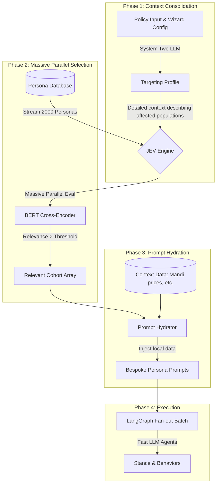

# JEV (System One) Implementation Plan

## 1. Overview & Purpose

**JEV (System One)** is a fast, non-generative, BERT-based classification model that powers massive-scale agent/cohort selection in the LegiSim platform. 

In traditional simulation platforms, finding relevant cohorts for a policy relies on rigid SQL `WHERE` clauses (e.g., `WHERE income < 50000 AND location = 'urban'`). This fails to capture semantic, nuanced, and indirect impacts (e.g., gig worker legislation indirectly affecting urban food vendors). 

JEV acts as a "System One" decision engine. By evaluating the cross-attention between a rich **Targeting Profile** (the policy context) and a **Persona Schema** (the cohort's traits), JEV makes rapid True/False (Noul primitive) decisions on whether a persona is relevant to a simulation. It evaluates 2,000 baseline personas in milliseconds, bypassing the latency and cost of generative LLMs while maintaining semantic understanding.

## 2. Architecture & Workflow

JEV operates within a strictly defined 4-Phase workflow in the LegiSim simulation pipeline.



## 3. Data Schemas

### Persona Schema (Fixed)
The core representation of a cohort in the database.

```json
{
  "id": "urban_gig_worker_tier1",
  "demographics": {
    "age": "18-25",
    "income": "lower_mid",
    "location": "urban_tier1"
  },
  "assets_and_vulnerabilities": ["no_health_insurance", "two_wheeler_loan"],
  "economic_dependency": ["fuel_prices", "smartphone_data_costs"]
}
```

### Targeting Profile Schema
Output of Phase 1 (LLM Context Consolidation).

```json
{
  "policy_id": "pol_123",
  "summary": "Mandatory employer contributions to gig worker health insurance.",
  "direct_impact_criteria": "Gig workers, delivery partners, ride-hailing drivers without existing health insurance.",
  "indirect_impact_criteria": "Platform companies facing higher costs, consumers of platform services facing price hikes, low-income urban workers.",
  "geographic_focus": "Tier 1 and Tier 2 cities"
}
```

## 4. API Contracts (JEV Microservice)

The JEV model is isolated in its own FastAPI microservice to manage heavy ML dependencies (PyTorch/Transformers).

**Endpoint:** `POST /api/v1/evaluate`

**Request Body:**
```json
{
  "targeting_profile": "Policy targets gig workers, delivery drivers, and low-income urban youth lacking health coverage...",
  "personas": [
    {
      "id": "urban_gig_worker_tier1",
      "text_representation": "Demographics: 18-25, lower_mid income, urban_tier1. Assets/Vulnerabilities: no_health_insurance, two_wheeler_loan. Dependencies: fuel_prices, smartphone_data_costs."
    },
    {
      "id": "rural_farmer_large",
      "text_representation": "Demographics: 45-60, high income, rural. Assets/Vulnerabilities: land_owner, tractor. Dependencies: monsoon, msp."
    }
  ],
  "threshold": 0.5
}
```
*Note: Personas are flattened into a `text_representation` before sending to JEV.*

**Response:**
```json
{
  "results": [
    {
      "id": "urban_gig_worker_tier1",
      "score": 0.92,
      "relevant": true
    },
    {
      "id": "rural_farmer_large",
      "score": 0.05,
      "relevant": false
    }
  ],
  "execution_time_ms": 42
}
```

## 5. Detailed Implementation

### 5.1 JEV Microservice (BERT Inference)
We use a lightweight Cross-Encoder (e.g., `cross-encoder/ms-marco-MiniLM-L-6-v2`) which excels at semantic similarity/relevance scoring between two textual sequences.

```python
# backend/services/jev/main.py
from fastapi import FastAPI
from pydantic import BaseModel
from typing import List
import time
import torch
from sentence_transformers import CrossEncoder

app = FastAPI(title="JEV System One")

# Load model globally on startup. Use GPU if available.
device = 'cuda' if torch.cuda.is_available() else 'cpu'
model = CrossEncoder('cross-encoder/ms-marco-MiniLM-L-6-v2', device=device)

class PersonaInput(BaseModel):
    id: str
    text_representation: str

class EvalRequest(BaseModel):
    targeting_profile: str
    personas: List[PersonaInput]
    threshold: float = 0.5

@app.post("/api/v1/evaluate")
async def evaluate(req: EvalRequest):
    start = time.time()
    
    # Prepare pairs: (Targeting Profile, Persona Text)
    pairs = [(req.targeting_profile, p.text_representation) for p in req.personas]
    
    # Massive parallel inference using batched predict
    # Predict returns logits. Apply sigmoid if model isn't configured to output probabilities.
    scores = model.predict(pairs, batch_size=256)
    
    results = []
    for i, p in enumerate(req.personas):
        # Normalize score between 0 and 1 depending on model output (MiniLM returns logits)
        prob = torch.sigmoid(torch.tensor(scores[i])).item()
        results.append({
            "id": p.id,
            "score": prob,
            "relevant": prob >= req.threshold
        })
        
    return {
        "results": results,
        "execution_time_ms": int((time.time() - start) * 1000)
    }
```

### 5.2 Phase 1: Context Consolidation Node
LangGraph node running on System Two (Z.ai GLM / Claude).

```python
# backend/app/workflows/nodes/context_consolidation.py
from langchain_core.prompts import PromptTemplate

def consolidate_context_node(state):
    policy_text = state["policy_text"]
    wizard_config = state["wizard_config"]
    
    prompt = """
    Analyze the following policy and configuration.
    Policy: {policy_text}
    Config: {wizard_config}
    
    Output a Targeting Profile that describes the demographic, economic, and geographic profile 
    of the populations directly and indirectly impacted by this policy.
    Respond in strict JSON format matching the Targeting Profile schema.
    """
    # Invoke LLM...
    # Return updated state with targeting_profile
```

### 5.3 Phase 2 & 3: Selection and Prompt Hydration
LangGraph node combining DB fetch, JEV API call, and Prompt hydration.

```python
# backend/app/workflows/nodes/jev_select.py
import httpx
import json

def jev_select_and_hydrate_node(state):
    targeting_profile = state["targeting_profile"]
    
    # 1. Fetch all 2000 personas from Redis/Postgres
    all_personas = fetch_all_personas()
    
    # 2. Flatten personas to text
    personas_for_jev = [
        {
            "id": p["id"],
            "text_representation": f"Demographics: {json.dumps(p['demographics'])}. Assets: {','.join(p['assets_and_vulnerabilities'])}. Dependencies: {','.join(p['economic_dependency'])}."
        }
        for p in all_personas
    ]
    
    # 3. Call JEV Service
    profile_text = f"Impacts: {targeting_profile['direct_impact_criteria']} {targeting_profile['indirect_impact_criteria']}"
    
    response = httpx.post("http://jev-service:8000/api/v1/evaluate", json={
        "targeting_profile": profile_text,
        "personas": personas_for_jev,
        "threshold": 0.65 # Calibrated threshold
    })
    
    relevant_ids = [r["id"] for r in response.json()["results"] if r["relevant"]]
    active_personas = [p for p in all_personas if p["id"] in relevant_ids]
    
    # 4. Prompt Hydration (Phase 3)
    hydrated_prompts = []
    for p in active_personas:
        # Fetch local context based on persona location/dependencies
        context = fetch_local_context(p)
        
        prompt = f"""
        You represent: {p['id']}
        Demographics: {p['demographics']}
        
        Current Economic Context:
        {context}
        
        How does the following policy affect you? Will you support or oppose it?
        Policy: {state['policy_summary']}
        """
        hydrated_prompts.append({"persona_id": p["id"], "prompt": prompt})
        
    return {"active_personas": active_personas, "hydrated_prompts": hydrated_prompts}
```

## 6. Docker & Infrastructure

JEV runs in its own container, optimized for ML workloads.

**Dockerfile (`backend/services/jev/Dockerfile`)**
```dockerfile
FROM python:3.10-slim

WORKDIR /app
COPY requirements.txt .

# Install PyTorch (CPU or GPU specific depending on deployment)
RUN pip install torch torchvision torchaudio --index-url https://download.pytorch.org/whl/cpu
RUN pip install -r requirements.txt

# Pre-download model weights during build
RUN python -c "from sentence_transformers import CrossEncoder; CrossEncoder('cross-encoder/ms-marco-MiniLM-L-6-v2')"

COPY . .
CMD ["uvicorn", "main:app", "--host", "0.0.0.0", "--port", "8000"]
```

**docker-compose.yml addition**
```yaml
services:
  jev-service:
    build:
      context: ./backend/services/jev
    ports:
      - "8000:8000"
    environment:
      - MODEL_NAME=cross-encoder/ms-marco-MiniLM-L-6-v2
    # deploy:
    #   resources:
    #     reservations:
    #       devices:
    #         - driver: nvidia
    #           count: 1
    #           capabilities: [gpu]
```

## 7. Environment Variables

*   `JEV_SERVICE_URL`: URL for the main backend to reach JEV (e.g., `http://jev-service:8000`)
*   `JEV_MODEL_NAME`: HuggingFace model ID (default: `cross-encoder/ms-marco-MiniLM-L-6-v2`)
*   `JEV_EVAL_THRESHOLD`: Confidence threshold for relevance (default: `0.65`)
*   `CUDA_VISIBLE_DEVICES`: (Optional) GPU allocation.

## 8. File Structure

```
/mnt/Data/competitions/incub8/legisim/
├── backend/
│   ├── services/
│   │   └── jev/
│   │       ├── Dockerfile
│   │       ├── requirements.txt
│   │       └── main.py              # FastAPI app & BERT inference
│   ├── app/
│   │   ├── workflows/
│   │   │   ├── nodes/
│   │   │   │   ├── context_consolidation.py # Phase 1
│   │   │   │   └── jev_select.py            # Phases 2 & 3
```

## 9. Testing & Acceptance Criteria

1.  **Latency**: JEV endpoint must process 2,000 personas against 1 targeting profile in `< 250ms` (CPU) or `< 50ms` (GPU).
2.  **Accuracy (Semantic vs SQL)**: A policy impacting "transportation workers" must successfully capture "gig delivery riders" (which SQL `industry='logistics'` might miss).
3.  **Threshold Calibration**: Create a test suite of 10 mock policies and hand-label the expected cohorts. Ensure the JEV threshold produces an F1 score > 0.85 against the manual labels.
4.  **Batching**: Ensure the `batch_size` in `model.predict()` is utilized effectively to prevent OOM errors while maximizing throughput.

## 10. Subagent Assignments & Order

1.  **Agent 1 (Infrastructure & ML):** Implement `backend/services/jev/main.py`, Dockerfile, and add to `docker-compose.yml`. Ensure the HuggingFace model downloads correctly and exposes the API.
2.  **Agent 2 (Workflow & LangGraph):** Implement the LangGraph nodes (`context_consolidation.py` and `jev_select.py`). Ensure exact adherence to the prompt hydration logic and Pydantic schemas.
3.  **Agent 3 (Data & Testing):** Populate the database with 2,000 mock personas matching the schema. Write `pytest` scripts to evaluate latency and relevance accuracy.
