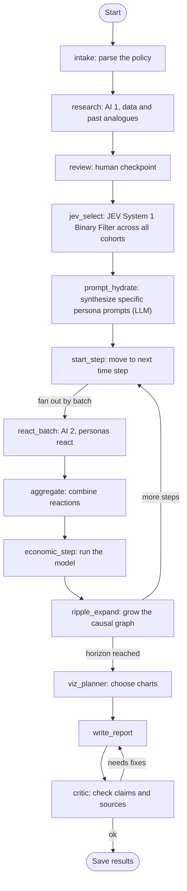

# LegiSim LangGraph Engine Architecture

## Overview & Purpose
The LangGraph Engine is the core orchestration layer for LegiSim. It handles the complex, multi-step workflow of analyzing a policy, gathering research, predicting population reactions, evaluating economic impacts, and generating a validated report. By using LangGraph, we achieve stateful, resumable, and highly observable execution of both LLM and plain code nodes.

## Pipeline Architecture

The pipeline consists of 14 nodes, integrating Strong LLMs, Small/Fast models, the new System One (JEV) model, human-in-the-loop checkpoints, and plain code logic.



## Node Details

| Node | What it does | Type |
|------|-------------|------|
| intake | Turns plain words/form answers into structured policy object. Flags unclear items | Strong model |
| research (AI 1) | Plans searches, fetches data, extracts facts with sources, finds similar past policies, lists assumptions. Can be a subgraph | Strong model + tools |
| review | Pauses so user can edit assumptions | Human step |
| jev_select (JEV) | Runs on ALL 2,000 personas, outputs True/False on whether to run simulation for each. Replaces SQL filters | System One model (JEV) |
| prompt_hydrate | Takes selected array of personas, builds targeted prompt & consolidates data for each | Strong model |
| start_step | Advances the clock and fans out work | Plain code |
| react_batch (AI 2) | Batch of cohorts reacts in parallel. Returns structured reactions | Small fast model |
| aggregate | Adds up reactions by group and region, checks totals | Plain code |
| economic_step | Updates prices, incomes, jobs, govt cost with simple models using reactions as inputs | Plain code |
| ripple_expand | Adds new effects to the causal graph for this step | Code + strong model |
| viz_planner | Picks which charts to show, writes chart spec for each | Strong model |
| write_report | Writes summary sections from numbers and the causal graph | Strong model |
| critic | Checks every claim matches a number or source, flags overreach. Sends back at most twice | Strong model |

## The JEV System Integration
The Joint Embedding Vector (JEV) system introduces two critical nodes right after the human review checkpoint:
1. **`jev_select`**: A fast, fine-tuned System One model (BERT-based) that acts as a binary filter over all ~2,000 cohort personas. It predicts whether a specific persona will actually be affected by the policy. This replaces legacy, rigid SQL filters with a semantic, high-recall filter.
2. **`prompt_hydrate`**: Takes the subset of personas flagged as `True` by `jev_select` and uses a Strong LLM to construct deeply contextualized prompts for each, fusing policy data, demographic data, and the specific reasons they were selected.

## State Management

State is strictly typed using Pydantic models wrapped in a Python `TypedDict` for the LangGraph State.

```python
from typing import TypedDict, Annotated
from pydantic import BaseModel
import operator

class SimulationState(TypedDict):
    policy: PolicyDefinition
    research_context: ResearchData
    personas_selected: list[Persona]
    hydrated_prompts: dict[str, str]
    current_step: int
    max_steps: int
    reactions: Annotated[list[Reaction], operator.add]
    economic_metrics: EconomicData
    causal_graph: dict
    report_content: str
    critic_iterations: int
    errors: list[str]
```

## Checkpointing, Streaming, and Resumability
- **Postgres Saver**: LangGraph state is checkpointed to PostgreSQL after every node execution. This provides fault tolerance and allows for the `review` human-in-the-loop step.
- **Thread IDs**: The `run_id` for a simulation directly maps to the LangGraph `thread_id`. This allows users to resume a paused simulation (e.g., after the human review step) exactly where they left off.
- **Streaming (SSE)**: Execution relies on LangGraph's streaming capabilities, exposed via Server-Sent Events (SSE) using custom callbacks in FastAPI. This pushes real-time node transition events and partial token streams directly to the Next.js frontend.

## Advanced Capabilities
- **Subgraphs**: To manage complexity, nodes like `research`, `ripple_expand`, and `write_report` + `critic` are implemented as distinct subgraphs. This isolates their state and iterative loops (e.g., the critic loop) from the main orchestrator loop.
- **Scenario Variants & Optimization**: If a user tweaks a policy (creating a variant), the pipeline can intelligently resume from the `review` node, reusing the expensive outputs from the `intake` and `research` nodes saved in the Postgres checkpoint.
- **Uncertainty & Monte Carlo**: The pipeline supports triggering multiple runs for the same policy with different random seeds or slight parameter variations to calculate uncertainty bands in the economic outputs.

## Sub-Plan Files
Detailed implementations of specific subsystems and agents within this graph are broken out into the following sub-plans:

- `01-pipeline-orchestrator/` - Master StateGraph definition
- `02-ripple-engine/` - 3-layer causal effect engine
- `03-cohort-agents/` - Population persona simulation
- `04-research-agent/` - AI research & data gathering
- `05-math-model-engine/` - Deterministic economic models
- `06-critic-agent/` - Validation & review agent
- `07-viz-planner/` - AI chart selection
- `08-report-writer/` - AI report generation
- `09-jev-system/` - JEV System One selection engine (NEW)
